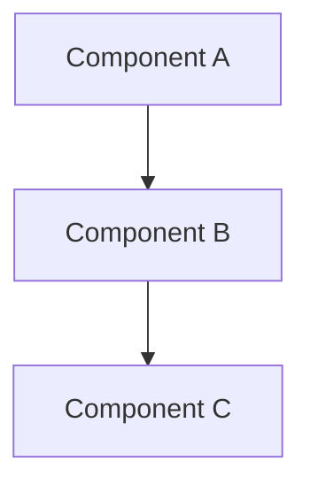

# Project Title

> One-line description of the project.

---

## Table of Contents

- [Overview](#overview)
- [Business Problem](#business-problem)
- [Objectives](#objectives)
- [Architecture](#architecture)
- [Services Used](#services-used)
- [Design Decisions](#design-decisions)
- [Implementation Steps](#implementation-steps)
- [Security Considerations](#security-considerations)
- [Challenges](#challenges)
- [Lessons Learned](#lessons-learned)
- [Outcomes](#outcomes)
- [Future Improvements](#future-improvements)

---

## Overview

Brief description of the project, its scope, and the environment it operates in.

## Business Problem

What business challenge does this project solve? Why was it needed?

- Problem statement
- Impact of not solving it
- Stakeholders affected

## Objectives

| # | Objective | Success Criteria |
|---|-----------|-----------------|
| 1 | | |
| 2 | | |
| 3 | | |

## Architecture

### High-Level Architecture

### Architecture Decisions

| Decision | Choice | Rationale |
|----------|--------|-----------|
| | | |

## Services Used

| Service | Purpose | Configuration |
|---------|---------|--------------|
| | | |

## Design Decisions

### Decision 1: [Title]

**Context**: What prompted the decision?

**Options Considered**:
1. Option A - description
2. Option B - description

**Decision**: What was chosen and why.

**Consequences**: Positive and negative impacts.

## Implementation Steps

### Phase 1: [Name]

1. Step description
2. Step description

### Phase 2: [Name]

1. Step description
2. Step description

## Security Considerations

- [ ] Encryption at rest (KMS CMK)
- [ ] Encryption in transit (TLS 1.2+)
- [ ] Least privilege IAM
- [ ] Network segmentation
- [ ] Logging and monitoring
- [ ] Data classification
- [ ] Compliance requirements

## Challenges

| Challenge | Root Cause | Resolution |
|-----------|-----------|-----------|
| | | |

## Lessons Learned

1. **Lesson**: What was learned
   - **Impact**: How it changed the approach

## Outcomes

| Metric | Before | After | Improvement |
|--------|--------|-------|------------|
| | | | |

## Future Improvements

- [ ] Improvement 1
- [ ] Improvement 2
- [ ] Improvement 3

---

## References

- [Link to documentation]()
- [Link to related project]()
