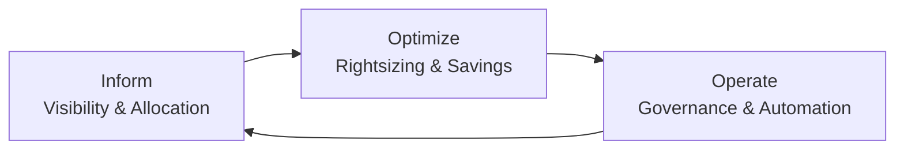

# 📐 Cost Optimization Pattern

> FinOps practices for cloud cost governance and optimization.

---

## Framework

## Strategies

| Strategy | Savings Potential | Effort |
|----------|-----------------|--------|
| Rightsizing | 20-40% | Low |
| Reserved Instances / Savings Plans | 30-60% | Low |
| Spot Instances (non-critical) | 60-90% | Medium |
| Architecture optimization | 20-50% | High |
| Shutdown non-prod after hours | 30-50% | Low |
| S3 lifecycle policies | 30-70% on storage | Low |

## Best Practices

1. **Tag everything** — enable tag-based cost allocation
2. **Budget alerts** — per account, per team, per project
3. **Regular rightsizing reviews** — monthly with Compute Optimizer
4. **Savings Plans coverage** — aim for 70-80% coverage
5. **Anomaly detection** — auto-alert on unexpected spend
6. **FinOps team accountability** — engineering owns cost, finance provides visibility

---

➡️ [Back to Patterns](../) | [Back to Portfolio](../../)
