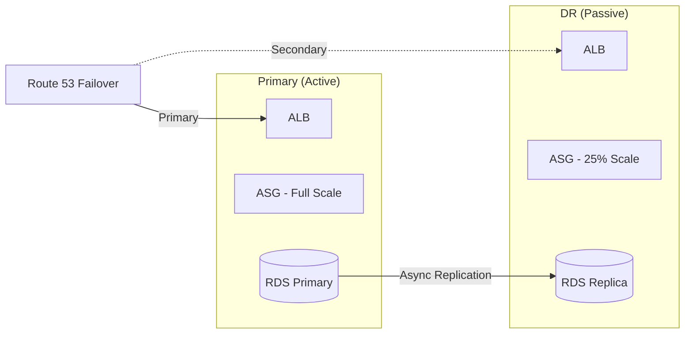
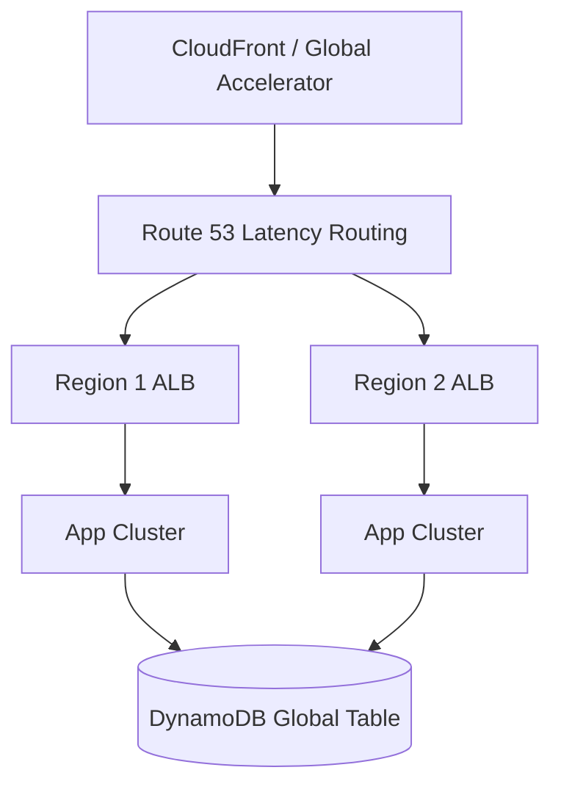

# 📐 Disaster Recovery Patterns

> Strategies for recovering from regional failures and catastrophic events.

---

## Overview

DR patterns ensure business continuity when entire regions or services become unavailable. The choice of pattern depends on RPO/RTO requirements and budget.

## Pattern Comparison

```mermaid
graph LR
    subgraph "Cost vs. Recovery Time"
        BR[Backup & Restore<br/>RPO: Hours | RTO: Hours<br/>Cost: $]
        PL[Pilot Light<br/>RPO: Minutes | RTO: 30-60 min<br/>Cost: $$]
        WS[Warm Standby<br/>RPO: Minutes | RTO: 10-30 min<br/>Cost: $$$]
        AA[Active-Active<br/>RPO: Zero | RTO: Zero<br/>Cost: $$$$]
    end
    
    BR --> PL --> WS --> AA
```

## Active-Passive (Warm Standby)



## Active-Active Multi-Region



## Use Cases

| Pattern | Best For |
|---------|----------|
| Backup & Restore | Dev/test, cost-sensitive, flexible RTO |
| Pilot Light | Core systems with moderate RTO tolerance |
| Warm Standby | Business-critical with RTO < 30 min |
| Active-Active | Zero-downtime requirement, global users |

## Pros / Cons

| Pattern | Pros | Cons |
|---------|------|------|
| Backup & Restore | Low cost, simple | Long RTO, data loss risk |
| Pilot Light | Moderate cost, fast spin-up | Manual scaling needed at failover |
| Warm Standby | Fast failover, pre-tested | 2x infrastructure cost |
| Active-Active | Zero downtime, global perf | Highest cost, data consistency complexity |

## Best Practices

1. **Test DR regularly** — untested DR is not DR
2. **Automate failover** — manual processes fail under pressure
3. **Document runbooks** — step-by-step for every scenario
4. **Monitor replication lag** — RPO is only valid if replication is healthy
5. **Use Infrastructure as Code** — rebuild from code in any region
6. **Consider data sovereignty** — DR region must comply with regulations

---

➡️ [Back to Patterns](../) | [Back to Portfolio](../../)
