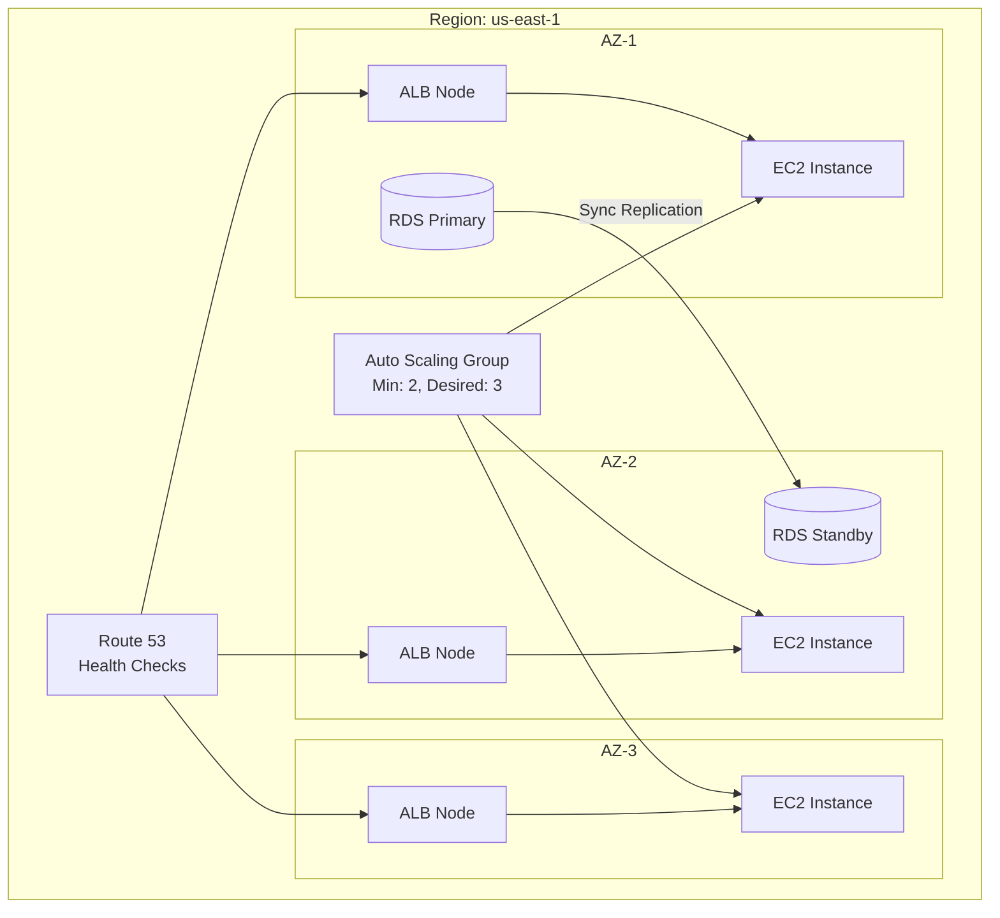

# 📐 High Availability Pattern

> Designing systems that remain operational despite component failures.

---

## Overview

High availability (HA) ensures that a system continues to function when individual components fail. This is achieved through redundancy, fault isolation, and automated recovery.

## Use Cases

- Production workloads with SLA requirements (99.9%+)
- Customer-facing applications where downtime = revenue loss
- Stateful services that require data durability
- Multi-tenant SaaS platforms

## Architecture

## Availability Targets

| Target | Monthly Downtime | Pattern Required |
|--------|-----------------|-----------------|
| 99.0% | 7.3 hours | Single AZ with recovery |
| 99.9% | 43 minutes | Multi-AZ with auto-failover |
| 99.99% | 4.3 minutes | Multi-Region warm standby |
| 99.999% | 26 seconds | Multi-Region active-active |

## Pros

- ✅ Fault tolerance — survives AZ failures
- ✅ Automatic recovery — no manual intervention
- ✅ Consistent performance — load distributed

## Cons

- ❌ Higher cost — redundant infrastructure
- ❌ Complexity — more components to manage
- ❌ Data consistency — multi-AZ replication lag

## Best Practices

1. **Deploy across 3+ AZs** — single AZ failure shouldn't impact availability
2. **Use managed services** — ALB, RDS Multi-AZ, ElastiCache Multi-AZ handle failover automatically
3. **Health checks at every layer** — Route 53, ALB, ASG health checks
4. **Stateless compute** — store state in databases/caches, not on instances
5. **Auto Scaling** — handle traffic spikes and replace failed instances
6. **Circuit breakers** — prevent cascade failures between services
7. **Chaos engineering** — regularly test failure scenarios

## Anti-Patterns

- ❌ Single AZ deployment for production
- ❌ Hardcoded IP addresses
- ❌ Session affinity without session storage
- ❌ Manual recovery procedures
- ❌ Single database without replication

---

➡️ [Back to Patterns](../) | [Back to Portfolio](../../)
