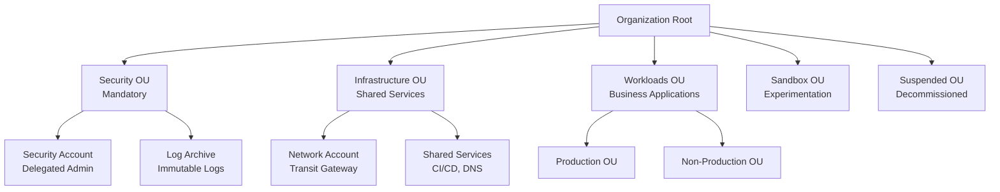

# 📐 Landing Zone Patterns

> Multi-account governance patterns for enterprise cloud adoption.

---

## Landing Zone Architecture

## Key Principles

| Principle | Implementation |
|-----------|---------------|
| Account per workload | Blast radius isolation |
| OU-based governance | SCPs applied at OU level |
| Centralized security | Delegated admin pattern |
| Immutable logging | Object Lock, SCP protection |
| Automated provisioning | Account vending machine |
| Least privilege | Identity Center + Permission Sets |

## Best Practices

1. **Minimize management account usage** — delegate everything
2. **Security baseline applied automatically** — every new account gets GuardDuty, Config, CloudTrail
3. **Network as shared service** — centralize TGW, DNS, egress
4. **Test SCPs in sandbox first** — never deploy restrictive SCPs to production without testing
5. **Infrastructure as Code everything** — reproducible, auditable, version-controlled

---

➡️ [Back to Patterns](../) | [Back to Portfolio](../../)
