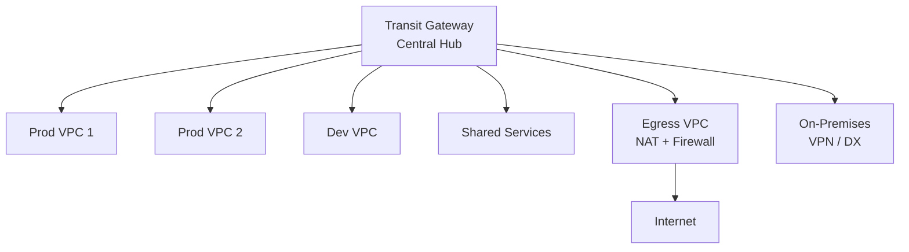

# 📐 Networking Patterns

> Hub-spoke, mesh, and hybrid connectivity architectures.

---

## Hub-and-Spoke (Transit Gateway)

| Pros | Cons |
|------|------|
| ✅ Centralized management | ❌ TGW per-attachment cost |
| ✅ Scalable (5000 attachments) | ❌ Single regional resource |
| ✅ Route table segmentation | ❌ Bandwidth limits per attachment |
| ✅ Supports VPN and DX | ❌ Additional hop latency (minimal) |

## Use Cases

| Pattern | When to Use |
|---------|-------------|
| Hub-Spoke (TGW) | 5+ VPCs, centralized control, multi-account |
| VPC Peering | 2-4 VPCs, simple connectivity, low cost |
| PrivateLink | Service-to-service access without full VPC connectivity |
| Shared VPC (RAM) | Teams in same account needing controlled subnets |
| Transit Gateway peering | Multi-region hub-spoke |

---

➡️ [Back to Patterns](../) | [Back to Portfolio](../../)
