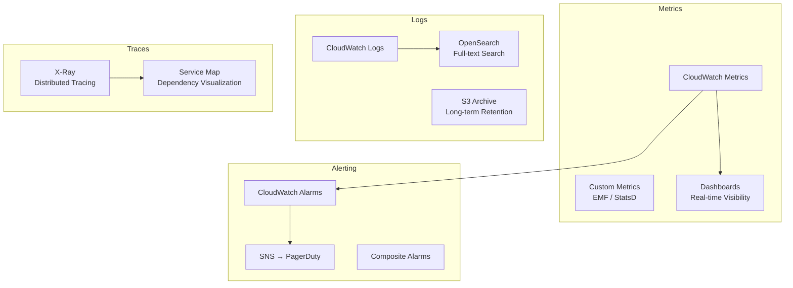

# 📐 Observability Pattern

> Comprehensive monitoring, logging, and distributed tracing for cloud-native applications.

---

## Three Pillars

## Best Practices

1. **Structured logging** — JSON format with correlation IDs
2. **Custom metrics** — business KPIs, not just infrastructure
3. **Distributed tracing** — trace requests across service boundaries
4. **Alerting on symptoms, not causes** — alert on error rates, not CPU
5. **Dashboards per audience** — executive, SRE, developer views

---

➡️ [Back to Patterns](../) | [Back to Portfolio](../../)
