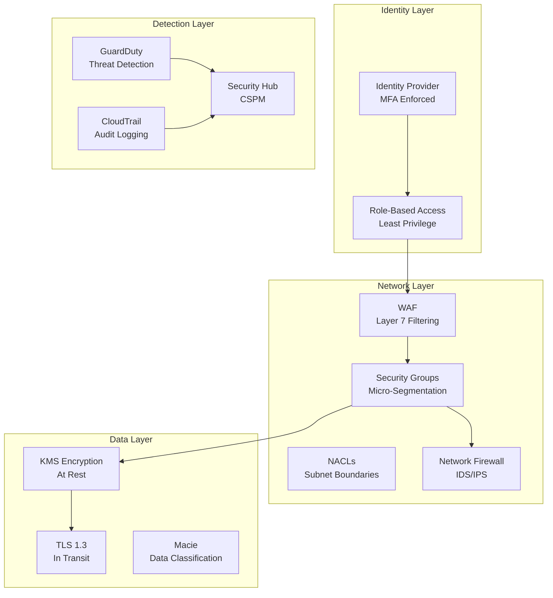

# 📐 Security Patterns

> Zero Trust architecture and defense-in-depth strategies for cloud environments.

---

## Zero Trust Architecture

## Principles

| Principle | Implementation |
|-----------|---------------|
| Never trust, always verify | MFA, token-based auth, session limits |
| Least privilege | IAM policies, permission boundaries, SCPs |
| Assume breach | Monitoring, logging, automated response |
| Verify explicitly | Context-based access (device, location, time) |
| Minimize blast radius | Account isolation, network segmentation |

## Best Practices

1. **Encrypt everything** — at rest (KMS) and in transit (TLS)
2. **No long-lived credentials** — IAM Identity Center, OIDC, instance profiles
3. **Defense in depth** — multiple layers of controls
4. **Automate detection and response** — EventBridge + Lambda remediation
5. **Centralize visibility** — Security Hub as single pane of glass
6. **Prevent over-privilege** — SCPs, permission boundaries, access analyzer

---

➡️ [Back to Patterns](../) | [Back to Portfolio](../../)
