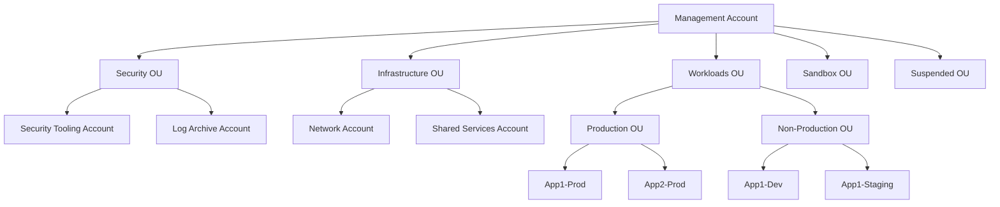
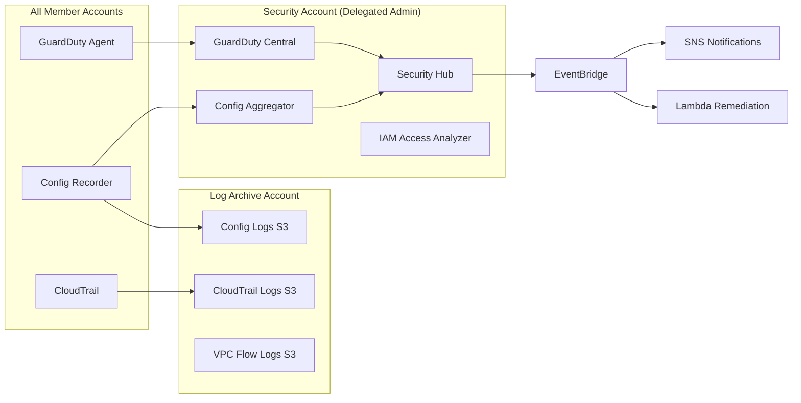
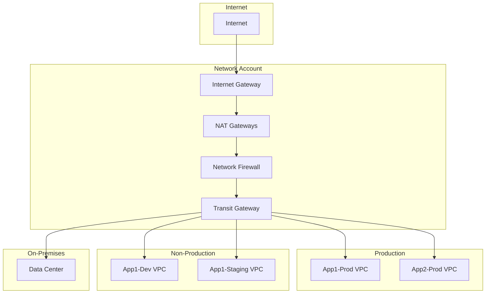

# ☁️ AWS Projects

Enterprise-grade AWS architecture, platform engineering, security, and automation projects.

---

## Table of Contents

- [Platform Engineering & Landing Zone](#platform-engineering--landing-zone)
- [Security Engineering](#security-engineering)
- [Networking](#networking)
- [Disaster Recovery](#disaster-recovery)
- [Automation](#automation)
- [AI Workloads](#ai-workloads)
- [Cost Optimization](#cost-optimization)

---

## Platform Engineering & Landing Zone

Enterprise AWS multi-account environment following the AWS Security Reference Architecture.

| Project | Description | Key Services |
|---------|-------------|-------------|
| [AWS Landing Zone](landing-zone/) | Complete multi-account governance framework | Organizations, Control Tower, SCPs |
| [Account Vending](landing-zone/) | Automated account provisioning with baselines | Organizations, Terraform, Step Functions |

### AWS Organizations

### Multi-Account Governance

- **Service Control Policies**: Preventive guardrails at OU level
- **IAM Identity Center**: Centralized access management with permission sets
- **AWS Config**: Organization-wide compliance monitoring
- **CloudTrail**: Immutable audit logging across all accounts
- **GuardDuty + Security Hub**: Centralized threat detection and CSPM

---

## Security Engineering

Defense-in-depth implementations protecting the cloud estate.

| Project | Focus | Key Pattern |
|---------|-------|-------------|
| [IAM Architecture](security/iam/) | Identity and access management | Least privilege, role chaining |
| [KMS Strategy](security/kms/) | Encryption key management | Multi-account key sharing, rotation |
| [GuardDuty](security/guardduty/) | Threat detection | Org-wide, automated response |
| [Security Hub](security/security-hub/) | Cloud security posture | CIS, NIST, PCI compliance |
| [CloudTrail](security/cloudtrail/) | Audit and compliance | Organization trail, integrity validation |

### Security Architecture

---

## Networking

Enterprise network architectures for connectivity, segmentation, and hybrid environments.

| Project | Pattern | Scale |
|---------|---------|-------|
| [Transit Gateway](networking/transit-gateway/) | Hub-and-spoke | Organization-wide |
| [Hybrid Connectivity](networking/hybrid-connectivity/) | VPN + Direct Connect | On-premises integration |
| [Multi-Account Networking](networking/multi-account-networking/) | Shared VPCs + RAM | Multi-team |

### Network Topology

---

## Disaster Recovery

Business continuity architectures across availability zones and regions.

| Project | Strategy | RPO | RTO |
|---------|----------|-----|-----|
| [Cross-Region DR](disaster-recovery/) | Warm Standby | Minutes | < 30 min |
| [Multi-Region Active-Active](disaster-recovery/) | Active-Active | Zero | Zero |
| [Backup Strategy](disaster-recovery/) | AWS Backup | Hours | Hours |

---

## Automation

Event-driven automation, fleet management, and operational excellence.

| Project | Technology | Use Case |
|---------|-----------|----------|
| [Lambda Functions](automation/lambda/) | Python, Node.js | Event-driven automation |
| [Boto3 Scripts](automation/boto3/) | Python SDK | Operational tasks |
| [Systems Manager](automation/systems-manager/) | SSM, Run Command | Fleet management, patching |

---

## AI Workloads

Generative AI, natural language processing, and ML platforms on AWS.

| Project | Technology | Pattern |
|---------|-----------|---------|
| [Gen AI Training Platform](ai-workloads/generative-ai-training-platform/) | S3, CloudFront, Lambda | Static + AI content |
| [RAG Architecture](ai-workloads/rag-architecture/) | Bedrock, OpenSearch | Retrieval-augmented generation |
| [AI Chatbot](ai-workloads/ai-chatbot/) | Bedrock, Lambda, API GW | Conversational AI |
| [Bedrock Integration](ai-workloads/bedrock-integration/) | Bedrock, Guardrails | Foundation models |
| [Knowledge Base Search](ai-workloads/knowledge-base-search/) | Bedrock KB, Embeddings | Semantic search |
| [Document Processing](ai-workloads/document-processing/) | Textract, Lambda, Bedrock | Document → Knowledge |
| [LLM Hosting](ai-workloads/llm-application-hosting/) | SageMaker, ECS | Model serving |

---

## Cost Optimization

FinOps practices, rightsizing, and cost governance across the organization.

| Topic | Approach |
|-------|----------|
| [Cost Governance](cost-optimization/) | Budgets, anomaly detection, tag-based allocation |
| [Rightsizing](cost-optimization/) | Compute Optimizer, trusted advisor |
| [Reserved/Savings Plans](cost-optimization/) | Coverage analysis, purchase strategies |

---

## 📖 Project Template

Each project follows a [standard documentation template](../PROJECT_TEMPLATE.md) covering:
- Business Problem & Objectives
- Architecture & Design Decisions
- Implementation Approach
- Security Considerations
- Challenges & Lessons Learned
- Outcomes & Future Improvements
