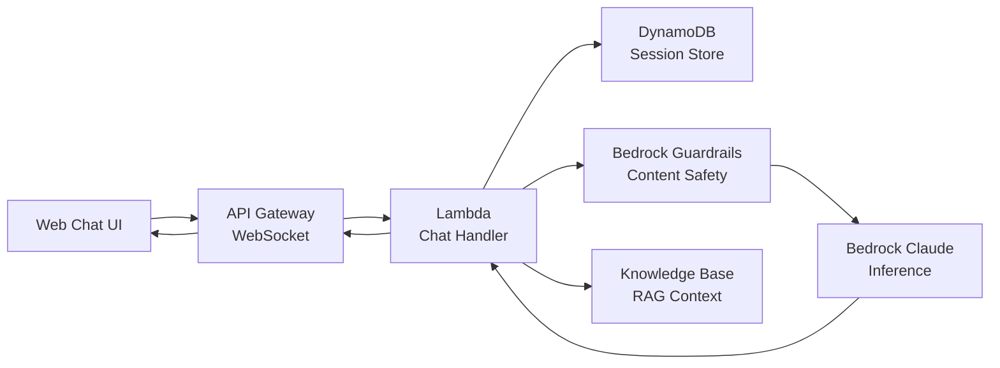

# 🤖 AI Chatbot

> Conversational AI with content guardrails, context management, and multi-turn dialogue.

## Architecture

## Features

- Multi-turn conversation with history management
- Streaming responses via WebSocket
- Content guardrails (PII filtering, topic restrictions)
- RAG-based grounding with knowledge base
- Session persistence in DynamoDB
- Token usage tracking and cost alerts

---

➡️ [Back to AI Workloads](../) | [Back to AWS](../../)
