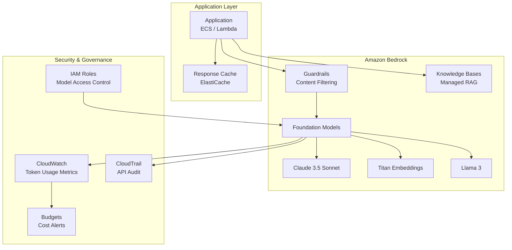

# 🤖 Amazon Bedrock Integration

> Foundation model access patterns, prompt engineering, guardrails, and knowledge base configuration.

---

## Overview

Patterns and best practices for integrating Amazon Bedrock into enterprise applications with security controls, cost management, and operational excellence.

## Architecture

## Foundation Models

| Model | Use Case | Input Cost | Output Cost |
|-------|----------|-----------|-------------|
| Claude 3.5 Sonnet | Complex reasoning, code | $3/M tokens | $15/M tokens |
| Claude 3 Haiku | Fast responses, classification | $0.25/M | $1.25/M |
| Titan Embeddings v2 | Vector embeddings | $0.02/M | N/A |
| Titan Text Express | Simple generation | $0.20/M | $0.60/M |

## Guardrails Configuration

| Control | Purpose |
|---------|---------|
| Content filters | Block harmful, inappropriate content |
| Denied topics | Prevent discussions outside domain |
| Word filters | Block PII, competitor names |
| Contextual grounding | Reduce hallucination with source checks |

## Security Controls

- IAM policies scoped to specific models
- VPC endpoints for private access (no internet)
- CloudTrail logging all Bedrock API calls
- Guardrails for content safety
- Budget alerts on token consumption
- Model access logging to S3

---

➡️ [Back to AI Workloads](../) | [Back to AWS](../../)
