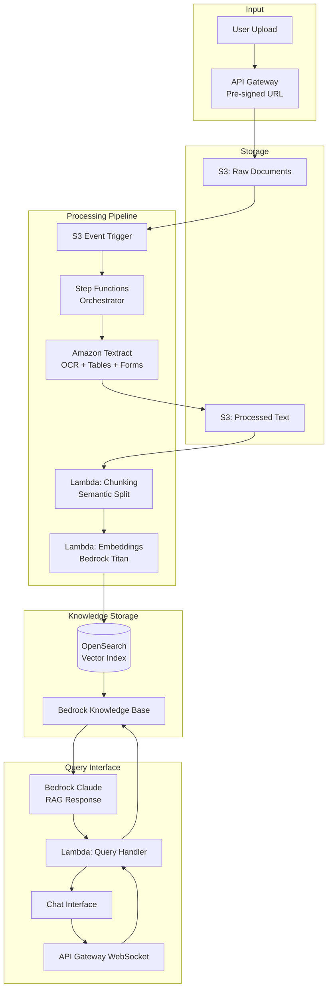

# 🤖 Document Processing Pipeline

> End-to-end pipeline: PDF Upload → S3 → Lambda → Textract → Chunking → Embeddings → Knowledge Base → Bedrock → Chat Interface

---

## Architecture

## Processing Steps

| Step | Service | Action |
|------|---------|--------|
| 1. Upload | API Gateway + S3 | Pre-signed URL → S3 put |
| 2. Trigger | S3 Event → Step Functions | Start processing pipeline |
| 3. Extract | Amazon Textract | OCR text, tables, forms from PDF |
| 4. Clean | Lambda | Remove headers, footers, page numbers |
| 5. Chunk | Lambda | Semantic chunking (500-1000 tokens) |
| 6. Embed | Bedrock Titan Embeddings | Generate 1536-dim vectors |
| 7. Store | OpenSearch Serverless | Index vectors with metadata |
| 8. Query | Bedrock Knowledge Base | Retrieve + generate answer |

## Supported Formats

| Format | Extraction Method |
|--------|------------------|
| PDF (text) | Textract DetectDocumentText |
| PDF (scanned) | Textract OCR |
| PDF (tables) | Textract AnalyzeDocument |
| DOCX | Lambda (python-docx) |
| TXT/MD | Direct read |
| Images (PNG/JPEG) | Textract OCR |

## Design Decisions

| Decision | Choice | Rationale |
|----------|--------|-----------|
| Orchestration | Step Functions | Visual workflow, error handling, retries |
| OCR | Textract | Best AWS-native OCR, handles tables/forms |
| Chunking | Semantic (sentence boundaries) | Preserves meaning across chunk boundaries |
| Vector DB | OpenSearch Serverless | Managed, auto-scaling, k-NN native |
| Chat interface | WebSocket API | Real-time streaming responses |

---

➡️ [Back to AI Workloads](../) | [Back to AWS](../../)
