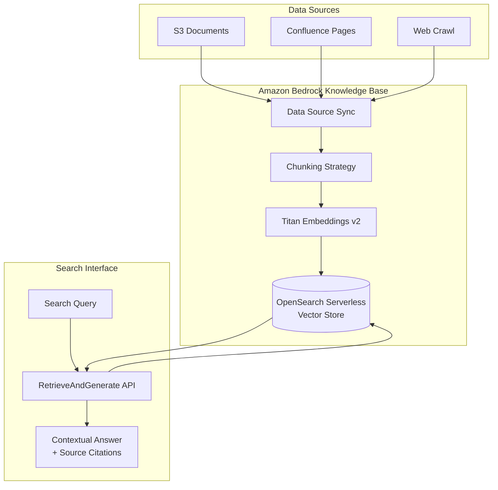

# 🤖 Knowledge Base Search

> Semantic search powered by vector embeddings and Amazon Bedrock Knowledge Bases.

## Architecture

## Key Capabilities

- Managed ingestion from S3, web crawlers, Confluence
- Automatic chunking and embedding generation
- Built-in RetrieveAndGenerate API
- Source citations with each answer
- Metadata filtering for scoped search
- Automatic re-sync on source changes

---

➡️ [Back to AI Workloads](../) | [Back to AWS](../../)
