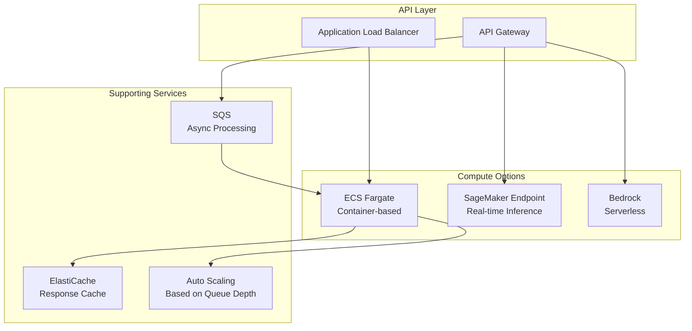

# 🤖 LLM Application Hosting

> Production model serving patterns for large language models on AWS.

## Architecture

## Hosting Options Comparison

| Option | Latency | Cost Model | Scaling | Use Case |
|--------|---------|-----------|---------|----------|
| Bedrock | Medium | Per-token | Automatic | General LLM access |
| SageMaker RT | Low | Per-instance-hour | Manual/Auto | Custom models |
| ECS + vLLM | Low | Per-container-hour | Task-based | Self-hosted open models |
| SageMaker Async | High | Per-request | Queue-based | Batch processing |

---

➡️ [Back to AI Workloads](../) | [Back to AWS](../../)
