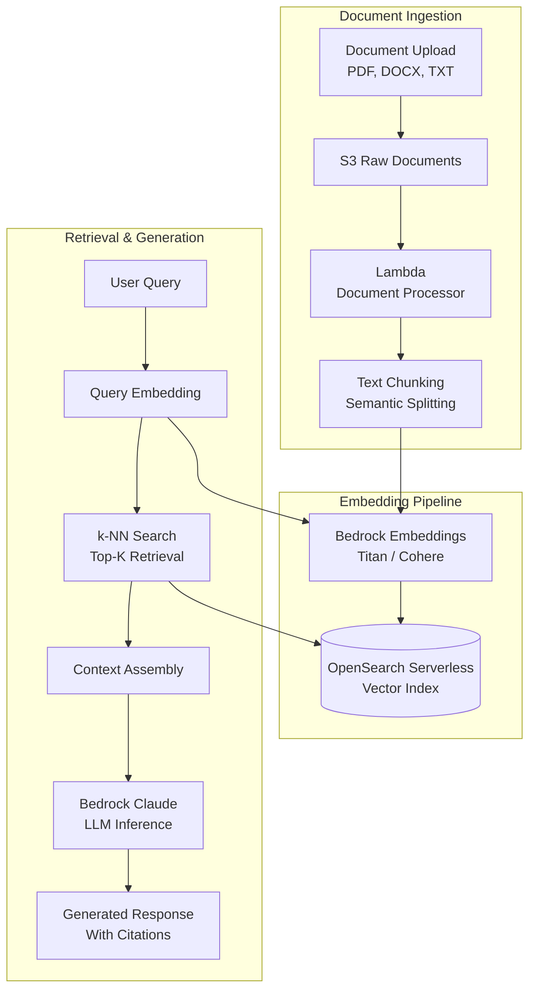
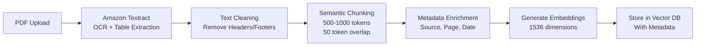

# 🤖 RAG Architecture

> Retrieval-Augmented Generation pipeline combining document ingestion, vector embeddings, semantic retrieval, and LLM inference.

---

## Overview

Enterprise RAG system that ingests organizational documents, generates embeddings, stores them in a vector database, and retrieves relevant context for LLM-powered question answering.

## Architecture

## Key Components

### Document Ingestion

### Retrieval Pipeline

| Step | Component | Purpose |
|------|-----------|---------|
| 1 | Query embedding | Convert question to vector |
| 2 | k-NN search | Find top-K similar chunks |
| 3 | Reranking | Score relevance of retrieved chunks |
| 4 | Context assembly | Format chunks with metadata |
| 5 | Prompt construction | System + context + question |
| 6 | LLM inference | Generate answer with citations |
| 7 | Response formatting | Clean output with source references |

## Design Decisions

| Decision | Choice | Rationale |
|----------|--------|-----------|
| Vector DB | OpenSearch Serverless | Managed, scalable, k-NN built-in |
| Embedding model | Titan Embeddings v2 | AWS-native, 1536 dimensions, multilingual |
| LLM | Claude 3 Sonnet (Bedrock) | Strong reasoning, 200K context, cost-effective |
| Chunking | Semantic (sentence boundaries) | Preserves meaning better than fixed-size |
| Chunk size | 500-1000 tokens, 50 overlap | Balance between context and precision |

## Services Used

| Service | Purpose |
|---------|---------|
| Amazon Bedrock | Embeddings + LLM inference |
| OpenSearch Serverless | Vector storage and k-NN search |
| Lambda | Document processing, orchestration |
| S3 | Raw document storage |
| Textract | PDF/image OCR |
| Step Functions | Ingestion pipeline orchestration |
| API Gateway | REST API for queries |
| CloudWatch | Monitoring, latency tracking |

---

➡️ [Back to AI Workloads](../) | [Back to AWS](../../)
