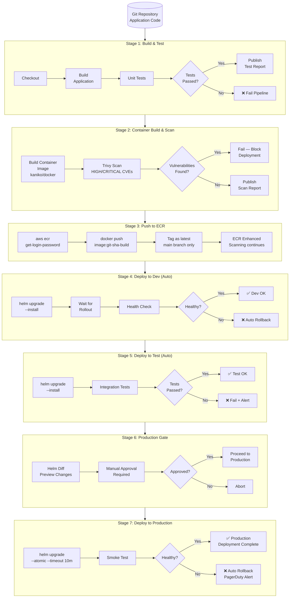

# Diagram: Application CI/CD Pipeline

## Overview

This diagram shows the full application delivery pipeline — from Git commit through build, test, container scan, ECR push, and Helm deployment across environments.

---

## Mermaid Source



---

## Image Tagging Strategy

| Tag Format | Example | Used For |
|---|---|---|
| `{git-sha}-{build-number}` | `abc1234-42` | All deployed versions |
| `latest` | `latest` | Convenience; main branch only |
| `v{semver}` | `v1.2.3` | Release tags (optional) |

Images are **immutable** in production ECR (IMMUTABLE tag mutability setting).

---

## Deployment Commands Reference

### Dev / Test

```bash
helm upgrade --install my-app ./helm/my-app \
  --namespace team-dev \
  --values helm/my-app/values.yaml \
  --values helm/environments/dev/my-app.yaml \
  --set image.tag=${IMAGE_TAG} \
  --wait --timeout 5m
```

### Production

```bash
helm upgrade --install my-app ./helm/my-app \
  --namespace team-prod \
  --values helm/my-app/values.yaml \
  --values helm/environments/prod/my-app.yaml \
  --set image.tag=${IMAGE_TAG} \
  --atomic --timeout 10m \
  --cleanup-on-fail
```

---

## Rendered Format

To render: [Mermaid Live Editor](https://mermaid.live)
