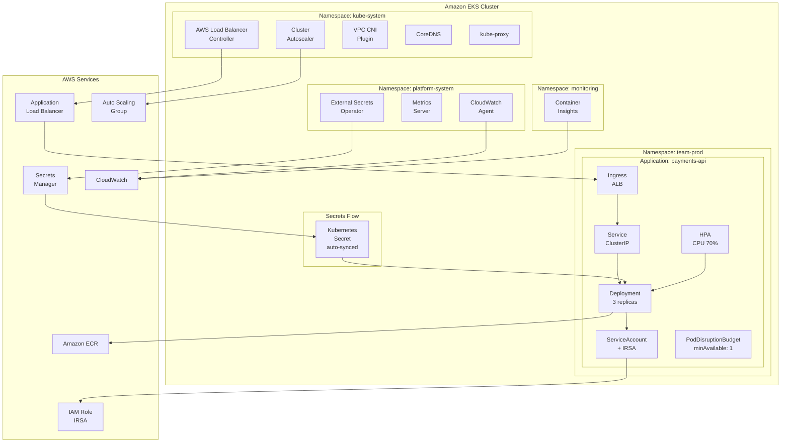

# Diagram: EKS Platform Architecture

## Overview

This diagram shows the Kubernetes platform architecture inside the EKS cluster — namespaces, platform components, application workloads, ingress, autoscaling, and secrets management.

---

## Mermaid Source

---

## Component Descriptions

| Component | Namespace | Purpose |
|---|---|---|
| AWS Load Balancer Controller | kube-system | Provisions ALB/NLB from Ingress/Service resources |
| Cluster Autoscaler | kube-system | Scales node groups based on pending pods |
| VPC CNI | kube-system | Pod networking with VPC-native IPs |
| CoreDNS | kube-system | Cluster DNS resolution |
| External Secrets Operator | platform-system | Syncs secrets from AWS Secrets Manager |
| Metrics Server | platform-system | Provides CPU/memory metrics for HPA |
| CloudWatch Agent | platform-system | Ships logs and metrics to CloudWatch |
| Container Insights | monitoring | Enhanced node/pod metrics in CloudWatch |

---

## Rendered Format

To render this diagram:
- [Mermaid Live Editor](https://mermaid.live)
- GitHub (native Mermaid rendering in `.md` files)
