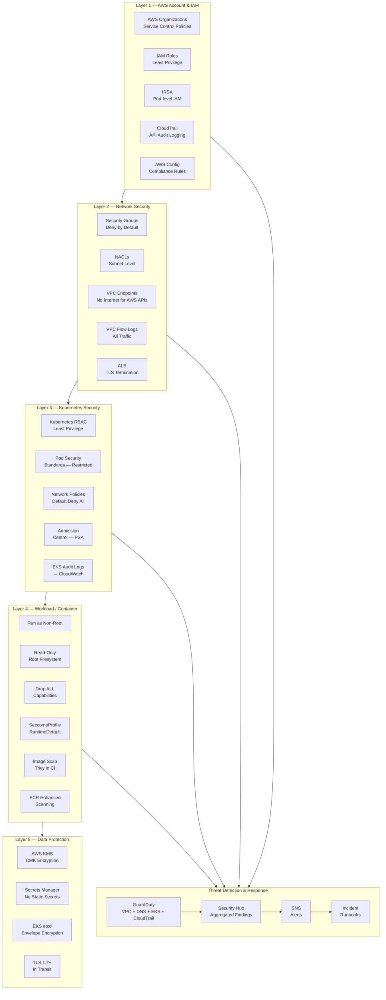
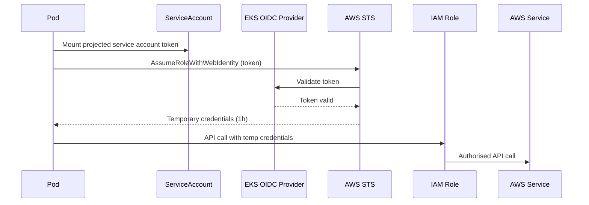

# Diagram: Security Architecture

## Overview

This diagram illustrates the layered security controls across the EKS platform — from AWS account boundary through to container runtime.

---

## Mermaid Source

---

## Security Controls by Layer

| Layer | Controls | Tools / Services |
|---|---|---|
| AWS Account | SCPs, IAM, CloudTrail | AWS Organizations, IAM, CloudTrail |
| Network | Security Groups, NACLs, VPC Endpoints, Flow Logs | VPC, AWS Network Firewall (optional) |
| Kubernetes | RBAC, PSS, Network Policies, Admission Control | EKS, Kubernetes built-in |
| Container | Non-root, read-only FS, no capabilities, seccomp | Container runtime, OCI spec |
| Data | KMS, Secrets Manager, TLS | KMS, Secrets Manager, ACM |
| Detection | GuardDuty, Security Hub, CloudTrail | GuardDuty, Security Hub |

---

## IRSA Trust Flow

---

## Rendered Format

To render: [Mermaid Live Editor](https://mermaid.live)
