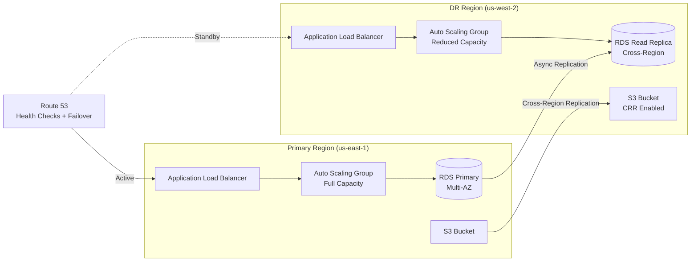
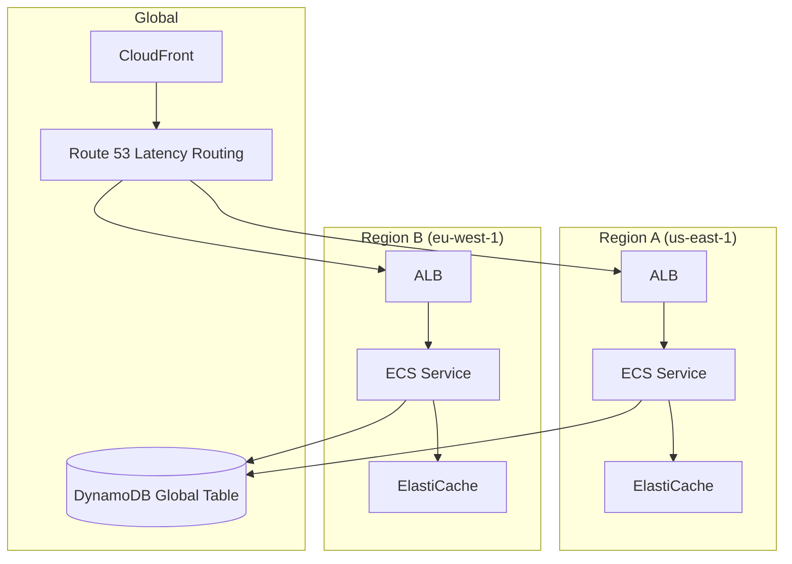

# 🔄 Disaster Recovery

> Cross-region architectures ensuring business continuity and data durability across AWS environments.

---

## Overview

Enterprise disaster recovery implementations covering multiple strategies from backup-and-restore to active-active multi-region architectures.

## DR Strategies Comparison

| Strategy | RPO | RTO | Cost | Complexity |
|----------|-----|-----|------|-----------|
| Backup & Restore | Hours | Hours | $ | Low |
| Pilot Light | Minutes | 30-60 min | $$ | Medium |
| Warm Standby | Minutes | 10-30 min | $$$ | Medium-High |
| Active-Active | Zero | Zero | $$$$ | High |

## Architecture: Warm Standby

## Architecture: Active-Active Multi-Region

## Key Components

### Route 53 Health Checks and Failover

- Active health checks on primary endpoints
- Automatic DNS failover when primary fails
- Configurable TTL for fast propagation

### Data Replication

| Data Store | Replication Method | Lag |
|-----------|-------------------|-----|
| RDS | Cross-region read replica | Seconds |
| DynamoDB | Global Tables | Milliseconds |
| S3 | Cross-Region Replication (CRR) | Minutes |
| ElastiCache | Global Datastore | Sub-second |
| EFS | Cross-Region Replication | Minutes |

### AWS Backup

- Centralized backup policies across accounts
- Cross-region copy rules for critical workloads
- Point-in-time recovery for databases
- Vault lock for compliance (WORM)

## Design Decisions

| Decision | Choice | Rationale |
|----------|--------|-----------|
| DR region selection | us-west-2 | Geographic diversity, full service availability |
| RDS replication | Cross-region read replica | Async with minimal performance impact on primary |
| Failover automation | Route 53 health checks | Native integration, no custom logic needed |
| Infrastructure DR | Terraform + CI/CD | Rebuild from code rather than replicate infrastructure |

## Testing Strategy

| Test Type | Frequency | Scope |
|-----------|-----------|-------|
| Backup restore validation | Weekly (automated) | Individual resources |
| Component failover | Monthly | Single service failover |
| Full DR exercise | Quarterly | Complete region failover |
| Chaos engineering | Ongoing | Random failure injection |

---

➡️ [Back to AWS Projects](../) | [Back to Portfolio](../../)
