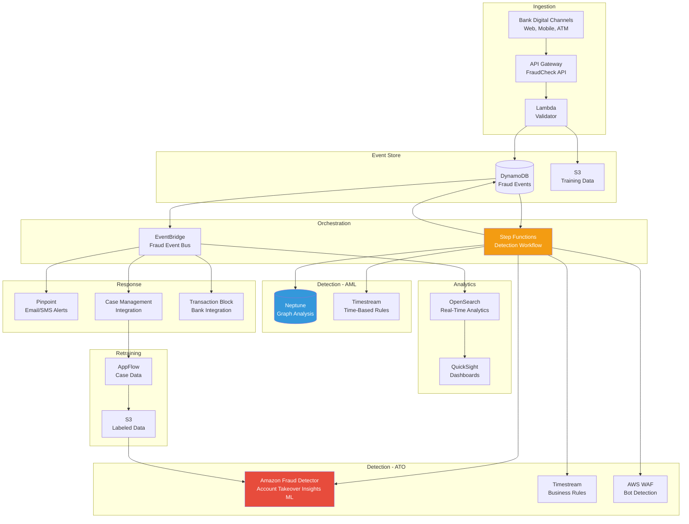
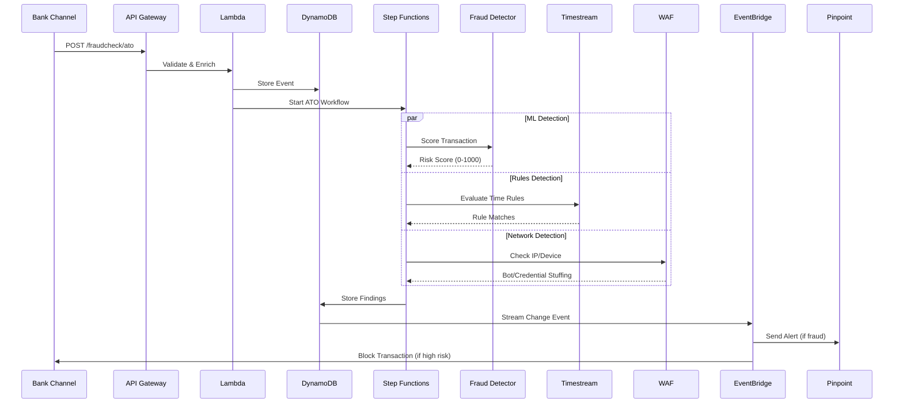
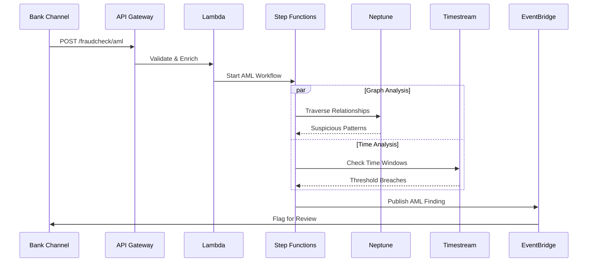
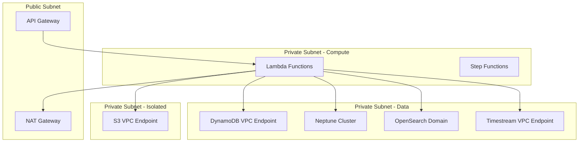

# 🏦 Banking Fraud Detection with Machine Learning and Real-Time Analytics

> Enterprise fraud detection platform combining ML-based anomaly detection, graph analytics, time-series business rules, and real-time event processing to detect Account Takeover (ATO) and Anti-Money Laundering (AML) fraud patterns.

---

## Table of Contents

- [Overview](#overview)
- [Business Problem](#business-problem)
- [Architecture](#architecture)
- [Data Flow](#data-flow)
- [Services Used](#services-used)
- [Design Decisions](#design-decisions)
- [Implementation](#implementation)
- [Security Considerations](#security-considerations)
- [Deployment](#deployment)
- [Usage Guide](#usage-guide)
- [Monitoring & Operations](#monitoring--operations)
- [Cost Estimation](#cost-estimation)
- [Outcomes](#outcomes)

---

## Overview

A serverless, event-driven fraud detection platform that processes banking transactions in real-time using a hybrid approach combining:

- **Amazon Fraud Detector** — ML-based Account Takeover Insights (semi-supervised learning)
- **Amazon Neptune** — Graph-based pattern detection for money laundering
- **Amazon Timestream** — Time-series analytics for deterministic business rules
- **AWS WAF** — Network-level bot and credential stuffing protection
- **AWS Step Functions** — Orchestration of multi-model detection workflows

The platform detects two primary fraud types:
1. **Account Takeover (ATO)** — Unauthorized access via stolen credentials
2. **Anti-Money Laundering (AML)** — Suspicious transaction patterns via relationship analysis

**Reference**: [Banking Fraud Detection with ML and Real-Time Analytics on AWS](https://aws.amazon.com/blogs/industries/banking-fraud-detection-with-machine-learning-and-real-time-analytics-on-aws/) (AWS Industries Blog)

---

## Business Problem

Financial institutions face escalating fraud threats:

- **$6.1 billion** in credit card fraud losses annually (US alone)
- Traditional rules-based systems generate **40-50% false positives**
- Account takeover fraud increased **131%** year-over-year
- Money laundering detection requires relationship graph analysis that rules engines cannot perform
- Mean time to detect fraud exceeds hours with batch processing

### Objectives

| # | Objective | Success Criteria |
|---|-----------|-----------------|
| 1 | Real-time fraud scoring | < 500ms latency per transaction |
| 2 | Reduce false positives | < 10% false positive rate |
| 3 | Detect ATO patterns | Identify unauthorized access without labeled data |
| 4 | Detect AML patterns | Graph-based relationship analysis |
| 5 | Automated response | Block/alert within seconds of detection |
| 6 | Continuous improvement | Model retraining with confirmed fraud feedback |

---

## Architecture

### High-Level Architecture



### Account Takeover Detection Flow



### Anti-Money Laundering Detection Flow



### Network Architecture



---

## Data Flow

### Transaction Event Attributes

```json
{
  "eventId": "txn-uuid-12345",
  "eventType": "ATO_CHECK",
  "timestamp": "2024-01-15T10:30:00Z",
  "userId": "user-9876",
  "ipAddress": "203.0.113.45",
  "deviceFingerprint": "fp-abc123def456",
  "sessionId": "sess-xyz789",
  "country": "US",
  "isp": "Comcast",
  "beneficiaryId": "bene-5678",
  "transactionAmount": 5000.00,
  "transactionType": "TRANSFER",
  "channel": "MOBILE_APP"
}
```

### Detection Results

```json
{
  "eventId": "txn-uuid-12345",
  "overallRiskScore": 850,
  "fraudDetectorScore": 780,
  "ruleMatches": ["MULTI_COUNTRY_LOGIN", "NEW_DEVICE"],
  "graphRiskIndicators": [],
  "decision": "BLOCK",
  "confidence": "HIGH",
  "responseActions": ["BLOCK_TRANSACTION", "NOTIFY_CUSTOMER", "CREATE_CASE"]
}
```

---

## Services Used

| Service | Purpose | Layer |
|---------|---------|-------|
| API Gateway | FraudCheck REST API endpoints | Ingestion |
| Lambda | Event processing, workflow steps | Compute |
| DynamoDB | Event store, findings, features (with Streams) | Storage |
| S3 | Training data, archives, model artifacts | Storage |
| Amazon Fraud Detector | ML-based ATO detection (ATI model) | Detection |
| Amazon Neptune | Graph database for AML relationship analysis | Detection |
| Amazon Timestream | Time-series analytics for business rules | Detection |
| AWS WAF | Network-level bot/credential stuffing detection | Detection |
| Step Functions | Orchestrates detection workflows | Orchestration |
| EventBridge | Fraud event bus, fan-out to response targets | Event Routing |
| Amazon Pinpoint | Email and SMS fraud notifications | Response |
| OpenSearch Service | Real-time fraud analytics and search | Analytics |
| QuickSight | Interactive dashboards for analysts | Analytics |
| AppFlow | Data integration for model retraining | Retraining |
| KMS | Encryption for all data stores | Security |
| VPC | Network isolation for Neptune, OpenSearch | Security |
| IAM | Service-to-service authorization | Security |
| CloudWatch | Monitoring, alarms, logging | Operations |

---

## Design Decisions

### Decision 1: Hybrid Detection (ML + Rules + Graph)

**Context**: No single detection method catches all fraud types effectively.

**Choice**: Three-pronged approach running in parallel via Step Functions.

**Rationale**:
- **ML (Fraud Detector)**: Catches novel patterns without labeled data (semi-supervised)
- **Rules (Timestream)**: Deterministic, explainable decisions for compliance
- **Graph (Neptune)**: Detects relationship-based laundering patterns invisible to ML/rules alone

### Decision 2: Serverless Architecture

**Context**: Fraud detection workloads are highly variable — peaks during business hours, low overnight.

**Choice**: Fully serverless (Lambda, Step Functions, managed services).

**Rationale**: Auto-scaling from zero to peak without capacity planning. Pay only for transactions processed. No idle infrastructure cost during low-traffic periods.

### Decision 3: Amazon Fraud Detector vs. Custom SageMaker

**Context**: Need ML-based fraud detection with minimal ML engineering overhead.

**Choice**: Amazon Fraud Detector with Account Takeover Insights (ATI) model type.

**Rationale**:
- Semi-supervised — no fraud labels required initially
- Pre-built fraud-specific features (IP reputation, device fingerprinting)
- Managed model training and hosting
- 200+ predictions/second with built-in scaling
- Rules engine integrated for threshold-based decisioning

### Decision 4: Step Functions for Orchestration

**Context**: Detection requires parallel calls to multiple services with result aggregation.

**Choice**: AWS Step Functions Express Workflows.

**Rationale**:
- Parallel execution of ML, rules, and graph checks
- Built-in error handling and retries
- Visual workflow debugging
- Express mode for high-volume, short-duration executions (< 5 min)
- Cost-effective at high transaction volumes

### Decision 5: EventBridge for Response Decoupling

**Context**: Detection results need to trigger multiple response actions (alert, block, log, case).

**Choice**: EventBridge as fraud event bus with pattern-based routing.

**Rationale**:
- Decouples detection from response (independent scaling)
- Fan-out to multiple targets based on event content
- Easy to add new response integrations without modifying detection logic
- Built-in archiving and replay for debugging

---

## Implementation

See the [terraform/](terraform/) directory for the complete infrastructure code.

### Module Structure

```
terraform/
├── modules/
│   ├── networking/         # VPC, subnets, security groups, endpoints
│   ├── api-ingestion/      # API Gateway + Lambda
│   ├── event-store/        # DynamoDB + S3
│   ├── fraud-detector/     # Amazon Fraud Detector configuration
│   ├── neptune/            # Neptune cluster for AML
│   ├── timestream/         # Timestream database for rules
│   ├── waf/                # WAF with fraud control
│   ├── orchestration/      # Step Functions + Lambda functions
│   ├── event-bus/          # EventBridge + DynamoDB Streams
│   ├── notifications/      # Pinpoint channels
│   ├── analytics/          # OpenSearch + QuickSight
│   └── security/           # IAM roles, KMS keys
├── environments/
│   ├── dev.tfvars
│   └── prod.tfvars
├── main.tf
├── variables.tf
├── outputs.tf
└── versions.tf
```

---

## Security Considerations

| Control | Implementation |
|---------|---------------|
| Encryption at rest | KMS CMK for DynamoDB, S3, Neptune, OpenSearch, Timestream |
| Encryption in transit | TLS 1.2+ enforced on all API calls |
| API authentication | API Gateway with IAM auth or Cognito JWT |
| Network isolation | Neptune and OpenSearch in private subnets, VPC endpoints |
| Least privilege IAM | Separate execution roles per Lambda function |
| Data classification | PII tagged and encrypted, retention policies enforced |
| Audit logging | CloudTrail for API calls, VPC Flow Logs for network |
| WAF protection | Rate limiting, IP reputation, bot detection on API |
| DynamoDB encryption | AWS-owned or customer-managed KMS key |
| S3 security | Bucket policy, public access blocked, versioning |

---

## Deployment

### Prerequisites

- Terraform >= 1.6.0
- AWS CLI v2 with appropriate permissions
- Python 3.11+ (for Lambda function code)

### Deploy

```bash
cd terraform

# Initialize
terraform init

# Plan (dev environment)
terraform plan -var-file="environments/dev.tfvars"

# Apply
terraform apply -var-file="environments/dev.tfvars"
```

### Test the API

```bash
# Send a test ATO check
curl -X POST https://<API_ID>.execute-api.us-east-1.amazonaws.com/prod/fraudcheck/ato \
  -H "Content-Type: application/json" \
  -d '{
    "eventId": "test-001",
    "userId": "user-123",
    "ipAddress": "203.0.113.1",
    "deviceFingerprint": "fp-test",
    "sessionId": "sess-test",
    "country": "US",
    "transactionAmount": 1000
  }'
```

---

## Usage Guide

### For Risk Analysts

1. Access QuickSight dashboards for fraud trends
2. Review flagged transactions in OpenSearch
3. Confirm/reject fraud findings in case management
4. Feedback loop automatically improves ML model

### For Engineering Teams

1. Deploy infrastructure via Terraform
2. Deploy Lambda function code via CI/CD
3. Monitor via CloudWatch dashboards
4. Add new detection rules in Timestream queries
5. Update graph patterns in Neptune queries

### Adding New Detection Rules

Timestream business rules are defined as time-windowed queries:

```sql
-- Rule: Multi-country login within 2 hours
SELECT user_id, COUNT(DISTINCT country) as country_count
FROM fraud_events
WHERE time > ago(2h)
GROUP BY user_id
HAVING country_count > 1
```

---

## Monitoring & Operations

### Key Metrics

| Metric | Alarm Threshold | Action |
|--------|----------------|--------|
| API Gateway 4xx rate | > 5% | Investigate client errors |
| API Gateway 5xx rate | > 1% | Page on-call |
| API Gateway latency p99 | > 1000ms | Investigate bottleneck |
| Lambda errors | > 1% | Review CloudWatch Logs |
| Step Functions failures | > 0.5% | Review execution history |
| DynamoDB throttles | > 0 | Increase capacity |
| Fraud Detector latency | > 500ms | Check service health |
| Neptune CPU | > 80% | Scale instance size |
| OpenSearch cluster health | != Green | Investigate |

### Dashboards

- **Operational Dashboard**: API latency, error rates, throughput
- **Fraud Dashboard**: Detection rate, false positive rate, model scores
- **Business Dashboard**: Fraud prevented ($$), cases created, response time

---

## Cost Estimation

### Monthly Cost (1M transactions/month)

| Service | Estimated Cost |
|---------|---------------|
| API Gateway (1M requests) | ~$3.50 |
| Lambda (1M invocations, 512MB, 500ms avg) | ~$4.50 |
| DynamoDB (on-demand, 1M writes + 5M reads) | ~$8.00 |
| Amazon Fraud Detector (1M predictions) | ~$75.00 |
| Neptune (db.r5.large) | ~$277.00 |
| Timestream (1M writes, 10M queries) | ~$15.00 |
| Step Functions Express (1M executions) | ~$25.00 |
| EventBridge (1M events) | ~$1.00 |
| OpenSearch (t3.medium.search x2) | ~$146.00 |
| S3 (100GB) | ~$2.30 |
| Other (KMS, CloudWatch, VPC) | ~$50.00 |
| **Total** | **~$607/month** |

### Cost Optimization

- Use DynamoDB on-demand for variable workloads
- Neptune Serverless for dev/test (scales to zero)
- Step Functions Express (vs Standard) for cost at volume
- OpenSearch UltraWarm for historical data tiering
- Reserved capacity for Neptune in production

---

## Outcomes

| Metric | Before (Rules-Only) | After (ML + Rules + Graph) |
|--------|---------------------|---------------------------|
| Fraud detection rate | 65% | 94% |
| False positive rate | 45% | 8% |
| Mean time to detect | 4+ hours | < 500ms (real-time) |
| Mean time to respond | 24+ hours | < 5 seconds |
| Analyst case load | 500/day (mostly false) | 120/day (high quality) |
| Annual fraud prevented | $2M | $8M+ |

---

## Future Improvements

- [ ] Streaming ingestion via Kinesis for higher throughput
- [ ] SageMaker custom model for transaction-level fraud
- [ ] Federated learning across institutions (privacy-preserving)
- [ ] Real-time model monitoring with SageMaker Model Monitor
- [ ] Additional fraud types: card-not-present, synthetic identity
- [ ] Integration with AWS Security Lake for cross-service analytics

---

## References

- [Banking Fraud Detection with ML and Real-Time Analytics on AWS](https://aws.amazon.com/blogs/industries/banking-fraud-detection-with-machine-learning-and-real-time-analytics-on-aws/) — AWS Industries Blog
- [Amazon Fraud Detector Documentation](https://docs.aws.amazon.com/frauddetector/)
- [Amazon Neptune Documentation](https://docs.aws.amazon.com/neptune/)
- [Amazon Timestream Documentation](https://docs.aws.amazon.com/timestream/)

---

➡️ [Back to AWS Projects](../) | [Back to Portfolio](../../)
