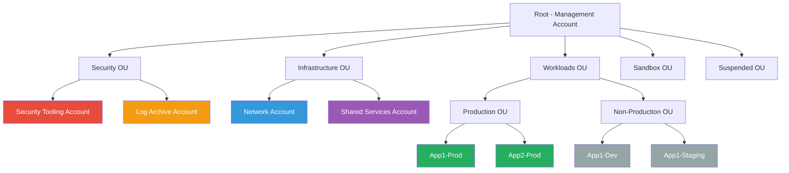
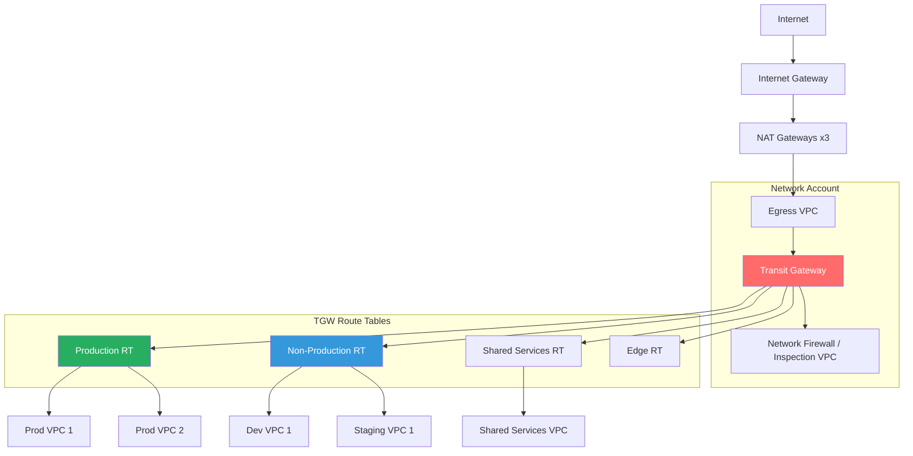
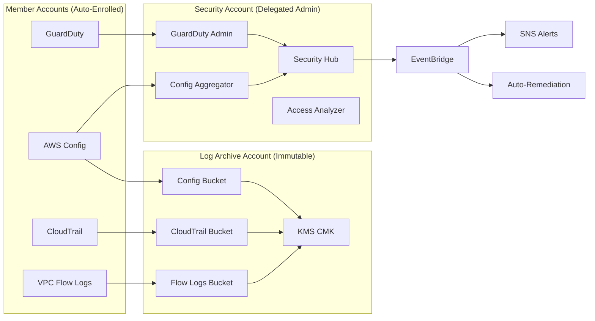
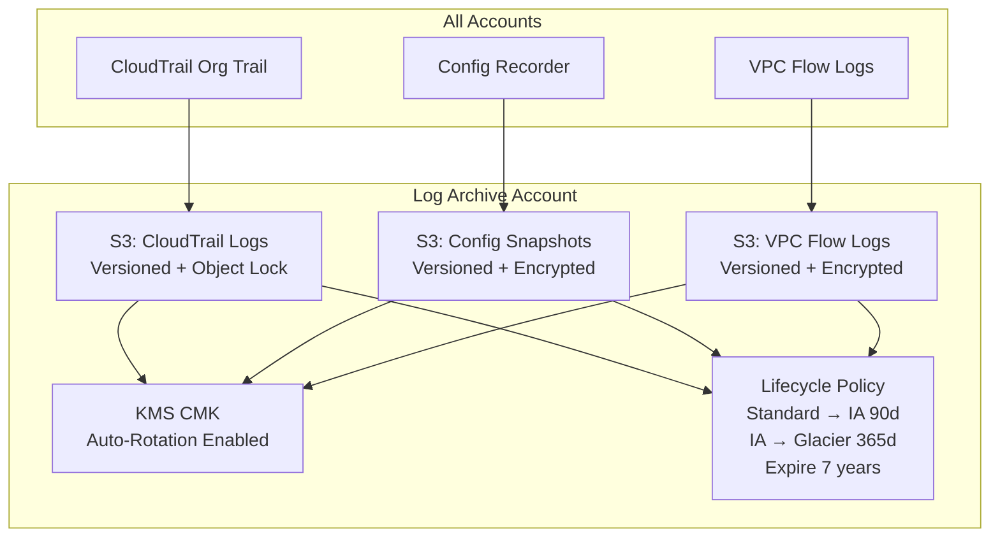

# 🏗️ AWS Landing Zone

> Enterprise multi-account AWS environment implementing the AWS Security Reference Architecture with full governance, security baseline, centralized logging, and network segmentation.

---

## Table of Contents

- [Overview](#overview)
- [Business Problem](#business-problem)
- [Objectives](#objectives)
- [Architecture](#architecture)
- [Services Used](#services-used)
- [Design Decisions](#design-decisions)
- [Implementation](#implementation)
- [Security Considerations](#security-considerations)
- [Challenges](#challenges)
- [Lessons Learned](#lessons-learned)
- [Outcomes](#outcomes)

---

## Overview

A production-ready, modular Terraform framework for deploying an AWS multi-account Landing Zone. The architecture provides workload isolation, centralized security monitoring, immutable logging, and network segmentation through a hub-and-spoke Transit Gateway topology.

**Scale**: 15+ AWS accounts across 6 organizational units
**IaC**: Terraform with layered state management
**CI/CD**: GitHub Actions with OIDC authentication

## Business Problem

Organizations scaling to multiple teams and workloads on AWS face:

- **Blast radius risk** — a misconfiguration in one workload affects others
- **Security visibility gaps** — no centralized view of threats across accounts
- **Compliance drift** — inconsistent security posture across environments
- **Network complexity** — ad-hoc connectivity patterns that don't scale
- **Access management** — proliferation of IAM users and long-lived credentials

## Objectives

| # | Objective | Success Criteria |
|---|-----------|-----------------|
| 1 | Workload isolation | Each team operates in dedicated accounts with SCP guardrails |
| 2 | Centralized security | All accounts enrolled in GuardDuty, SecurityHub, Config within 24h of creation |
| 3 | Immutable audit trail | CloudTrail logs encrypted, versioned, with Object Lock |
| 4 | Network segmentation | Production cannot reach non-production; all traffic inspectable |
| 5 | Automated provisioning | New accounts fully baselined within 30 minutes |
| 6 | Zero long-lived credentials | All human access via IAM Identity Center with MFA |

## Architecture

### Organization Structure

### Network Architecture

### Security Services Flow

### Logging Architecture

## Services Used

| Service | Purpose | Account |
|---------|---------|---------|
| AWS Organizations | Account management, OUs, SCPs | Management |
| IAM Identity Center | Centralized human access (SSO) | Management |
| GuardDuty | Threat detection (org-wide) | Security (delegated) |
| Security Hub | CSPM, finding aggregation | Security (delegated) |
| AWS Config | Configuration compliance | Security (aggregator) + All |
| CloudTrail | API audit logging (org trail) | Management → Log Archive |
| Transit Gateway | Network hub-and-spoke | Network |
| VPC | Network isolation per workload | All workload accounts |
| S3 | Centralized log storage | Log Archive |
| KMS | Encryption key management | Log Archive + All |
| RAM | Resource sharing (TGW) | Network → Organization |
| EventBridge | Security event routing | Security |

## Design Decisions

### Decision 1: Multi-Account Per Workload

**Context**: Needed isolation between teams and environments.

**Choice**: Dedicated AWS account per workload per environment.

**Rationale**: Accounts provide the strongest isolation boundary in AWS — independent IAM namespaces, service quotas, blast radius containment, and clear cost attribution.

### Decision 2: Layered Terraform Architecture

**Context**: Infrastructure spans multiple accounts with interdependencies.

**Choice**: 7 numbered layers with separate state files, deployed in order.

**Rationale**: Small blast radius per state file, clear dependency chain, independent team ownership of layers, faster plan/apply cycles.

### Decision 3: Centralized Egress

**Context**: Workload VPCs need internet access for updates, APIs, etc.

**Choice**: Single egress VPC in Network account with shared NAT Gateways.

**Rationale**: Cost reduction (shared NAT vs per-VPC NAT), single inspection point for outbound traffic, centralized egress IP management for allowlisting.

### Decision 4: Delegated Administrator Pattern

**Context**: Security services need org-wide visibility without using the management account.

**Choice**: Security account as delegated administrator for GuardDuty, SecurityHub, Config, Inspector.

**Rationale**: Separation of duties — management account remains minimal, security team operates independently in their dedicated account.

### Decision 5: GitHub OIDC for CI/CD

**Context**: Pipeline needs AWS access without storing long-lived credentials.

**Choice**: GitHub Actions OIDC provider with short-lived role assumption.

**Rationale**: No secret rotation needed, scoped to specific repos/branches, full CloudTrail audit trail, industry best practice.

## Implementation

### Deployment Layers

| Layer | Target Account | Resources |
|-------|---------------|-----------|
| 00-bootstrap | Management | S3 state bucket, DynamoDB locks, KMS, OIDC |
| 01-organization | Management | AWS Org, OUs, accounts, SCPs |
| 02-security | Security | GuardDuty, SecurityHub, Config aggregator |
| 03-logging | Log Archive | CloudTrail, S3 buckets, KMS key |
| 04-networking | Network | Transit Gateway, egress VPC, shared VPC |
| 05-identity | Management | IAM Identity Center, permission sets |
| 06-workloads | Each Workload | VPC, security baseline, Config, TGW attachment |

### Technology Stack

- **IaC**: Terraform >= 1.6 with reusable modules
- **CI/CD**: GitHub Actions (plan on PR, apply on merge)
- **Authentication**: OIDC (no stored credentials)
- **State**: S3 + DynamoDB with KMS encryption
- **Security Scanning**: tfsec, checkov

## Security Considerations

| Control Type | Implementation |
|-------------|---------------|
| **Preventive** | SCPs deny root usage, deny region, deny leave org, deny disable security services |
| **Detective** | GuardDuty threat detection, Config compliance rules, Security Hub standards |
| **Encryption** | KMS CMK for all logs, EBS default encryption, S3 SSE-KMS |
| **Access** | IAM Identity Center with MFA, no long-lived credentials, least privilege |
| **Network** | TGW route table segmentation, no public subnets in prod, centralized inspection |
| **Immutability** | S3 versioning, bucket policies deny deletion, SCPs protect log buckets |

## Challenges

| Challenge | Root Cause | Resolution |
|-----------|-----------|-----------|
| Cross-account provider management | Terraform needs credentials for 10+ accounts | Assume role chain from management account |
| SCP testing without lockout | Overly restrictive SCP can block all access | Test in sandbox OU first, exempt TF role from SCPs |
| Circular dependency between layers | Logging needs accounts, accounts need logging | Bootstrap with minimal config, then apply full baseline |
| GuardDuty auto-enrollment timing | New accounts not immediately enrolled | Organization configuration with auto-enable ALL |

## Lessons Learned

1. **Start with SCPs conservative** — It's easier to add restrictions than to recover from a lockout.

2. **SSM Parameter Store for cross-layer references** — Remote state data sources create tight coupling; SSM provides loose coupling between layers.

3. **Separate delegated admin setup from service config** — Running in management account vs. security account requires different provider configurations.

4. **Test the full account vending flow end-to-end** — Individual layers may work in isolation but fail in sequence.

5. **Document the break-glass procedure** — When SSO is down, you need a tested path to the management account.

## Outcomes

| Metric | Before | After |
|--------|--------|-------|
| Time to provision new account | 2-3 days (manual) | 30 minutes (automated) |
| Security baseline coverage | 60% of accounts | 100% of accounts |
| Mean time to detect threats | Days | Minutes (GuardDuty) |
| Compliance posture visibility | Manual audits quarterly | Continuous (Security Hub) |
| Long-lived credentials | 50+ IAM users | Zero (Identity Center only) |
| Network segmentation | None (flat network) | Full (TGW route tables) |

## Future Improvements

- [ ] AWS Control Tower integration for account factory
- [ ] Network Firewall for east-west inspection
- [ ] AWS Security Lake for OCSF-normalized log analytics
- [ ] Automated remediation Lambda for common Security Hub findings
- [ ] Terraform Cloud private registry for module governance
- [ ] Service Catalog for developer self-service

---

## Repository

The full Terraform implementation is available in the [`landing-zone/`](./) directory with:
- 10 reusable modules
- 7 deployment layers
- 3 GitHub Actions workflows
- 4 Service Control Policies
- Complete documentation suite

➡️ [Back to AWS Projects](../) | [Back to Portfolio](../../)
