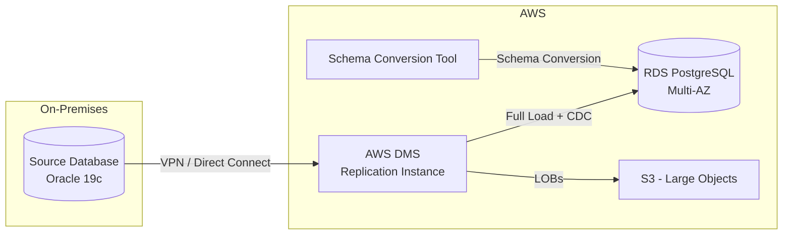

# 🚀 RDS Database Migration

> Enterprise database migration from on-premises to AWS RDS using DMS with minimal downtime.

---

## Overview

Migration of production databases from on-premises Oracle/SQL Server to AWS RDS PostgreSQL, achieving near-zero downtime through continuous replication.

## Architecture

## Migration Phases

| Phase | Activity | Duration |
|-------|----------|----------|
| Assessment | SCT assessment report, dependency mapping | 2 weeks |
| Schema conversion | Oracle → PostgreSQL DDL conversion | 1 week |
| Full load | Initial data migration with DMS | 12-48 hours |
| CDC replication | Continuous replication (catch-up) | 1-2 weeks |
| Validation | Row counts, checksums, app testing | 1 week |
| Cutover | Stop writes, final sync, switch connection | 30 min |

## Services Used

| Service | Purpose |
|---------|---------|
| DMS | Data replication (full load + CDC) |
| SCT | Schema conversion and assessment |
| RDS PostgreSQL | Target database (Multi-AZ) |
| Direct Connect | Low-latency on-prem connectivity |
| CloudWatch | Replication monitoring and alerting |
| Secrets Manager | Database credential management |

---

➡️ [Back to Migrations](../) | [Back to AWS](../../)
