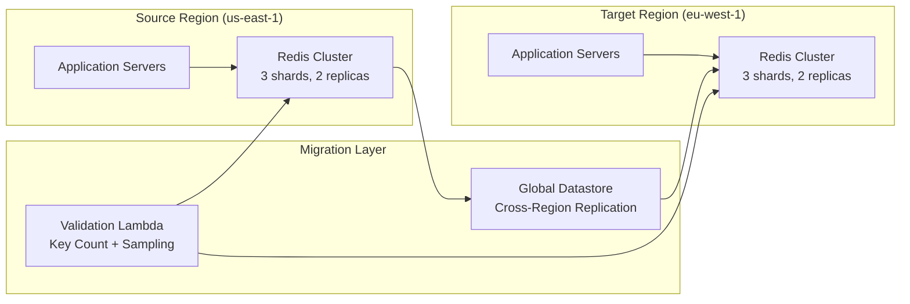

# 🚀 Redis Cross-Region Migration

> Zero-downtime ElastiCache Redis migration between AWS regions with data validation and automated cutover.

---

## Overview

Migration of a multi-TB Redis cluster from one AWS region to another with zero data loss and minimal downtime, supporting high-throughput production workloads.

## Business Problem

- Primary Redis cluster in a legacy region with limited capacity
- Growing latency for users in other geographies
- Need to consolidate into the primary landing zone region
- Zero tolerance for data loss during migration

## Architecture

## Migration Strategy

| Phase | Duration | Description |
|-------|----------|-------------|
| 1. Setup Global Datastore | 2 hours | Enable cross-region replication |
| 2. Sync and Validate | 24-48 hours | Full sync + continuous validation |
| 3. Application Cutover | 5 minutes | DNS switch + connection pool update |
| 4. Cleanup | 1 hour | Demote source, remove Global Datastore |

## Services Used

| Service | Purpose |
|---------|---------|
| ElastiCache (Redis 7.x) | Source and target clusters |
| Global Datastore | Cross-region async replication |
| Lambda | Data validation, key sampling |
| CloudWatch | Replication lag monitoring |
| Route 53 | DNS-based cutover |
| EventBridge | Automation orchestration |

## Outcomes

| Metric | Result |
|--------|--------|
| Data loss | Zero |
| Downtime | < 30 seconds (DNS propagation) |
| Data volume migrated | 2.3 TB |
| Validation accuracy | 100% key match |

---

➡️ [Back to Migrations](../) | [Back to AWS](../../)
