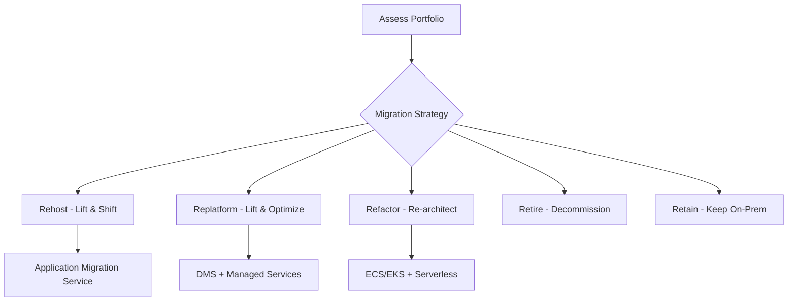

# 🚀 Workload Migration

> Multi-account workload migration using AWS Migration Hub, Application Migration Service, and replatforming strategies.

---

## Overview

Large-scale application migration from legacy infrastructure to AWS Landing Zone accounts, following the AWS Migration Acceleration Program (MAP) methodology.

## Migration Strategy (7 Rs)

## Services Used

| Service | Purpose |
|---------|---------|
| Migration Hub | Central tracking and orchestration |
| Application Migration Service | Server replication (rehost) |
| DMS | Database migration |
| CloudEndure | Block-level replication |
| Transfer Family | File transfer automation |

---

➡️ [Back to Migrations](../) | [Back to AWS](../../)
