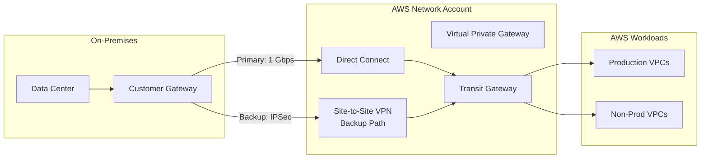

# 🌐 Hybrid Connectivity

> Secure connectivity between AWS and on-premises data centers using VPN and Direct Connect.

---

## Architecture

## Connectivity Options

| Option | Bandwidth | Latency | Encryption | Cost |
|--------|-----------|---------|-----------|------|
| Direct Connect | 1-100 Gbps | Low (dedicated) | MACsec | $$$$ |
| Site-to-Site VPN | Up to 1.25 Gbps | Variable | IPSec | $ |
| DX + VPN (encrypted) | 1-100 Gbps | Low | IPSec over DX | $$$$$ |

---

➡️ [Back to Networking](../) | [Back to AWS](../../)
