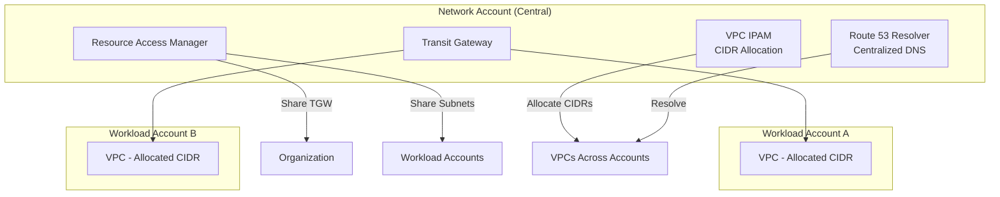

# 🌐 Multi-Account Networking

> Scalable network architecture using RAM, IPAM, and shared resources across AWS accounts.

---

## Architecture

## Key Components

| Component | Purpose | Benefit |
|-----------|---------|---------|
| VPC IPAM | Centralized CIDR management | No IP conflicts, automated allocation |
| RAM | Share TGW and subnets | Workloads attach without network team intervention |
| Route 53 Resolver | Centralized DNS resolution | Consistent name resolution across accounts |
| Network Firewall | Centralized traffic inspection | Single pane for security monitoring |

---

➡️ [Back to Networking](../) | [Back to AWS](../../)
