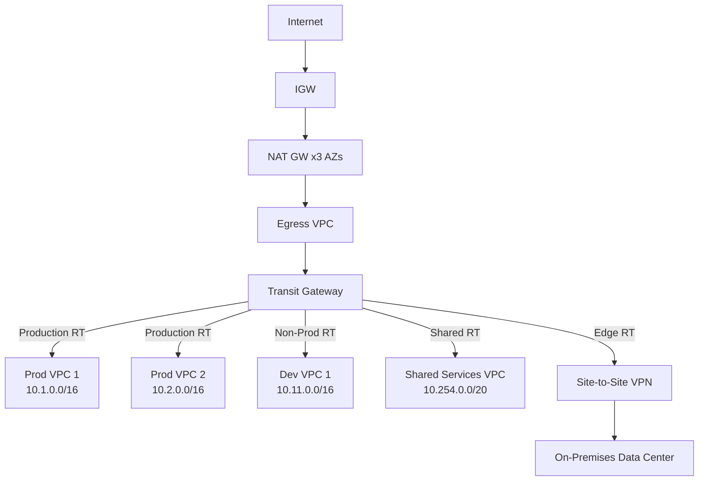

# 🌐 Transit Gateway - Hub and Spoke Network

> Centralized network architecture connecting multiple AWS accounts with traffic segmentation and centralized egress.

---

## Architecture

## Route Table Segmentation

| Route Table | Associated VPCs | Can Reach | Cannot Reach |
|------------|-----------------|-----------|--------------|
| Production | Prod workloads | Shared Services, Egress | Non-Production |
| Non-Production | Dev, Staging | Shared Services, Egress | Production |
| Shared Services | Shared VPC | All workloads | Direct internet |
| Edge | Egress VPC, VPN | All (routes to workloads) | N/A |

## Key Design Decisions

- **Centralized NAT**: Shared egress reduces cost and provides single inspection point
- **Route table isolation**: Production and non-production cannot communicate
- **RAM sharing**: TGW shared with entire organization via Resource Access Manager
- **Auto-accept**: New VPC attachments automatically accepted

---

➡️ [Back to Networking](../) | [Back to AWS](../../)
