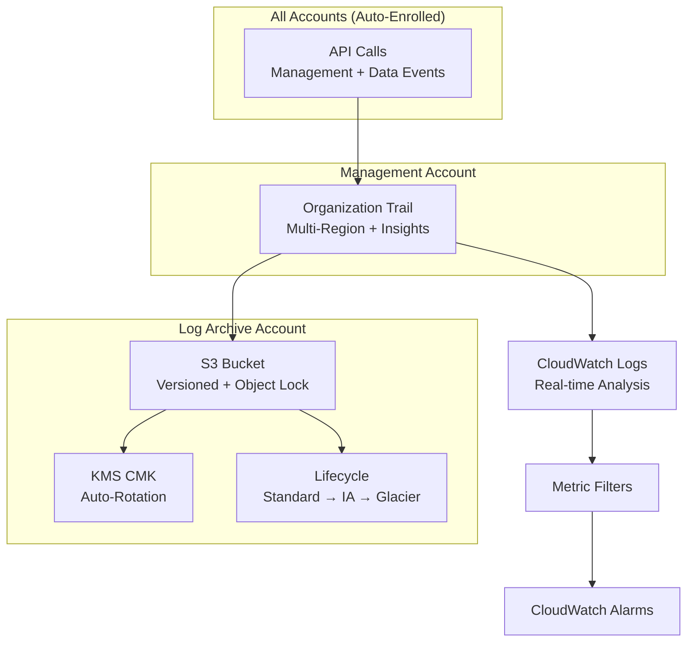

# 🔐 AWS CloudTrail - Organization Audit Trail

> Immutable, encrypted audit logging across all accounts and regions.

## Architecture

## Key Controls

- **Log file validation**: Digest files for tamper detection
- **KMS encryption**: Customer-managed key with restricted policy
- **S3 Object Lock**: WORM compliance (governance mode)
- **Bucket policy**: Deny deletion, require SSL
- **SCP protection**: Deny trail modification in member accounts
- **Multi-region**: Single trail captures all regions

---

➡️ [Back to Security](../) | [Back to AWS](../../)
