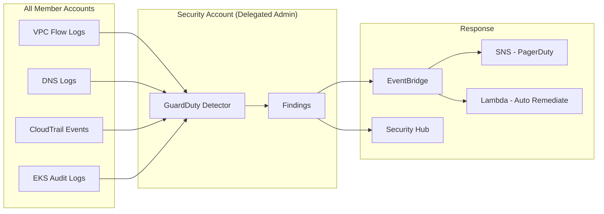

# 🔐 Amazon GuardDuty - Organization-Wide Threat Detection

> Centralized threat detection across all AWS accounts with automated response.

## Architecture

## Finding Severity Response

| Severity | Action | SLA |
|----------|--------|-----|
| Critical (8-10) | PagerDuty alert + auto-isolate | Immediate |
| High (7-8.9) | Slack alert + investigation | < 4 hours |
| Medium (4-6.9) | Ticket creation | < 24 hours |
| Low (1-3.9) | Weekly review | 1 week |

---

➡️ [Back to Security](../) | [Back to AWS](../../)
