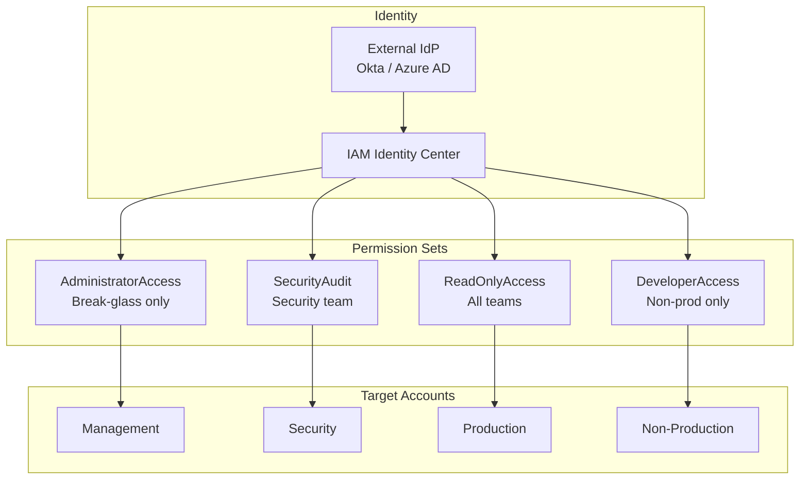

# 🔐 IAM Architecture

> Enterprise IAM design following least privilege principles with cross-account access patterns.

---

## Architecture

## Key Patterns

| Pattern | Description | Use Case |
|---------|-------------|----------|
| Permission Sets | AWS-managed + inline policies | Human access via SSO |
| Service Roles | Scoped to specific service | EC2, Lambda, ECS task roles |
| Cross-Account Roles | Trust policy + assume role | CI/CD, delegated admin |
| Permission Boundaries | Maximum permissions cap | Developer self-service |
| SCPs | Organization-level deny | Preventive guardrails |

---

➡️ [Back to Security](../) | [Back to AWS](../../)
