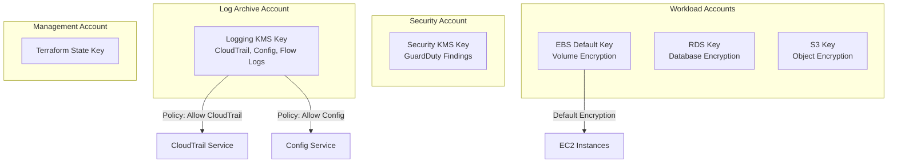

# 🔐 KMS Encryption Strategy

> Multi-account key management with cross-account sharing, automatic rotation, and key policies.

## Key Hierarchy

## Best Practices Implemented

- Automatic key rotation (annual)
- Separate keys per account and purpose
- Key policies with explicit principal grants
- Alias-based key references (not ARN)
- CloudTrail logging of all key usage
- Deletion protection (30-day window)

---

➡️ [Back to Security](../) | [Back to AWS](../../)
