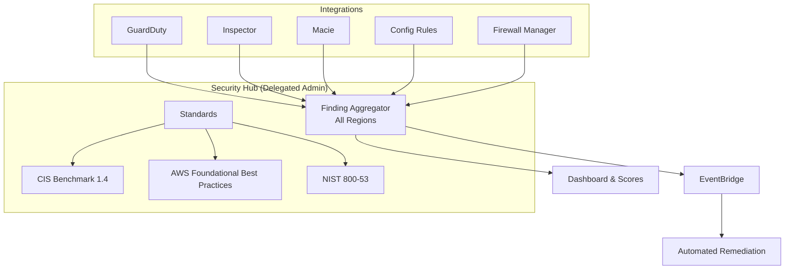

# 🔐 AWS Security Hub

> Cloud Security Posture Management with compliance frameworks and finding aggregation.

## Architecture

## Compliance Coverage

| Standard | Controls | Auto-Remediation |
|----------|----------|-----------------|
| AWS Foundational | 200+ | Partial (high-impact) |
| CIS 1.4 | 50+ | Partial |
| NIST 800-53 | 150+ | Planned |

---

➡️ [Back to Security](../) | [Back to AWS](../../)
