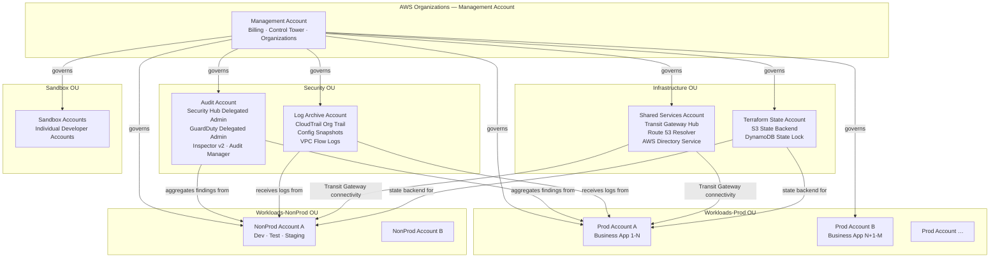

# Target Architecture Overview

**Document:** 01  
**Programme:** XYZ Corporation AWS Cloud Transformation  
**Version:** 1.0  
**Status:** Approved for Programme Use  
**Related Documents:** [00-master-index.md](00-master-index.md) | [02-security-governance-design.md](02-security-governance-design.md) | [03-platform-iac-design.md](03-platform-iac-design.md) | [04-reliability-dr-design.md](04-reliability-dr-design.md) | [05-finops-design.md](05-finops-design.md) | [06-adr-catalog.md](06-adr-catalog.md)

---

## Table of Contents

1. [Purpose and Scope](#1-purpose-and-scope)
2. [Current State Summary](#2-current-state-summary)
3. [Target State Maturity](#3-target-state-maturity)
4. [Multi-Account Strategy and OU Hierarchy](#4-multi-account-strategy-and-ou-hierarchy)
5. [Multi-Account Architecture Diagram](#5-multi-account-architecture-diagram)
6. [WAF Pillar-to-Architecture Mapping](#6-waf-pillar-to-architecture-mapping)
7. [Platform Layer](#7-platform-layer)
8. [Shared Services Account](#8-shared-services-account)
9. [Production vs. Non-Production Separation](#9-production-vs-non-production-separation)

---

## 1. Purpose and Scope

This document defines the logical structure of XYZ Corporation's future-state AWS environment. It establishes a common architectural baseline for all stakeholders participating in the transformation programme — spanning Principal Architects, Security, Platform Engineering, Reliability, FinOps, and executive sponsors.

The document covers:

- The current-state WAF maturity assessment that justifies the transformation investment
- The target-state maturity levels the programme commits to achieving within 12–18 months
- The multi-account strategy and AWS Organisational Unit (OU) hierarchy that governs the entire estate
- The logical architecture diagram depicting account structure, OU boundaries, shared services flows, and inter-account connectivity
- The mapping of all six AWS Well-Architected Framework (WAF) pillars to their architectural responses and primary AWS services
- The Platform Layer as the provisioning and governance backbone of the target state
- The Shared Services account pattern for centralised networking, DNS, directory, and VPC endpoint services
- The production and non-production separation model enforced via OU-level Service Control Policies (SCPs)

**Out of scope for this document:** Security controls detail (see [02-security-governance-design.md](02-security-governance-design.md)), IaC pipeline implementation (see [03-platform-iac-design.md](03-platform-iac-design.md)), DR patterns (see [04-reliability-dr-design.md](04-reliability-dr-design.md)), FinOps operating model (see [05-finops-design.md](05-finops-design.md)), and architecture decision rationale (see [06-adr-catalog.md](06-adr-catalog.md)).

No Terraform code, CloudFormation templates, runbook steps, or CI/CD pipeline configuration files are included in this document (Requirement 7.3).

---

## 2. Current State Summary

XYZ Corporation currently operates **2,000+ workloads** across **20+ AWS accounts** supporting **40+ business applications**. The estate was built organically through manual console operations over multiple years, with limited governance, no centralised security posture, and negligible Infrastructure as Code (IaC) coverage.

The following baseline WAF maturity scores were established during the Phase 0 discovery assessment. These scores serve as the starting point for the transformation programme and provide the evidence basis for each pillar's architectural response.

| WAF Pillar | Current Score | Evidence |
|---|---|---|
| Operational Excellence | 1.5 / 5 | Console-driven operations; minimal IaC (<15% coverage); no runbooks or standard operating procedures; no drift detection |
| Security | 1.5 / 5 | Exposed resources with public S3 ACLs in use; no centralised security posture or findings aggregation; long-lived IAM access keys widespread; no MFA enforcement on root credentials |
| Reliability | 2.0 / 5 | Workloads are operational but without defined RTO/RPO targets; no DR patterns documented or tested; no formalised workload tiering or chaos engineering practice |
| Performance Efficiency | 1.5 / 5 | No rightsizing or Compute Optimizer adoption; no standard architecture patterns or blueprints; organic instance type selection with significant over-provisioning |
| Cost Optimisation | 1.0 / 5 | No enforced tagging strategy; no FinOps operating cadence; no Savings Plans or Reserved Instance commitment strategy; CUR not configured for cost visibility |
| Sustainability | 1.0 / 5 | Carbon footprint not measured; no Graviton adoption strategy; significant idle and over-provisioned compute capacity |
| **Aggregate** | **~1.4 / 5** | Estate-wide assessment against all six WAF pillars |

The aggregate score of approximately **1.4/5** represents a materially below-baseline cloud maturity posture. The most critical gaps — Security and Cost Optimisation — expose the organisation to both compliance risk and avoidable spend. The transformation programme addresses all six pillars in a sequenced, phased delivery (Phase 0 through Phase 4).

---

## 3. Target State Maturity

The transformation programme targets the following per-pillar WAF maturity scores within **12–18 months** of programme initiation. These targets are based on the architectural capabilities introduced across Phase 0 through Phase 4 and represent achievable outcomes without application re-architecture or workload modernisation.

| WAF Pillar | Target Score | Key Outcome |
|---|---|---|
| Operational Excellence | 3.5 / 5 | IaC-first provisioning via Terraform module library; GitOps CI/CD pipelines eliminating manual console changes in production; platform-driven self-service via AWS Service Catalog; CCoE ownership of standards and governance |
| Security | 4.0 / 5 | Zero-trust foundations via IAM Identity Center replacing per-account IAM users; automated guardrails via SCPs; continuous compliance via Security Hub (target score ≥85%); MTTD for HIGH/CRITICAL findings under one hour |
| Reliability | 3.5 / 5 | All workloads classified into four tiers with explicit RTO/RPO targets; multi-AZ/multi-region DR patterns implemented for Tier 1 and Tier 2; 100% of Tier 1 workloads chaos-tested via AWS Fault Injection Simulator |
| Performance Efficiency | 3.0 / 5 | Right-sized compute based on AWS Compute Optimizer recommendations; standard architecture blueprints via Service Catalog; Graviton instance type adoption evaluated for top compute workloads |
| Cost Optimisation | 3.5 / 5 | FinOps operating cadence (weekly/monthly/quarterly reviews) established; enforced tagging reaching ≥95% compliance; anomaly detection via AWS Cost Anomaly Detection; 20–40% savings from Savings Plans/RIs; 30–60% non-production compute savings via scheduling |
| Sustainability | 2.5 / 5 | Carbon footprint baseline established via AWS Customer Carbon Footprint Tool; Graviton migration evaluated and initiated for eligible workloads; right-sizing reducing idle capacity |
| **Aggregate** | **≥ 3.3 / 5** | Programme-level target across all six pillars |

The gap between the current aggregate of ~1.4/5 and the target of ≥3.3/5 represents a **+1.9-point improvement** and requires substantive architectural change across all six pillars. The phased delivery model ensures that foundational capabilities (Phase 0–1: governance and security) are in place before platform and workload-level improvements are layered on in Phases 2–4.

---

## 4. Multi-Account Strategy and OU Hierarchy

AWS Control Tower is the governance anchor for the target-state AWS estate. It enforces a consistent OU structure across all 20+ accounts, enabling policy-as-code guardrails via SCPs and providing a centralised view of compliance posture across the organisation.

The rationale for adopting AWS Control Tower with this specific OU hierarchy is documented in **ADR-002** ([06-adr-catalog.md](06-adr-catalog.md)).

### 4.1 Foundational Accounts

The following accounts form the Control Tower foundational layer. They are provisioned first in Phase 0 and serve as shared infrastructure for all subsequent account vending and workload onboarding.

| Account | Role |
|---|---|
| Management Account | AWS Organizations root; consolidated billing; AWS Control Tower home account; AWS Organizations policies (SCPs) managed from here; **no workloads are deployed in this account** |
| Log Archive Account | Central, write-protected destination for all AWS CloudTrail organisation-level trail logs, AWS Config snapshots, and VPC Flow Logs from all member accounts; read-only access restricted to the security team |
| Audit Account | Delegated administrator for AWS Security Hub, Amazon GuardDuty, AWS Inspector v2, Amazon Macie, and AWS Audit Manager; holds cross-account read access across the entire organisation for compliance and security investigations |

### 4.2 Five-OU Hierarchy

AWS Control Tower governs all accounts within the following five-OU structure. Each OU has a distinct SCP theme that defines the maximum permission boundary for all accounts within it.

| OU | Accounts Contained | Governing SCP Theme |
|---|---|---|
| Security OU | Audit Account, Log Archive Account | Strict read-only posture; deny all resource creation outside designated security services; protect audit evidence from modification or deletion |
| Infrastructure OU | Shared Services Account (Transit Gateway hub, Route 53 Resolver, AWS Directory Service), Terraform State Account (S3 backend, DynamoDB lock) | Deny public resource exposure; enforce VPC endpoint usage for all AWS service traffic; no direct workload hosting |
| Workloads-Prod OU | All production workload accounts (one or more per business application domain) | Deny unapproved AWS regions; require encryption at rest on all supported services; deny public Amazon S3 bucket ACLs; deny disabling of AWS CloudTrail and AWS Config; require MFA for destructive API calls |
| Workloads-NonProd OU | All development, test, and staging accounts | Same guardrails as Workloads-Prod OU plus: enforcement of AWS Instance Scheduler tags; allow broader service experimentation within pre-approved service list; deny spend above defined monthly budget thresholds |
| Sandbox OU | Individual developer sandbox accounts | Time-bounded account vending (accounts automatically decommissioned after a defined period); deny production-sensitive services (e.g., Direct Connect, large Reserved Instance purchases); no VPC peering to production accounts |

### 4.3 Account Vending

New accounts within each OU are provisioned through the AWS Control Tower Account Factory using a standardised Account Factory template. This ensures that all new accounts receive the baseline SCP guardrails, AWS Config recorder, AWS CloudTrail enrolment, GuardDuty member enrolment, Security Hub member enrolment, and default VPC deletion as part of account bootstrap — with no manual configuration required. Account Factory customisations are delivered via Customisations for AWS Control Tower (CfCT).

---

## 5. Multi-Account Architecture Diagram

The diagram below depicts the target-state multi-account topology. It shows the AWS Organizations root and Management Account, the five OUs, the key accounts within each OU, and the primary inter-account data flows for security aggregation, centralised logging, Transit Gateway connectivity, and Terraform state management.

**Diagram notes:**

- Arrows from the Management Account represent AWS Organizations governance relationships (SCP application, account enrolment via Control Tower) — not network paths.
- Security findings aggregation flows (Audit Account) and log centralisation flows (Log Archive Account) traverse AWS service APIs, not VPC network paths.
- Transit Gateway connectivity (Shared Services Account) represents VPC-level network connectivity via Transit Gateway attachments.
- Terraform state access (Terraform State Account) is an API-level interaction from CI/CD pipeline roles, protected by IAM resource policies on the S3 bucket and DynamoDB table.
- The Sandbox OU has no Transit Gateway attachment to production accounts; sandbox accounts are network-isolated.

---

## 6. WAF Pillar-to-Architecture Mapping

The table below maps each of the six WAF pillars to the key challenge identified in the current-state assessment, the architectural response in the target state, and the primary AWS services that realise that response. This mapping provides the high-level rationale for every major architectural decision in the design suite.

| WAF Pillar | Key Challenge (Current State) | Target-State Architectural Response | Primary AWS Services |
|---|---|---|---|
| Operational Excellence | Manual console operations; IaC coverage below 15%; no runbooks; no drift detection; high operational overhead and inconsistency across accounts | IaC-first with Terraform module library owned by the CCoE; GitOps CI/CD pipelines for all infrastructure changes; AWS Service Catalog self-service for teams; AWS Config and drift detection for continuous compliance | AWS Control Tower, AWS Service Catalog, AWS Systems Manager, AWS Config, AWS CloudFormation StackSets |
| Security | Exposed resources (public S3 ACLs); no centralised security posture; long-lived IAM access keys; no MFA enforcement; no findings aggregation | Zero-trust via IAM Identity Center replacing per-account IAM users; Security Hub aggregation across all accounts; automated preventive guardrails via SCPs; continuous detection via GuardDuty and Inspector v2 | AWS Security Hub, Amazon GuardDuty, AWS Inspector v2, AWS Firewall Manager, IAM Identity Center, AWS CloudTrail, AWS Secrets Manager, AWS Audit Manager |
| Reliability | No defined RTO/RPO targets; no DR patterns or documentation; no workload tiering; no chaos engineering practice; reactive incident response | Four-tier workload classification with explicit RTO/RPO per tier; multi-AZ minimum for all production workloads; multi-region DR for Tier 1; AWS Backup organisation-wide policies; AWS Fault Injection Simulator for chaos testing | Amazon Route 53, Elastic Load Balancing, Amazon EC2 Auto Scaling, Amazon RDS Multi-AZ, AWS Backup, AWS Fault Injection Simulator, Amazon CloudWatch |
| Performance Efficiency | No rightsizing; organic and over-provisioned instance selection; no standard architecture blueprints; no capacity planning cadence | AWS Compute Optimizer recommendations integrated into the FinOps operating cadence; standard architecture blueprints via Service Catalog; Graviton instance type evaluation for eligible workloads | AWS Compute Optimizer, Amazon EC2 Auto Scaling, Amazon ECS, Amazon EKS, Graviton instance families |
| Cost Optimisation | No enforced tagging strategy; no FinOps operating cadence; no Savings Plans or Reserved Instance commitments; CUR not configured; non-production environments running 24/7 | Enforced tagging via SCPs; CUDOS QuickSight dashboard on CUR data; AWS Cost Anomaly Detection for alerting; Savings Plans and Reserved Instances for committed baseline workloads; AWS Instance Scheduler for non-production scheduling | AWS Cost and Usage Reports, AWS Cost Anomaly Detection, AWS Compute Optimizer, AWS Instance Scheduler, AWS Savings Plans |
| Sustainability | Carbon footprint not measured; no Graviton adoption; significant idle and over-provisioned capacity | Baseline established via AWS Customer Carbon Footprint Tool; Graviton migration where feasible based on Compute Optimizer data; right-sizing reducing idle capacity and associated energy consumption | AWS Customer Carbon Footprint Tool, AWS Compute Optimizer, Graviton instance families |

---

## 7. Platform Layer

The Platform Layer is the provisioning and governance backbone of the target state. It enables teams to deliver infrastructure in a self-service model while enforcing architectural standards through automated policy checks and pre-approved patterns. Without the Platform Layer, the OU and SCP structure described in Section 4 cannot be operationalised — teams need a governed, automated path to provision infrastructure that does not require direct console access.

The Platform Layer is described in detail in [03-platform-iac-design.md](03-platform-iac-design.md). The components summarised below are introduced primarily in Phase 2.

| Component | Description |
|---|---|
| Terraform Module Library | Versioned, reusable Terraform modules covering six domains: networking (VPC, subnets, Transit Gateway), compute (EC2 Auto Scaling, ECS, EKS), security (IAM roles, KMS keys, Security Group patterns), storage (S3, RDS, EFS), observability (CloudWatch dashboards and alarms), and account baseline (Config recorder, GuardDuty enrolment). Hosted in a central Git repository owned by the CCoE. Modules use semantic versioning and are published to a CCoE-managed registry. |
| AWS Service Catalog | Three approved portfolios enabling self-service infrastructure provisioning without direct console or Terraform access for non-platform engineers: (1) Three-Tier Web Application — VPC, ALB, EC2 Auto Scaling Group, RDS Multi-AZ, CloudWatch baseline; (2) Event-Driven Serverless — API Gateway, Lambda, DynamoDB, SQS, EventBridge, AWS X-Ray; (3) Data Lake Landing Zone — S3 (landing and processed zones), AWS Glue Data Catalog, Amazon Athena, AWS Lake Formation. All products have encryption, tagging, and security group guardrails embedded — these cannot be disabled at launch time. |
| CI/CD Infrastructure Pipelines | GitOps model: all infrastructure changes are committed to a version-controlled Git repository. Every change triggers an automated pipeline: code commit → policy scan (Checkov / OPA / tflint) → Terraform plan review → approval gate (CCoE reviewer for production) → Terraform apply → drift detection. No direct console modifications are permitted in Workloads-Prod OU accounts. When a policy violation is detected during the scan phase, the apply stage is blocked and the responsible team is notified via Amazon SNS. |
| Golden AMI Pipeline | AWS Image Builder pipelines producing hardened, CIS Benchmark Level 1-compliant Amazon Machine Images (AMIs) and container base images. Every new AMI version is scanned by AWS Inspector v2; images failing vulnerability thresholds are not promoted to production. AMIs are versioned and distributed to all workload accounts via AWS Resource Access Manager (RAM). ECR-hosted container base images follow the same hardening and scanning pipeline. |

---

## 8. Shared Services Account

The Shared Services account resides within the Infrastructure OU and hosts centralised networking and supporting services shared across all workload accounts. Centralising these services eliminates per-account duplication, reduces data transfer costs, and ensures consistent connectivity and security policy application across the estate.

The Shared Services account is introduced in Phase 1 (networking foundations) and expanded in Phase 2 (DNS, directory, VPC endpoints).

| Service | Role in Target Architecture |
|---|---|
| AWS Transit Gateway | Hub-and-spoke VPC connectivity model. The Shared Services account hosts the Transit Gateway hub; all workload account VPCs (Workloads-Prod OU and Workloads-NonProd OU) attach as spokes. This model provides a single, auditable connectivity layer, enables routing policy enforcement at the Transit Gateway level, and eliminates the operational complexity of a full-mesh VPC peering topology at scale. On-premises connectivity (AWS Direct Connect or AWS Site-to-Site VPN) terminates at the Transit Gateway hub in the Shared Services account. |
| Amazon Route 53 Resolver | Centralised DNS resolution for the entire estate. Route 53 Resolver outbound endpoints in the Shared Services account forward DNS queries for on-premises and external domains to the appropriate resolver. Inbound endpoints allow on-premises systems to resolve AWS-hosted private hosted zone records. Forwarding rules are distributed to all workload account VPCs via AWS RAM. This eliminates per-VPC resolver configuration and ensures consistent DNS resolution policy across all accounts. |
| AWS Directory Service | Optional component, deployed when workloads require Kerberos or LDAP authentication. AWS Directory Service for Microsoft Active Directory (AWS Managed Microsoft AD) in the Shared Services account is trusted by workload accounts via a forest trust or directory trust relationship. This avoids deploying independent Active Directory instances per workload account. Not required for workloads using IAM Identity Center for human access or IAM roles for service-to-service authentication. |
| VPC Endpoints (Interface) | Centralised interface VPC endpoints for high-use AWS services including Amazon S3 (Gateway endpoint distributed via route tables), Amazon EC2 API, AWS Systems Manager (SSM, SSM Messages, EC2 Messages), and AWS Secrets Manager. Centralising interface endpoints in the Shared Services account and sharing them via AWS PrivateLink to workload account VPCs reduces per-account endpoint costs and ensures all AWS API traffic stays within the AWS network, eliminating public internet dependency for AWS service calls. |

**Network isolation note:** Sandbox OU accounts do not receive a Transit Gateway attachment to the Shared Services hub. Sandbox VPCs have internet access via their own Internet Gateway but are network-isolated from all production and non-production workload accounts.

---

## 9. Production vs. Non-Production Separation

The boundary between production and non-production environments is enforced at the OU level via SCPs. This approach ensures that the separation is a hard organisational boundary — not dependent on per-account configuration, team discipline, or IAM policy correctness within any individual account. SCPs define the maximum permission boundary; they cannot be overridden by IAM policies within the accounts they govern.

### 9.1 Workloads-Prod OU SCP Boundaries

The following SCPs are applied to all accounts in the Workloads-Prod OU. They represent the minimum preventive guardrail set for production workloads:

| SCP Control | Behaviour | Rationale |
|---|---|---|
| Deny unapproved AWS regions | Denies all API actions in any AWS region not included in the approved region allowlist (configured per organisation during Phase 0) | Limits the blast radius of compromised credentials; ensures data residency compliance with applicable regulations |
| Deny public Amazon S3 bucket ACLs | Denies `s3:PutBucketAcl` and `s3:PutObjectAcl` calls that would result in public access; denies removal of S3 Block Public Access settings at the bucket or account level | Prevents accidental data exposure; S3 public ACL misconfigurations are a leading source of cloud data breaches |
| Require encryption at rest | Denies creation of unencrypted Amazon EBS volumes, unencrypted Amazon RDS instances, and S3 buckets without default encryption enabled | Ensures data-at-rest protection is consistently applied to all production storage resources |
| Deny disabling AWS CloudTrail and AWS Config | Denies `cloudtrail:StopLogging`, `cloudtrail:DeleteTrail`, `config:DeleteDeliveryChannel`, and related API actions | Preserves the immutable audit trail and configuration history required for compliance investigations and incident response |
| Require MFA for destructive API calls | Denies high-impact API actions (e.g., `ec2:TerminateInstances`, `rds:DeleteDBInstance`, `s3:DeleteBucket`) unless the caller's session includes MFA authentication | Reduces the risk of accidental or malicious destructive actions on production resources |

### 9.2 Workloads-NonProd OU SCP Boundaries

The Workloads-NonProd OU inherits all Workloads-Prod OU guardrails and adds the following non-production-specific controls:

| SCP Control | Behaviour | Rationale |
|---|---|---|
| Enforce Instance Scheduler tags | Denies creation of Amazon EC2 instances and Amazon RDS instances without the `ScheduleTag` tag required by the AWS Instance Scheduler solution | Ensures all non-production compute resources are eligible for automated scheduling, enabling the 30–60% non-production cost savings target (see [05-finops-design.md](05-finops-design.md)) |
| Allow broader service experimentation | Does not restrict access to pre-approved experimental services (e.g., newer compute types, preview AI/ML services) within a defined allowlist; production accounts deny services not in the approved production service list | Enables development teams to evaluate new services and architecture patterns without unblocking them in production prematurely |
| Deny spend above monthly budget thresholds | Uses AWS Budgets alert actions to deny new resource provisioning API calls when a per-account monthly spend threshold is reached | Prevents runaway spend in development and test accounts; thresholds are reviewed and adjusted quarterly |

### 9.3 Policy Inheritance and Override

SCPs operate on a deny-override model: a Deny in an SCP takes precedence over any Allow in an IAM policy within the account. There is no mechanism for an account administrator to override an SCP applied by the Management Account. This means:

- A developer with Administrator access in a Workloads-Prod OU account **cannot** create a public S3 bucket, disable CloudTrail, or deploy resources in an unapproved region — regardless of their IAM permissions.
- A team deploying to Workloads-NonProd OU **cannot** remove the Instance Scheduler tag from an EC2 instance to avoid scheduling — the API call is denied at the organisation level.
- The Sandbox OU SCPs deny access to production-sensitive services (e.g., AWS Direct Connect, large EC2 Reserved Instance purchases) even for accounts with Administrator access within the sandbox.

This enforcement model is the primary architectural mechanism for maintaining the production/non-production boundary and for preventing configuration drift between environments as the estate scales.

---

*Document: 01-target-architecture-overview.md — Part of the XYZ Corporation AWS Cloud Transformation Architectural Design Suite. Version 1.0.*
