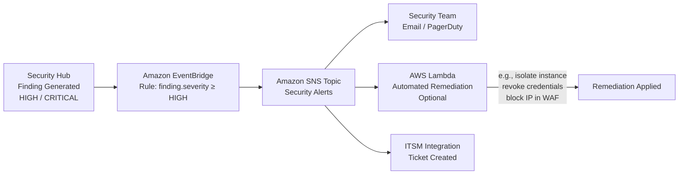
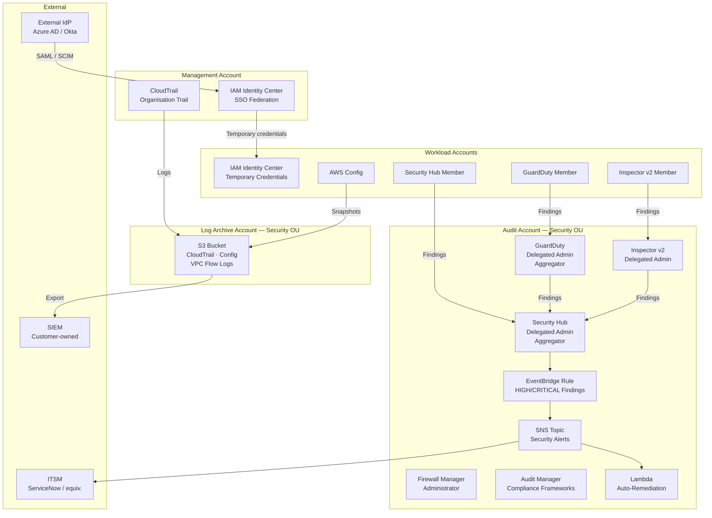

# XYZ Corporation — Security & Governance Design

**Document Number:** 02  
**Version:** 1.0  
**Status:** Approved for Programme Use  
**WAF Pillars Covered:** Security (primary), Operational Excellence (governance), Reliability (audit trail)  
**Related Documents:** [01 — Target Architecture Overview](./01-target-architecture-overview.md) · [03 — Platform & IaC Design](./03-platform-iac-design.md) · [06 — ADR Catalog](./06-adr-catalog.md)

---

## Table of Contents

1. [Purpose](#1-purpose)
2. [Security Design Principles](#2-security-design-principles)
3. [Governance](#3-governance)
   - 3.1 [AWS Control Tower Deployment](#31-aws-control-tower-deployment)
   - 3.2 [Account Vending Machine](#32-account-vending-machine)
   - 3.3 [Customisations for Control Tower (CfCT)](#33-customisations-for-control-tower-cfct)
   - 3.4 [SCP Guardrail Set](#34-scp-guardrail-set)
4. [Identity and Access Management](#4-identity-and-access-management)
   - 4.1 [IAM Identity Center](#41-iam-identity-center)
   - 4.2 [Workload Identity (Service-to-Service)](#42-workload-identity-service-to-service)
5. [Phase 0 Security Controls](#5-phase-0-security-controls)
6. [Threat Detection and Security Posture](#6-threat-detection-and-security-posture)
   - 6.1 [AWS Security Hub — Aggregator Mode](#61-aws-security-hub--aggregator-mode)
   - 6.2 [Amazon GuardDuty](#62-amazon-guardduty)
   - 6.3 [AWS Inspector v2](#63-aws-inspector-v2)
   - 6.4 [AWS Firewall Manager](#64-aws-firewall-manager)
   - 6.5 [AWS Audit Manager](#65-aws-audit-manager)
7. [Centralised Logging](#7-centralised-logging)
8. [Secrets Management](#8-secrets-management)
9. [Automated Security Response Pipeline](#9-automated-security-response-pipeline)
10. [Security Services Topology Diagram](#10-security-services-topology-diagram)

---

## 1. Purpose

This document defines the zero-trust security foundations, centralised compliance posture, and identity architecture for XYZ Corporation's AWS estate. The design governs all 20+ existing AWS accounts enrolled into AWS Control Tower and addresses the Security WAF pillar maturity gap — from the current baseline of 1.5/5 to a target of 4.0/5 within the transformation programme.

**Key measurable outcomes this design achieves:**

- **Security Hub score ≥ 85%** across AWS Foundational Security Best Practices (FSBP) controls, measured continuously from Phase 1 onwards
- **Mean Time to Detect (MTTD) < 1 hour** for HIGH and CRITICAL severity findings, achieved via the automated response pipeline defined in Section 9
- **Zero long-lived IAM access keys** for human identities, enforced as a Phase 0 control and preventively blocked via SCP from Phase 1
- **Immutable, centralised audit trail** covering all management events, data events, and configuration changes across every account in the organisation

---

## 2. Security Design Principles

Five principles underpin every architectural decision in this document. They are listed in priority order — when controls conflict, earlier principles take precedence.

1. **Assume breach** — every access request is explicitly verified, regardless of network location. No implicit trust is granted to traffic originating inside the VPC perimeter or to human identities that have previously authenticated.

2. **Least privilege everywhere** — permissions are scoped to the minimum required for the specific task and duration. Wildcard actions and resource ARNs are prohibited in production permission sets and execution roles. IAM Access Analyzer validates that no unintended public or cross-account resource access exists.

3. **Defence in depth** — multiple independent control layers address each threat category. Preventive controls (SCPs, security groups, bucket policies) reduce attack surface. Detective controls (GuardDuty, Security Hub, CloudTrail) surface anomalies. Responsive controls (EventBridge rules, Lambda remediation, ITSM ticketing) reduce time-to-contain. No single control failure results in a security breach.

4. **Immutable audit trail** — every AWS API call is recorded in a tamper-resistant, organisation-level CloudTrail trail. Log Archive Account storage is write-protected via SCP (see Section 3.4). CloudTrail log file validation is enabled. No account in the organisation can disable CloudTrail or delete archived logs.

5. **Shift left on compliance** — continuous automated evidence collection via AWS Audit Manager replaces periodic, manual audit cycles. Policy-as-code checks in the CI/CD pipeline (see Platform & IaC Design, Section 3.5) detect compliance deviations at commit time, before reaching production.

---

## 3. Governance

### 3.1 AWS Control Tower Deployment

AWS Control Tower is the governance anchor for the entire AWS estate. It is deployed in the Management Account and governs all 20+ existing accounts under a unified OU and SCP structure. Control Tower provides:

- A pre-validated landing zone with security baseline controls applied to every enrolled account at enrolment time
- Mandatory controls (strongly recommended Control Tower guardrails) that enforce baseline security invariants across all OUs — these cannot be disabled by account teams
- A single-pane-of-glass compliance dashboard in the Control Tower console, surfacing guardrail compliance status per account and per OU
- Integration with AWS Organizations, enabling organisation-wide service delegation (Security Hub, GuardDuty, Firewall Manager, Audit Manager) from the Audit Account

The five-OU hierarchy enforced by Control Tower is documented in the Target Architecture Overview (Section 1.4). Each OU inherits the SCPs defined in Section 3.4 in addition to the Control Tower-managed mandatory controls.

### 3.2 Account Vending Machine

New AWS accounts are provisioned via **Account Factory** — the Control Tower account vending mechanism. Account Factory eliminates manual account bootstrapping and guarantees that every new account is enrolled with all guardrails pre-applied before any workloads are deployed. Key Account Factory behaviours:

- The requesting team submits an account vending request (product launch via AWS Service Catalog or a GitOps-triggered pipeline) specifying the target OU, account owner, and cost centre tags
- Control Tower creates the account, applies the OU's SCP set, deploys the Customisations for Control Tower (CfCT) baseline stack, and enrolls the account into Security Hub, GuardDuty, and AWS Config as a member
- The requesting team receives IAM Identity Center access via their assigned permission set; no root credential sharing occurs

### 3.3 Customisations for Control Tower (CfCT)

Customisations for Control Tower (CfCT) extends the landing zone by deploying additional organisation-wide configurations to each account at enrolment time and on a drift-remediation schedule. CfCT customisations applied across all accounts include:

- Deletion of the default VPC in all regions outside the approved region list
- Enabling Amazon EBS encryption by default in all regions
- Deployment of the account-level AWS Config recorder and delivery channel pointed to the Log Archive Account
- Enrollment of the account as a GuardDuty member and Security Hub member
- Baseline CloudWatch alarm set for root account sign-in activity

These customisations are defined as CloudFormation StackSets and are the primary use case where AWS CloudFormation is preferred over Terraform (see ADR-001 in the ADR Catalog).

### 3.4 SCP Guardrail Set

The following SCPs are applied at the root or OU level as preventive guardrails. SCPs define the maximum permission boundary for all principals in the target OU or account — they cannot grant permissions, only restrict them. Account administrators and workload teams cannot override or disable these controls.

| SCP Control | Applied At | Rationale |
|---|---|---|
| Deny unapproved AWS regions | Root (all OUs) | Limits blast radius of compromised credentials; ensures data residency compliance by constraining resource creation to pre-approved regions only |
| Deny public S3 bucket ACLs and public bucket policies | Root (all OUs) | Prevents accidental data exposure — Amazon S3 misconfiguration is a leading source of cloud data breaches |
| Require encryption at rest (deny unencrypted EBS volume creation, unencrypted RDS instance creation, and S3 bucket creation without default encryption) | Workloads-Prod OU | Ensures data-at-rest protection for regulated production workloads; EBS encryption default (CfCT) adds a second layer in all accounts |
| Deny disabling AWS CloudTrail and AWS Config | Root (all OUs) | Preserves audit trail integrity and configuration history; satisfies the immutable audit trail principle |
| Deny creation of IAM users with console access | Root (all OUs except Management Account) | Enforces IAM Identity Center as the sole human access path; eliminates per-account IAM user proliferation and long-lived password risk |
| Deny root account API usage | Root (all OUs) | Eliminates root credential attack surface; root access is restricted to break-glass procedures with hardware MFA |
| Deny deletion of Log Archive account resources (S3 objects, buckets, CloudTrail trails) | Security OU | Protects audit evidence from insider threat or accidental deletion; complementary to S3 Object Lock on the CloudTrail bucket |
| Deny Instance Scheduler tag removal in NonProd | Workloads-NonProd OU | Enforces cost-saving instance scheduling compliance; prevents account teams from circumventing non-production shutdown schedules (see FinOps Design, Section 3.8) |

> **Note on SCP scope:** SCPs are additive from Root to OU to Account. The Management Account is excluded from the IAM user SCP to preserve break-glass and Control Tower operational access. All other accounts, including the Audit Account and Log Archive Account, are governed by the full root-level SCP set plus any OU-specific additions.

---

## 4. Identity and Access Management

### 4.1 IAM Identity Center

AWS IAM Identity Center (formerly AWS SSO) is the **sole mechanism for human access** to all AWS accounts. Per-account IAM users with console passwords or programmatic access keys are deprecated and removed during Phase 0 and Phase 1. The SCP in Section 3.4 prevents new IAM users with console access from being created in any account after Phase 0 completion.

**Federation architecture:**

IAM Identity Center is deployed in the Management Account and federates with an external Identity Provider (IdP) — Azure Active Directory or Okta — via **SAML 2.0** for authentication and **SCIM** for automatic user and group provisioning and de-provisioning. The external IdP is the system of record for all user identities; IAM Identity Center does not manage local user directories. Identity lifecycle events (joiner, mover, leaver) are propagated automatically from the IdP to IAM Identity Center via SCIM without manual intervention.

> **External dependency:** The external IdP (Azure Active Directory or Okta) is owned and operated by XYZ Corporation. The integration boundary is the SAML 2.0 metadata exchange and SCIM endpoint. This design defines the AWS-side configuration only; IdP-side federation configuration is out of scope.

**Permission set design:**

Permission sets define the access level assigned to users and groups within each AWS account. All permission sets follow least-privilege principles and are aligned to defined job roles:

| Permission Set | Scope | Access Level |
|---|---|---|
| ReadOnly | All accounts | Read-only across all services; no write or delete actions |
| Developer | Workloads-NonProd OU accounts | Deploy and manage workload resources within the account's approved service list; no IAM, security service, or billing access |
| PlatformEngineer | All non-Security OU accounts | Full infrastructure access excluding IAM Identity Center administration and Log Archive write access |
| SecurityAnalyst | Audit Account, Log Archive Account (read-only) | Security service administration (Security Hub, GuardDuty, Inspector v2); read-only CloudTrail and Config log access |
| BillingAdmin | Management Account | Cost Explorer, CUR, Savings Plans, and Budgets access; no resource provisioning |

Session duration is bounded to a maximum of 8 hours for all human permission sets. Temporary credentials are issued per-session; no long-lived access keys are generated or distributed. All session-start and permission-set-assumption events are recorded in CloudTrail.

### 4.2 Workload Identity (Service-to-Service)

Machine identities follow a strict no-stored-credentials model:

- **EC2 instances** — access AWS services exclusively via IAM Instance Profiles attached at launch. Instance Profile roles follow least privilege and are scoped to the specific services and actions the workload requires. No access keys are stored on instance storage or in user data.
- **AWS Lambda functions** — use execution roles with the minimum permissions required for the function's declared purpose. Execution roles are version-controlled alongside the function definition in the Terraform module.
- **Cross-account access** — uses IAM role assumption with explicit trust policies that specify the allowed principal account and, where appropriate, an `aws:PrincipalTag` condition. Shared credentials are never used across account boundaries.
- **CI/CD pipelines** — use OIDC-based role assumption from the pipeline provider (e.g., GitHub Actions OIDC, AWS CodeBuild service role). No long-lived access keys are stored in CI/CD secret stores.

All cross-account role assumption events are recorded in AWS CloudTrail in both the assuming account and the target account.

---

## 5. Phase 0 Security Controls

Phase 0 establishes the minimum security hygiene baseline before any workloads are migrated or modernised. These controls are non-negotiable prerequisites for all subsequent programme phases. They address the highest-risk findings in the current state — exposed credentials, ungoverned root accounts, and undetected cross-account access — without requiring workload changes.

**1. Long-lived IAM access key removal**

A programmatic inventory of all IAM users and access keys is conducted across all 20+ accounts using IAM credential reports and AWS Config managed rule `iam-user-no-active-access-key-if-not-authorised`. All long-lived access keys older than 90 days are rotated or removed. Human-identity keys are replaced with IAM Identity Center temporary credentials. Service account keys are replaced with IAM Instance Profiles or execution roles. Any key that cannot be immediately removed is flagged, documented, and placed on a 30-day remediation SLA. After Phase 1, the SCP in Section 3.4 prevents new console-access IAM users from being created.

**2. Root MFA enforcement**

Hardware MFA tokens are enrolled on all AWS account root credentials, including the Management Account and all member accounts. A CloudWatch Events alarm and SNS notification are configured to alert the security team within 5 minutes of any root account console sign-in event. Root credential usage is denied via SCP for all API operations (see Section 3.4). Root credentials are stored in a secured, audited break-glass process.

**3. IAM Access Analyzer — organisation-wide enablement**

AWS IAM Access Analyzer is enabled with the AWS Organizations organisation as the zone of trust. Access Analyzer continuously evaluates resource-based policies on S3 buckets, IAM roles, KMS keys, Lambda functions, SQS queues, and Secrets Manager secrets across all member accounts. Any finding that indicates unintended public or cross-account resource access generates an alert in Security Hub and is tracked to remediation. Access Analyzer is deployed in every account via the CfCT baseline stack (see Section 3.3).

---

## 6. Threat Detection and Security Posture

### 6.1 AWS Security Hub — Aggregator Mode

AWS Security Hub is deployed with the **Audit Account as the delegated administrator**. Member accounts are automatically enrolled via AWS Organizations integration at account vending time (see Section 3.2). Security Hub operates in aggregator mode: all findings from all member accounts are centralised in the Audit Account for unified triage and response.

Security Hub aggregates findings from the following sources:

- Amazon GuardDuty (threat detection findings)
- AWS Inspector v2 (vulnerability findings for EC2, Lambda, ECR)
- Amazon Macie (S3 data classification findings, where S3 sensitive data discovery is enabled)
- AWS Firewall Manager (WAF rule violation findings)
- AWS Config (non-compliant resource configuration findings)
- Third-party integrations (via Security Hub partner integrations, where applicable)

**Enabled compliance standards:**

| Standard | Primary Use |
|---|---|
| AWS Foundational Security Best Practices (FSBP) | Primary benchmark; target score ≥ 85% across all FSBP controls |
| CIS AWS Foundations Benchmark | Secondary benchmark; validates CIS-hardening posture |
| PCI DSS / HIPAA / SOC 2 | Applied per Phase 0 compliance discovery; at least one framework is active from Phase 1 |

The **target Security Hub score is ≥ 85%** across FSBP controls. This metric is reviewed in the weekly security posture review cadence. Findings with severity CRITICAL or HIGH are actioned within the MTTD target of under one hour via the automated response pipeline in Section 9.

### 6.2 Amazon GuardDuty

Amazon GuardDuty is enabled **organisation-wide** via delegated administration from the Audit Account. All member accounts are enrolled as GuardDuty members without requiring opt-in from account teams. GuardDuty provides ML-based threat detection across the following data sources:

| Data Source | Threat Category Detected |
|---|---|
| AWS CloudTrail management events | Credential compromise, API abuse, privilege escalation |
| VPC Flow Logs | Port scanning, C2 communication, lateral movement |
| DNS logs | Domain generation algorithm (DGA) malware, DNS exfiltration |
| S3 data events (S3 Protection) | Unusual S3 API access, data exfiltration from S3 |
| EKS audit logs (EKS Protection) | Container escape, privilege escalation in Kubernetes |
| EC2 malware scanning (Malware Protection) | Malware and ransomware on EC2 instance volumes |

GuardDuty findings are aggregated from all member accounts into the Audit Account and automatically ingested into Security Hub for unified prioritisation and automated response.

### 6.3 AWS Inspector v2

AWS Inspector v2 is enabled across all accounts for **continuous vulnerability scanning**. Like GuardDuty, Inspector v2 is delegated to the Audit Account and enrolled organisation-wide. Inspector v2 scans:

- **EC2 instances** — OS-level and application-level CVEs from the National Vulnerability Database (NVD); scans are continuous and triggered on new package installation events via Systems Manager Agent
- **AWS Lambda functions** — package dependency vulnerabilities in function deployment packages and layers
- **Amazon ECR container images** — vulnerability scanning triggered on every image push to ECR and on a periodic schedule for images already in the registry

Inspector v2 findings are routed to Security Hub for unified prioritisation alongside GuardDuty and Macie findings.

### 6.4 AWS Firewall Manager

AWS Firewall Manager is configured with the **Audit Account as the administrator**. It centrally deploys and maintains:

- **AWS WAF rule sets** — OWASP Top 10 managed rule groups applied to all public-facing Application Load Balancers and Amazon CloudFront distributions across all accounts in the organisation. Firewall Manager ensures that new ALBs and CloudFront distributions created in any member account are automatically protected without requiring account-team action.
- **AWS Shield Advanced** — protections on qualifying resources (Internet-facing ALBs, CloudFront distributions, Elastic IPs, Route 53 hosted zones) from Phase 1 onwards. Shield Advanced provides DDoS event visibility and 24/7 access to the AWS Shield Response Team (SRT).
- **Security Group policies** — enforcing allowed ingress and egress patterns across accounts; detecting and alerting on security groups that allow unrestricted inbound access (0.0.0.0/0) on sensitive ports.

### 6.5 AWS Audit Manager

AWS Audit Manager is configured in the Audit Account with the applicable compliance frameworks confirmed during Phase 0 discovery. At minimum, one of the following frameworks is active from Phase 1:

- **PCI DSS** — if any workload processes, stores, or transmits cardholder data
- **HIPAA** — if any workload handles protected health information (PHI)
- **SOC 2** — as a baseline for all SaaS and B2B workloads where customer trust assurance is required

Audit Manager provides continuous, automated evidence collection mapped to framework controls. Evidence is collected automatically from Config, CloudTrail, Security Hub, and IAM. This replaces the manual, spreadsheet-based evidence gathering process used in the current state. Evidence is stored in the Audit Account and accessible to the security team and external auditors via the Audit Account's SecurityAnalyst permission set.

---

## 7. Centralised Logging

Centralised logging consolidates all audit evidence in the Log Archive Account under write-protected storage. No account in the organisation can delete, modify, or disable log delivery — this is enforced by the SCP in Section 3.4 and by S3 bucket policies on the Log Archive Account.

**AWS CloudTrail — Organisation Trail**

AWS CloudTrail is enabled as a single **organisation-level trail** from the Management Account. The organisation trail covers all current and future member accounts automatically. The trail captures:

- All management events (control-plane API calls) across all regions
- Data events for Amazon S3 (object-level operations on sensitive buckets) and AWS Lambda (function invocations) where applicable
- CloudTrail Insights events (anomalous API call rate detection)

All trail logs are delivered to a dedicated, write-protected S3 bucket in the Log Archive Account. The bucket has:
- S3 Object Lock (Governance mode) with a minimum retention period aligned to the applicable compliance framework
- S3 server-side encryption using an AWS KMS customer-managed key owned by the Log Archive Account
- S3 access logging enabled, with access logs delivered to a separate prefix in the same bucket
- Bucket policy denying `s3:DeleteObject`, `s3:PutBucketPolicy`, and `cloudtrail:StopLogging` from all principals except the designated break-glass role

Log file integrity validation is enabled on the trail; SHA-256 digest files are delivered alongside log files to detect any tampering.

**AWS Config — Organisation-Wide Delivery Channel**

AWS Config is enabled organisation-wide via the CfCT baseline (see Section 3.3). The organisation-level delivery channel directs all Config snapshots and configuration history to the Log Archive Account. Config provides the resource configuration timeline required for compliance investigations and is the data source for Audit Manager evidence collection.

**VPC Flow Logs**

VPC Flow Logs are enabled on all VPCs across all accounts and delivered to a centralised Amazon CloudWatch Logs log group or S3 prefix in the Log Archive Account. Flow logs capture accepted and rejected traffic at the ENI level and are the primary data source for network-layer threat investigation. GuardDuty also consumes VPC Flow Logs independently for threat detection (see Section 6.2).

**SIEM Integration Boundary**

Where a third-party Security Information and Event Management (SIEM) platform is in scope, the integration boundary is an S3 export or Amazon Kinesis Data Firehose stream from the Log Archive Account to the SIEM ingestion endpoint.

> **External dependency:** XYZ Corporation is responsible for procuring, operating, and maintaining the SIEM platform. This design defines the AWS-side data export mechanism only — the S3 bucket prefix structure, Kinesis Data Firehose delivery stream configuration, and IAM cross-account read role. SIEM-internal parsing, correlation rules, and alerting are out of scope.

---

## 8. Secrets Management

All application secrets are migrated away from hard-coded source code values and plaintext configuration files. The approved secrets management services are:

| Service | Approved Use Cases | Key Capability |
|---|---|---|
| AWS Secrets Manager | Dynamic secrets: database credentials, API keys, OAuth tokens, TLS certificates | Native automatic rotation for Amazon RDS, Amazon Redshift, and Amazon DocumentDB; rotation Lambda functions for custom secret types; cross-account secret sharing via resource-based policy |
| AWS Systems Manager Parameter Store | Static configuration values: application configuration parameters, feature flags, non-sensitive connection strings | SecureString parameters encrypted with AWS KMS customer-managed keys; no rotation requirement; lower cost for high-volume parameter reads |

**Decision boundary between services:** If the secret requires automatic periodic rotation, use AWS Secrets Manager. If the value is static or rotation is managed outside AWS (e.g., a manually rotated third-party API key updated by the application team), use Parameter Store SecureString.

**Migration path:**

- **Phase 0 discovery** — a secrets inventory is produced by scanning source code repositories, CI/CD pipeline variable stores, and EC2 instance user data for credential patterns. All identified secrets are catalogued with owning application, secret type, and rotation frequency requirement.
- **Phase 1 migration** — application teams migrate all secrets to either Secrets Manager or Parameter Store per the decision boundary above. Applications are updated to retrieve secrets at runtime via the Secrets Manager SDK or Parameter Store API rather than reading from environment variables or configuration files. Hard-coded credentials in source code are revoked immediately upon migration.
- **Preventive control** — from Phase 1, AWS IAM Access Analyzer and Amazon CodeGuru Reviewer (where applicable) are used to detect new hard-coded credential patterns in code reviews.

---

## 9. Automated Security Response Pipeline

When a HIGH or CRITICAL severity finding is generated in AWS Security Hub, the following automated response pipeline achieves detection-to-notification within the MTTD target of under one hour. The pipeline is deployed in the Audit Account and operates across all member accounts via the Security Hub aggregator.

**Pipeline component details:**

**1. Security Hub Custom Action / EventBridge Rule**

An Amazon EventBridge rule in the Audit Account triggers on all Security Hub findings where `finding.Severity.Label` equals `HIGH` or `CRITICAL`. The rule is also configurable to match specific finding types (e.g., `GuardDuty:Backdoor/EC2`) that warrant immediate automated remediation regardless of severity label. The EventBridge rule is the single entry point for all automated response logic; adding new response behaviours requires only adding a new EventBridge target, not modifying the Security Hub configuration.

**2. Amazon SNS Topic — Fan-out**

The EventBridge rule publishes the finding payload to a dedicated Amazon SNS topic (`SecurityAlerts`) in the Audit Account. The SNS topic fans out to multiple subscribers simultaneously:

- Email distribution list for the security team and on-call engineer
- PagerDuty or OpsGenie webhook for on-call escalation (where configured)
- AWS Lambda function for automated remediation (see below)
- ITSM integration endpoint for ticket creation (see below)

**3. Optional Lambda Automated Remediation**

Pre-built AWS Lambda functions perform automated remediation for common, well-understood finding types where automated action is safe and reduces time-to-contain:

| Finding Type (Example) | Automated Remediation Action |
|---|---|
| IAM access key exposed (GitGuardian / Macie) | Revoke the access key immediately via `iam:UpdateAccessKey`; notify key owner |
| EC2 instance communicating with known C2 endpoint | Attach a quarantine security group denying all ingress and egress |
| S3 bucket made public | Apply a `s3:PutBucketPublicAccessBlock` policy to restore block public access settings |
| Unrestricted ingress security group (0.0.0.0/0 on port 22/3389) | Remove the offending ingress rule via `ec2:RevokeSecurityGroupIngress` |
| Root account sign-in detected | Trigger break-glass alert to CISO and on-call; no automated account action |

All Lambda remediation actions are logged to AWS CloudTrail, creating an auditable record of automated changes made in response to security findings. Lambda functions operate with the minimum IAM permissions required for their specific remediation action; they do not have broad administrative permissions.

**4. ITSM Integration**

A ticket is created in the organisation's ITSM platform (ServiceNow or equivalent) with the finding details, severity, account ID, affected resource ARN, and a direct link to the finding in the Security Hub console.

> **External dependency:** XYZ Corporation owns the ITSM platform integration design. The integration boundary is the SNS subscription delivering the finding payload to the ITSM webhook or API endpoint. ITSM-internal workflow configuration, escalation routing, and SLA tracking are out of scope.

---

## 10. Security Services Topology Diagram

The following diagram depicts the end-to-end security services topology: Security Hub aggregation, GuardDuty delegation, CloudTrail centralisation, and IAM Identity Center federation. Account boundaries and data flow directions are shown explicitly.

**Topology notes:**

- The Management Account hosts the organisation-level CloudTrail trail and IAM Identity Center. No workloads run in the Management Account.
- The Audit Account is the delegated administrator for all detective security services (Security Hub, GuardDuty, Inspector v2, Firewall Manager, Audit Manager). The automated response pipeline (EventBridge → SNS → Lambda/ITSM) runs in the Audit Account.
- The Log Archive Account is the immutable storage destination for all log data. It has no administrative services; access is read-only for security analysts via the SecurityAnalyst permission set.
- Workload accounts are enrolled as members of all detective services at account vending time. Findings flow upward to the Audit Account automatically.
- External dependencies (IdP, SIEM, ITSM) are explicitly identified at their integration boundaries. Internal design of these systems is outside the scope of this document.

---

*Document 02 of 6 — XYZ Corporation AWS Architecture Design Suite*  
*Related: [00 — Master Index](./00-master-index.md) · [01 — Target Architecture Overview](./01-target-architecture-overview.md) · [03 — Platform & IaC Design](./03-platform-iac-design.md)*
