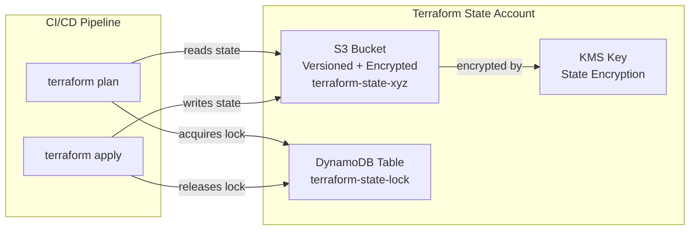
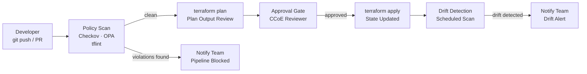

# Platform & IaC Design

**Document:** 03  
**Programme:** XYZ Corporation AWS Cloud Transformation  
**Status:** Approved for Programme Use  
**WAF Pillars Addressed:** Operational Excellence, Security, Cost Optimisation  
**Related Documents:** [01 — Target Architecture Overview](./01-target-architecture-overview.md) · [02 — Security & Governance Design](./02-security-governance-design.md)

---

## Table of Contents

1. [Purpose](#1-purpose)
2. [IaC Tooling Selection](#2-iac-tooling-selection)
3. [Terraform Module Library Structure](#3-terraform-module-library-structure)
4. [Remote State Management](#4-remote-state-management)
5. [CI/CD Pipeline — GitOps Model](#5-cicd-pipeline--gitops-model)
6. [Policy Violation Control](#6-policy-violation-control)
7. [AWS Service Catalog](#7-aws-service-catalog)
8. [Golden AMI and Container Base Images](#8-golden-ami-and-container-base-images)
9. [Existing Resource Import Strategy](#9-existing-resource-import-strategy)
10. [Cloud Centre of Excellence (CCoE)](#10-cloud-centre-of-excellence-ccoe)

---

## 1. Purpose

This document defines the tooling, module library structure, CI/CD pipeline patterns, and self-service provisioning model for XYZ Corporation's AWS transformation programme. It addresses the Operational Excellence pillar by replacing manual console operations with a governed, IaC-first delivery model.

The primary objective is to increase IaC coverage from below 15% to **at or above 80%** of provisioned infrastructure across the 20+ account estate. This target is achieved through Phase 2 activities: publishing the Terraform module library, activating GitOps CI/CD pipelines, standing up AWS Service Catalog portfolios, and progressively importing existing high-value resources into Terraform state.

This document is read alongside [02 — Security & Governance Design](./02-security-governance-design.md), which defines the security baseline that all platform components enforce, and [01 — Target Architecture Overview](./01-target-architecture-overview.md), which describes the multi-account topology the platform layer governs.

---

## 2. IaC Tooling Selection

### 2.1 Primary Tool: Terraform

Terraform is designated as the primary IaC tool for multi-account infrastructure provisioning across the XYZ Corporation estate. Full decision rationale is captured in ADR-001 in the [ADR Catalog](./06-adr-catalog.md).

**Rationale summary:**

| Criterion | Rationale |
|---|---|
| Multi-provider and multi-account | Manages AWS, on-premises, and SaaS resources under a single declarative model; no per-provider toolchain fragmentation |
| State management maturity | Remote state with Amazon S3 and Amazon DynamoDB locking is a proven pattern at enterprise scale |
| Module ecosystem | The Terraform Registry provides a wide library of community and official AWS modules; the CCoE builds on top of these rather than from scratch |
| Team skill availability | Terraform is the dominant IaC tool in the market; hiring and training pipelines are significantly larger than for AWS CDK or AWS CloudFormation |

### 2.2 CloudFormation StackSets for CfCT

AWS CloudFormation StackSets remain in use for specific use cases tightly coupled to AWS Control Tower Customisations (CfCT), where CloudFormation is the native format. CfCT use cases include:

- Organisation-wide baseline Config rules deployed at account enrolment time
- Default VPC deletion in all new accounts
- Baseline CloudTrail and AWS Config recorder configuration

All other multi-account infrastructure provisioning uses Terraform.

---

## 3. Terraform Module Library Structure

The module library is hosted in a central Git repository (GitHub or AWS CodeCommit) under the CCoE organisation. Modules follow the standard Terraform module structure with versioned releases and semantic versioning tags. Consumers reference modules by version tag; no module is consumed directly from the main branch in production.

### 3.1 Module Domain Coverage

| Domain | Module Coverage |
|---|---|
| **Networking** | VPC (multi-AZ), subnets (public/private/isolated), Internet Gateway, NAT Gateway, Transit Gateway attachment, Route 53 hosted zones, VPC endpoints |
| **Compute** | EC2 Auto Scaling Group, Launch Template, ECS cluster (EC2 and Fargate), EKS cluster, ALB/NLB, Target Groups |
| **Security** | IAM roles and policies, KMS key with key policy, Security Groups (baseline ingress/egress patterns), IAM Identity Center permission set |
| **Storage** | S3 bucket (with encryption, versioning, and lifecycle policies), RDS cluster (MySQL/PostgreSQL Multi-AZ), EFS file system, DynamoDB table |
| **Observability** | CloudWatch log group, CloudWatch alarms, CloudWatch dashboard, X-Ray group, SNS topic for alerting |
| **Account Baseline** | Config recorder, CloudTrail, GuardDuty member enrolment, Security Hub member enrolment, default VPC deletion, EBS encryption default |

### 3.2 Module Design Standards

The following standards apply to all modules published to the CCoE registry:

- **Minimal required inputs** — each module exposes only the inputs necessary for correct provisioning; optional inputs carry documented defaults aligned to the security baseline defined in [02 — Security & Governance Design](./02-security-governance-design.md)
- **Mandatory tagging** — `tags` is a required variable in every module, enforcing the mandatory tagging schema (Owner, CostCentre, Environment, Application) as defined in the FinOps design
- **Encryption by default** — KMS encryption is enabled by default for all storage modules; modules do not accept an `encryption_enabled = false` override in production environments
- **Pre-publication validation** — modules are tested with Terraform Validate and Checkov before being published to the CCoE registry; modules that introduce HIGH severity policy violations are rejected

---

## 4. Remote State Management

Terraform remote state is centralised in the Terraform State Account within the Infrastructure OU. This account is dedicated to state storage and lock management; no workload resources are deployed into it.

### 4.1 State Management Architecture

### 4.2 Design Decisions

| Decision | Rationale |
|---|---|
| S3 bucket versioning enabled | Accidental state corruption can be recovered from a previous version without data loss |
| Access logging to Log Archive Account | S3 access logs for the state bucket are delivered to the Log Archive Account, providing an immutable audit trail of all state access events |
| Access restricted to pipeline role and CCoE break-glass role | No developer has direct access to the state bucket; all state reads and writes occur through the CI/CD pipeline role using OIDC-based role assumption |
| Separate state files per environment and domain | Prod and NonProd state is isolated; state files are further partitioned by module domain (e.g., networking, compute) to minimise blast radius from any single state corruption event |

---

## 5. CI/CD Pipeline — GitOps Model

All infrastructure changes follow the GitOps model: the Git repository is the single source of truth. No direct console modifications are permitted in production accounts. The pipeline enforces this constraint through SCP controls (deny manual provisioning) and pipeline role scoping (only the pipeline role can invoke `terraform apply` in production).

### 5.1 Pipeline Flow

### 5.2 Pipeline Stage Details

| Stage | Tooling | Gate Condition |
|---|---|---|
| Code Commit | Git (GitHub / CodeCommit) | Branch protection; PRs required for main branch |
| Policy Scan | Checkov (Terraform static analysis), OPA (custom org policies), tflint (syntax/provider validation) | Pipeline blocks on any HIGH severity violation |
| Plan | Terraform plan output stored as pipeline artifact | Plan output reviewed by approver |
| Approval Gate | Manual approval in pipeline; auto-approved for NonProd environments below risk threshold | Required for Prod OU; optional for NonProd |
| Apply | Terraform apply via OIDC-based role assumption; no long-lived keys in CI/CD | Apply only on explicit approval |
| Drift Detection | Scheduled Terraform plan (no apply); compare against state | Alerts CCoE and account team if live state differs from code |

---

## 6. Policy Violation Control

When the Policy Scan stage detects a violation during static analysis, the following control sequence is triggered:

1. **Apply stage blocked** — the pipeline halts immediately; `terraform apply` cannot be executed for the affected change. The PR cannot be merged to the main branch until all violations are resolved.
2. **SNS notification dispatched** — an Amazon SNS notification is published to the platform-alerts topic, delivering the specific violation detail, the affected Terraform resource identifier, the policy rule that was breached, and the severity level to the responsible team via email or webhook integration.
3. **Violation detail recorded as pipeline artifact** — the Checkov or OPA report is stored as a pipeline artifact, linked to the PR for traceability. The developer must address the violation, push an updated commit, and trigger a new scan cycle before the pipeline can progress.

This control satisfies Requirement 3.10: a policy violation detected during the plan phase blocks the apply stage and notifies the responsible team.

---

## 7. AWS Service Catalog

AWS Service Catalog enables self-service infrastructure provisioning through pre-approved architecture products. Non-platform engineers interact with the catalogue rather than writing Terraform directly. All products have guardrails embedded: encryption, mandatory tagging, and security group patterns are not optional. Launch constraints restrict which IAM roles can launch products, preventing privilege escalation through the catalogue.

### 7.1 Approved Portfolios

| Portfolio | Products Included |
|---|---|
| **Three-Tier Web Application** | VPC + subnets, Application Load Balancer, EC2 Auto Scaling Group, RDS Multi-AZ, CloudWatch alarms baseline |
| **Event-Driven Serverless** | Amazon API Gateway, AWS Lambda functions, Amazon DynamoDB table, Amazon SQS queues, Amazon EventBridge rules, AWS X-Ray tracing |
| **Data Lake Landing Zone** | S3 landing and processed buckets, AWS Glue Data Catalog, Amazon Athena workgroup, AWS Lake Formation permissions |

Service Catalog portfolios are backed by the Terraform module library. Account teams request infrastructure by selecting a portfolio product and supplying environment-specific input values; the underlying Terraform execution is orchestrated by the platform CI/CD pipeline.

---

## 8. Golden AMI and Container Base Images

Standardised, hardened compute base images are a prerequisite for consistent security posture across all workload accounts. AWS Image Builder is the pipeline for producing and maintaining these images.

### 8.1 AWS Image Builder Pipeline

- **OS hardening** — CIS Benchmark Level 1 hardening is applied via Image Builder components; AWS Systems Manager Agent and Amazon CloudWatch Agent are pre-installed on every image
- **Security scanning** — AWS Inspector v2 scans every new AMI version; images that fail the vulnerability threshold (CRITICAL or HIGH CVEs above defined counts) are not promoted to the approved image catalogue and cannot be used as Launch Template sources in workload accounts
- **Versioning and distribution** — AMIs are versioned using semantic versioning and shared to all workload accounts via AWS Resource Access Manager (RAM); previous versions are deprecated after a defined retention period and removed from workload account access
- **ECR container base images** — Amazon ECR-hosted base images for common runtimes (Node.js, Python, Java) follow the same CIS hardening and Inspector v2 scanning pipeline; images are pushed to ECR with image scanning enabled on push and on schedule

### 8.2 Image Lifecycle

The image lifecycle follows a promote-or-reject model:

1. Image Builder pipeline executes OS hardening components and installs baseline agents
2. Inspector v2 scans the candidate image; results are evaluated against the vulnerability threshold
3. **Pass**: image is tagged as approved, version incremented, and shared via RAM to all workload accounts
4. **Fail**: image is rejected, a notification is dispatched to the platform team, and the previous approved version remains active until a remediated build succeeds

---

## 9. Existing Resource Import Strategy

Bringing existing infrastructure under IaC governance is a phased activity spanning Phases 2 and 3. The import strategy prioritises high-value, high-risk resources and uses a progressive SCP tightening approach to enforce IaC compliance per account as resources are brought under Terraform management.

### 9.1 Four-Step Import Process

**Step 1 — Inventory**

AWS Config and AWS Systems Manager Inventory are used to produce a complete resource inventory across all 20+ accounts. The inventory output is a prioritised register of resources ranked by:
- Business criticality (cross-referenced with the workload tiering model in [04 — Reliability & DR Design](./04-reliability-dr-design.md))
- Change risk (high-change-frequency resources carry higher import priority)
- Resource type coverage (resources with available Terraform module coverage are prioritised)

**Step 2 — terraform import / State Migration**

High-value resources — VPCs, RDS clusters, security groups, and IAM roles — are imported into Terraform state using `terraform import` or equivalent state migration tooling. Each imported resource configuration is validated against the Terraform module library to confirm it meets current standards; deviations from the module baseline are flagged for remediation. Resources that cannot be expressed cleanly using existing modules are used to inform new module development.

**Step 3 — Drift Baseline**

Post-import, a scheduled Terraform plan (no apply) is executed against each imported resource. This establishes a clean drift baseline. Once the baseline is confirmed clean, the drift detection stage of the CI/CD pipeline monitors for any future divergence between live infrastructure state and Terraform state. Drift alerts are dispatched to the CCoE and the responsible account team.

**Step 4 — Decommission Console Access**

As resources in a given account come under IaC control, the SCP denying manual provisioning and modification of controlled resource types is progressively applied to that account. Console access for resource creation and modification is removed in a rolling fashion per account, ensuring no regression to console-driven operations. Break-glass access is retained for the CCoE under documented emergency procedures.

---

## 10. Cloud Centre of Excellence (CCoE)

The CCoE is the cross-functional governance and enablement body responsible for the platform and IaC standards that underpin the transformation programme. It operates across Phase 2 and onwards.

### 10.1 Cross-Functional Composition

| Role | Representative Function | Responsibilities |
|---|---|---|
| Platform Engineering Lead | Platform Engineering | Owns Terraform module library architecture; CI/CD pipeline design; GitOps standards; module publishing workflow |
| Security Architect | Security | Reviews all modules for security baseline compliance; approves KMS, IAM, and network architecture patterns; participates in policy scan rule definition |
| FinOps Analyst | FinOps | Defines tagging schema enforcement; reviews module cost implications; integrates rightsizing guidance into module defaults |
| Product Engineering Representative | Product Engineering | Represents consuming teams; validates module usability; identifies Service Catalog product requirements; provides feedback on self-service patterns |
| Cloud Governance Manager | Programme / Governance | Chairs CCoE board; maintains architecture pattern register; manages ADR lifecycle; oversees phase gate approvals |

### 10.2 Ownership and Responsibilities

The CCoE owns the following platform assets:

- **Terraform module library** — module authoring standards, versioning policy, Checkov/OPA rule set, pre-publication validation pipeline, and deprecation lifecycle
- **AWS Service Catalog** — portfolio composition, product guardrail definitions, launch constraint configuration, and product version management
- **Architecture pattern approvals** — all new architecture patterns proposed by product engineering teams are reviewed and approved by the CCoE board before being added to the module library or Service Catalog

The CCoE does not own workload-level architecture decisions. Product engineering teams retain autonomy over application design within the guardrails the CCoE defines.

### 10.3 Governance Cadence

| Cadence | Forum | Participants | Activity |
|---|---|---|---|
| Weekly | Platform Stand-up | CCoE Engineering leads | Module backlog review; pipeline incident triage; drift alert review |
| Monthly | CCoE Board | All CCoE roles + invited stakeholders | Architecture pattern approval; module library roadmap; SCP change review; IaC coverage metrics review |
| Quarterly | Governance Review | CCoE + Security + FinOps + Programme leadership | ADR review and update; phase gate assessment; policy rule set refresh; Service Catalog portfolio review |

The monthly CCoE Board meeting is the formal gate for approving new architecture patterns. Proposals must include a completed ADR (following the structure defined in [06 — ADR Catalog](./06-adr-catalog.md)) and a Checkov/OPA policy scan result for any associated Terraform module.

---

## Cross-Reference Summary

| Section | Satisfies Requirement | Related Document |
|---|---|---|
| Purpose | 3.1 | 01 — Target Architecture Overview |
| IaC Tooling Selection | 3.1 | 06 — ADR Catalog (ADR-001) |
| Terraform Module Library | 3.2 | 02 — Security & Governance Design |
| Remote State Management | 3.3 | 01 — Target Architecture Overview |
| CI/CD Pipeline — GitOps Model | 3.4, 3.9 | 02 — Security & Governance Design |
| Policy Violation Control | 3.10 | — |
| AWS Service Catalog | 3.5 | 01 — Target Architecture Overview |
| Golden AMI and Container Base Images | 3.6 | 02 — Security & Governance Design |
| Existing Resource Import Strategy | 3.7 | 04 — Reliability & DR Design |
| Cloud Centre of Excellence (CCoE) | 3.8 | 06 — ADR Catalog |

---

*Document 03 of 06 — XYZ Corporation AWS Cloud Transformation Architecture Design Suite*  
*Phase reference: Phase 2 (Platform & IaC) — see [00 — Master Index](./00-master-index.md) for phased roadmap*
