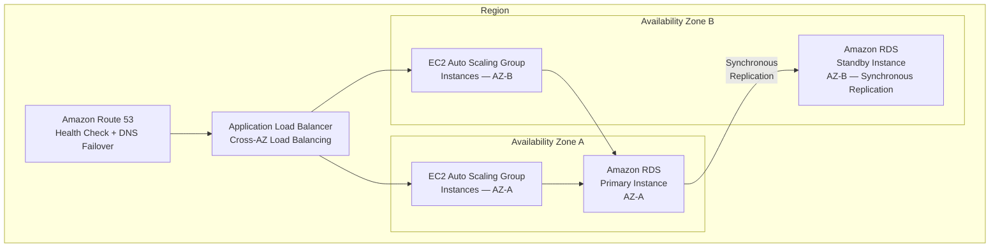
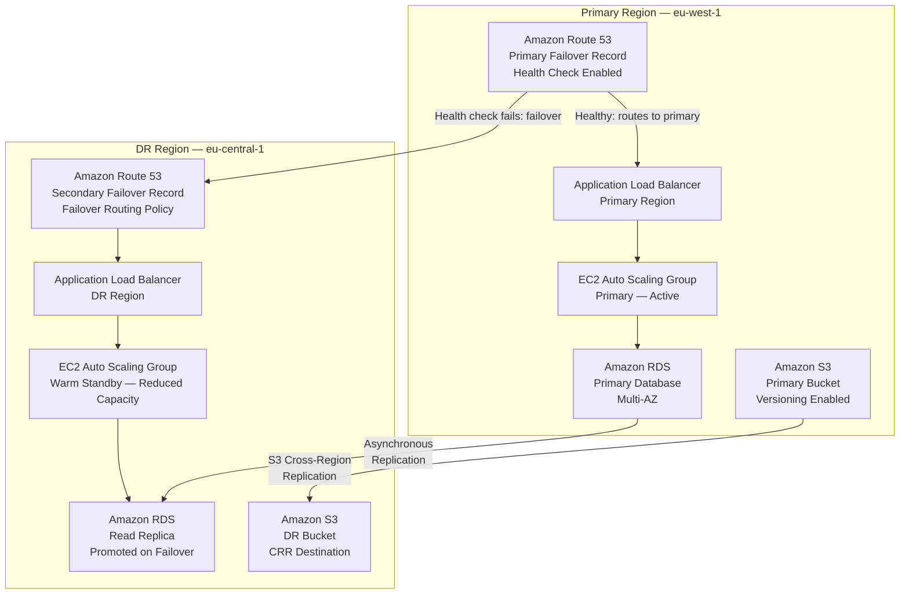
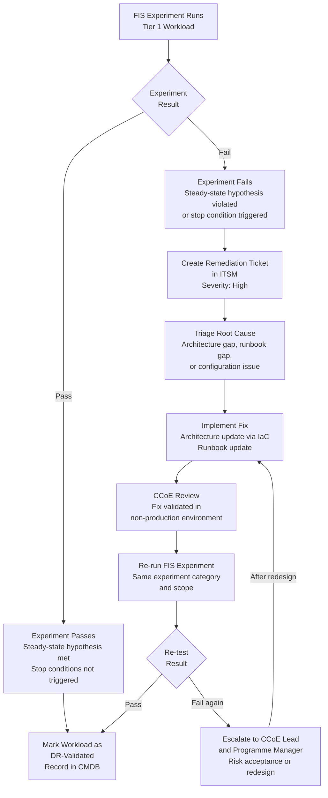

# 04 — Reliability & DR Design
## XYZ Corporation AWS Cloud Transformation

**Document Status:** Approved for Programme Use
**WAF Pillars Covered:** Reliability (primary), Operational Excellence (observability, incident response)
**Requirements Satisfied:** 4.1, 4.2, 4.3, 4.4, 4.5, 4.6, 4.7, 4.8, 4.9, 7.1, 7.2, 7.3, 7.4, 7.5, 7.6
**Related Documents:** [01-target-architecture-overview.md](01-target-architecture-overview.md) | [02-security-governance-design.md](02-security-governance-design.md) | [03-platform-iac-design.md](03-platform-iac-design.md)

---

## Table of Contents

1. [Purpose](#1-purpose)
2. [Workload Tiering Model](#2-workload-tiering-model)
3. [DR Patterns by Tier](#3-dr-patterns-by-tier)
4. [Multi-AZ Reference Architecture (Tier 2/3)](#4-multi-az-reference-architecture-tier-23)
5. [Multi-Region DR Reference Architecture (Tier 1)](#5-multi-region-dr-reference-architecture-tier-1)
6. [AWS Backup — Organisation-Wide Policies](#6-aws-backup--organisation-wide-policies)
7. [Chaos Engineering — AWS Fault Injection Simulator](#7-chaos-engineering--aws-fault-injection-simulator)
8. [Observability for Reliability](#8-observability-for-reliability)
9. [Incident Response and Runbook Pattern](#9-incident-response-and-runbook-pattern)

---

## 1. Purpose

This document defines the workload tiering model, Recovery Time Objective (RTO) and Recovery Point Objective (RPO) targets, disaster recovery (DR) patterns, AWS Backup policies, chaos engineering strategy, observability stack, and incident response pattern for XYZ Corporation's AWS estate.

The target outcome is that **100% of Tier 1 workloads are DR-tested with documented RTO and RPO targets** before the programme transitions to steady-state operations (Phase 4). This document raises the Reliability WAF pillar score from the current baseline of 2.0/5 toward the target of 3.5/5.

**Scope:** All 2,000+ workloads across 20+ AWS accounts. Workload classification is conducted during Phase 0 discovery. DR pattern implementation is phased across Phases 1–3 in alignment with the platform readiness established by the [Platform & IaC Design](03-platform-iac-design.md).

**Out of Scope:** Application re-architecture, runbook step-by-step instructions, and Terraform or CloudFormation implementation templates.

---

## 2. Workload Tiering Model

### 2.1 Four-Tier Classification

All XYZ Corporation workloads are assigned to one of four tiers based on business criticality, customer impact, and regulatory obligation. Tier assignment is performed during Phase 0 discovery by the application owners in collaboration with the Cloud Centre of Excellence (CCoE), and is recorded in the configuration management database (CMDB).

| Tier | Label | RTO Target | RPO Target | Business Impact | Example Workloads |
|---|---|---|---|---|---|
| **Tier 1** | Mission Critical | ≤ 1 hour | ≤ 15 minutes | Revenue-generating, customer-facing, or regulated; outage has immediate financial or reputational impact | Payment processing, core banking platform, customer portal, regulated data services |
| **Tier 2** | Business Critical | ≤ 4 hours | ≤ 1 hour | Important business operations but not immediately customer-impacting; degraded service acceptable short-term | ERP systems, HR platforms, internal service portals, partner integration APIs |
| **Tier 3** | Important | ≤ 24 hours | ≤ 4 hours | Internal tooling and reporting; no direct customer impact; business inconvenience only | Internal APIs, analytics dashboards, batch reporting, non-customer-facing admin tools |
| **Tier 4** | Standard | ≤ 72 hours | ≤ 24 hours | Non-critical; can tolerate extended downtime; loss of recent data acceptable | Development environments, test environments, scheduled batch jobs, proof-of-concept workloads |

### 2.2 Tiering Governance

- **Initial classification:** Phase 0 discovery produces a tiering register for all 40+ business applications. Each application owner formally approves the tier assignment.
- **Review cadence:** Tier assignments are reviewed annually and following any material change to a workload's business function, regulatory scope, or customer exposure.
- **Escalation:** Where application owners disagree on tier assignment, the CCoE acts as arbitrator; the default position is to assign the higher (more critical) tier.
- **Tier 1 mandatory controls:** Any workload classified Tier 1 automatically triggers the multi-region DR assessment gate (see Section 3.2) and the AWS Fault Injection Simulator (FIS) validation requirement (see Section 7) before the workload is considered production-ready.

---

## 3. DR Patterns by Tier

### 3.1 HA and DR Pattern by Tier

| Tier | HA Pattern | DR Pattern | Minimum Deployment |
|---|---|---|---|
| **Tier 1** | Active-active or active-passive across multiple Availability Zones | Active-passive multi-region with Route 53 health-check failover; active-active multi-region where RPO = 0 is required | Multi-AZ mandatory; multi-region required if multi-region trigger criteria are met (see 3.2) |
| **Tier 2** | Active-passive across multiple Availability Zones | Single-region warm standby; automated failover to standby environment within RTO | Multi-AZ mandatory |
| **Tier 3** | Multi-AZ | Single-region cold standby or restore from AWS Backup | Multi-AZ strongly recommended |
| **Tier 4** | Single-AZ acceptable | Backup and restore only; no standby environment required | Single-AZ acceptable |

### 3.2 Multi-Region Trigger Criteria for Tier 1

A Tier 1 workload **must** adopt a multi-region DR pattern (Section 5) if any of the following criteria apply:

1. **RPO ≤ 15 minutes with zero tolerance for regional data loss** — data must survive an AWS region-level failure
2. **Regulatory or contractual requirement** — the workload is subject to a compliance obligation that mandates geographic data redundancy (e.g., financial services continuity regulations)
3. **Customer SLA contractual penalty** — a breach of availability SLA exceeding the RTO would trigger a material financial penalty
4. **Revenue impact threshold** — the workload generates revenue at a rate where one hour of downtime exceeds the annualised cost of operating a warm standby in a second region
5. **Single point of regional dependency** — the workload has no viable single-region HA topology due to tightly coupled dependencies that cannot be replicated within one region

Where none of the above criteria apply, a Tier 1 workload may use multi-AZ active-passive within a single region as its DR pattern, provided this is documented and approved by the CCoE and the workload owner.

---

## 4. Multi-AZ Reference Architecture (Tier 2/3)

This section defines the standard multi-AZ reference architecture for a three-tier web application at Tier 2 or Tier 3. It provides high availability within a single AWS Region by distributing compute and database resources across two or more Availability Zones (AZs).

### 4.1 Architecture Diagram

### 4.2 Component Design Notes

- **Amazon Route 53** — DNS health checks monitor the Application Load Balancer endpoint. If the health check fails, Route 53 can route to an alternative record (e.g., a static error page or a secondary region for Tier 1 workloads).
- **Application Load Balancer** — cross-AZ load balancing is enabled by default, distributing requests evenly across EC2 instances in AZ-A and AZ-B regardless of the number of instances per AZ.
- **EC2 Auto Scaling Group** — the ASG spans both AZs with a minimum of one instance per AZ. Auto Scaling policies are configured with CloudWatch alarms to scale out on CPU utilisation or request count. Instances are launched from hardened Golden AMIs produced by the AWS Image Builder pipeline (see [03-platform-iac-design.md](03-platform-iac-design.md)).
- **Amazon RDS Multi-AZ** — RDS Multi-AZ provides synchronous replication from the primary instance (AZ-A) to the standby instance (AZ-B). In the event of a primary instance failure or AZ disruption, RDS automatically promotes the standby to primary. The failover typically completes within 60–120 seconds, well within Tier 2 RTO of ≤ 4 hours.
- **Data path** — EC2 instances in both AZs connect to the RDS primary endpoint. After a failover, the RDS endpoint DNS is updated automatically; applications using the provided RDS endpoint string reconnect to the new primary without configuration change.

---

## 5. Multi-Region DR Reference Architecture (Tier 1)

This section defines the multi-region DR reference architecture for Tier 1 workloads. It extends the multi-AZ pattern with an active-passive warm standby in a geographically separate AWS Region, providing resilience against region-level disruptions.

### 5.1 Architecture Diagram

### 5.2 Component Table

| Component | Primary Region Role | DR Region Role | Failover Behaviour |
|---|---|---|---|
| Amazon Route 53 | Primary failover routing record; health checks the primary ALB | Secondary failover routing record; receives traffic when primary health check fails | Automatic DNS failover within Route 53 TTL (typically 60 seconds with health check interval of 30 seconds) |
| Application Load Balancer | Serves all production traffic | Receives traffic after Route 53 failover completes | Passive until failover is triggered; no pre-warming required for warm standby |
| EC2 Auto Scaling Group | Full production capacity; instances running from Golden AMI | Warm standby at reduced capacity (e.g., 25–50% of production fleet); scales out automatically post-failover | ASG scale-out triggered by CloudWatch alarms or manually initiated during DR event |
| Amazon RDS | Primary database; Multi-AZ for AZ-level HA within primary region | Read Replica receiving asynchronous replication from primary; promoted to standalone primary on failover | Manual or automated promotion of Read Replica; promotion takes 3–10 minutes; application must reconnect to new endpoint |
| Amazon S3 | Source bucket with versioning enabled | Destination bucket for S3 Cross-Region Replication (CRR); objects replicated asynchronously with typical latency of seconds to minutes | CRR destination bucket is available independently; no failover action required for S3 |

### 5.3 Failover Sequence (Tier 1 Multi-Region)

The failover sequence for a Tier 1 multi-region workload follows this order:

1. **Detection** — Amazon Route 53 health check detects primary ALB is unhealthy (threshold: 3 consecutive failures at 30-second intervals)
2. **DNS failover** — Route 53 switches the primary failover record to the secondary failover record in the DR region; DNS TTL propagation completes within 60 seconds
3. **Traffic routing** — new connections are routed to the DR region ALB; the warm standby ASG begins serving requests immediately from its reduced-capacity fleet
4. **ASG scale-out** — CloudWatch alarms in the DR region trigger ASG scale-out to full production capacity to meet demand
5. **RDS promotion** — the RDS Read Replica in the DR region is promoted to a standalone primary database; the application reconnects using the new endpoint
6. **Validation** — CloudWatch Synthetics canaries in the DR region confirm application health; on-call engineers verify key user journeys
7. **Post-failover** — the original primary region is assessed; recovery and fail-back are planned and executed only after the root cause is resolved and the primary region is confirmed stable

**Integration boundary — ITSM:** A P1 incident ticket is created automatically via Amazon EventBridge → ITSM webhook at the point of Route 53 health check failure. The SLA timer starts at ticket creation. See Section 9 for the full incident response pattern.

---

## 6. AWS Backup — Organisation-Wide Policies

AWS Backup is deployed with organisation-wide backup policies applied through AWS Organizations. Backup plans are assigned to resource groups that are tagged with the workload tier tag (`Tier: 1 | 2 | 3 | 4`). The CCoE owns the backup policy definitions; workload teams are responsible for ensuring resources are correctly tagged.

### 6.1 Backup Plans by Tier

| Tier | Backup Frequency | Retention | Cross-Region Copy | Notes |
|---|---|---|---|---|
| **Tier 1** | Continuous (point-in-time) where supported; otherwise hourly | 35 days for daily recovery points; 12 months for monthly recovery points | Yes — cross-region copy to DR region (e.g., eu-central-1) | RDS automated backups with point-in-time recovery (PITR) enabled; S3 Versioning provides object-level recovery |
| **Tier 2** | Daily | 35 days for daily recovery points; 12 months for monthly recovery points | Yes — cross-region copy to a secondary region | Daily backup window aligned to lowest-traffic period |
| **Tier 3** | Daily | 14 days | No | Single-region backup only; restore-from-backup is the DR pattern |
| **Tier 4** | Weekly | 7 days | No | Minimal backup; primarily to support restore-from-scratch scenarios |

### 6.2 AWS Backup Vault Lock

AWS Backup Vault Lock is enabled on **Tier 1 and Tier 2 backup vaults**. Vault Lock enforces Write-Once, Read-Many (WORM) protection on backup recovery points, preventing:

- Accidental deletion of backups by operations teams
- Malicious deletion by a compromised IAM identity or insider threat
- Deletion by any AWS account — including the management account — during the minimum retention lock period

**Configuration principles:**
- The minimum retention lock period is set to match the tier's minimum retention requirement (35 days for Tier 1 and Tier 2 daily recovery points)
- Vault Lock is configured in governance mode during Phase 2 (allows modification by privileged accounts) and transitions to compliance mode in Phase 3 (immutable; no exceptions)
- Vault Lock changes are recorded in AWS CloudTrail and alerted via the security response pipeline

---

## 7. Chaos Engineering — AWS Fault Injection Simulator

AWS Fault Injection Simulator (FIS) is the mandatory chaos engineering tool for validating Tier 1 workload resilience. FIS experiments are run in a controlled manner with defined blast radius, steady-state hypotheses, and pre-approved stop conditions to ensure safety. All Tier 1 workloads must pass the full FIS experiment suite before being considered DR-validated.

### 7.1 FIS Experiment Categories

A minimum of five experiment categories must be executed for each Tier 1 workload. The following table defines the mandatory categories:

| Experiment Category | FIS Action | Target | Steady-State Hypothesis | Validation Criteria |
|---|---|---|---|---|
| **EC2 instance termination** | `aws:ec2:terminate-instances` | A defined percentage (e.g., 30%) of the workload's EC2 instances within the production ASG | Application availability is maintained; ASG replaces terminated instances | ASG replaces terminated instances within the defined launch time; no customer-facing 5xx errors beyond acceptable threshold within RTO; CloudWatch alarms do not breach critical thresholds |
| **AZ failure simulation** | `aws:ec2:stop-instances` combined with network disruption targeting a single AZ | All EC2 instances within one Availability Zone of the workload deployment | Application continues to serve requests from remaining AZs | Traffic routes successfully to remaining AZs; RDS Multi-AZ standby is promoted; no customer impact beyond a brief connection interruption; recovery completes within RTO |
| **Network latency injection** | `aws:network:latency` | VPC network interfaces for the workload's compute resources | Application handles increased latency gracefully without cascading failures | Application responds with degraded performance but does not return errors; CloudWatch alarms for latency percentiles (p95, p99) trigger within defined thresholds; circuit breakers engage where applicable |
| **RDS failover** | `aws:rds:failover-db-cluster` | The workload's RDS Multi-AZ cluster or Aurora Global Database cluster | Database remains accessible after failover; application reconnects automatically | Standby instance is promoted within the RPO; application reconnects to the new primary endpoint without manual intervention; data integrity confirmed post-failover |
| **CPU stress** | `aws:ssm:send-command` (using stress-ng or equivalent via SSM Run Command) | A subset of EC2 instances within the workload ASG | Auto Scaling triggers scale-out before customer impact occurs | EC2 Auto Scaling scale-out policy triggers based on CloudWatch CPU utilisation alarm; additional instances are launched and pass health checks; original stressed instances remain functional or are replaced |

### 7.2 FIS Experiment Guardrails

- **Stop conditions** — each FIS experiment template defines a stop condition linked to a CloudWatch alarm. If a critical alarm fires during the experiment (e.g., 5xx error rate > 5%), the experiment is immediately halted and AWS FIS rolls back any reversible actions.
- **Blast radius controls** — experiments targeting EC2 instances use a percentage-based target selection (not all-or-nothing) to preserve minimum service capacity during testing.
- **Approval gate** — FIS experiments on Tier 1 production workloads require CCoE approval and are run during a pre-agreed maintenance window. FIS experiments on Tier 1 workloads in a staging environment may be run without a maintenance window.
- **Observation period** — a minimum observation period of 30 minutes follows each experiment to confirm the workload returns to steady state before the experiment is declared passed.

### 7.3 FIS Failure Remediation Workflow

When a Tier 1 workload fails an FIS chaos experiment, the following remediation and re-test workflow must be completed before the workload is considered DR-validated:

**Workflow notes:**
- All FIS experiment results (pass and fail) are recorded in the CMDB against the workload entry
- A Post-Incident Review (PIR) is required for any Tier 1 FIS experiment failure (see Section 9.5)
- DR-Validated status is re-assessed annually and following any material architectural change to the workload

---

## 8. Observability for Reliability

The observability stack for detecting reliability degradation and providing actionable signals to on-call engineers comprises three AWS services. Together they provide infrastructure metrics, distributed tracing, and synthetic user-journey monitoring.

### 8.1 Observability Services

| Service | Purpose | Key Metrics / Signals |
|---|---|---|
| **Amazon CloudWatch** | Infrastructure metrics collection, log aggregation, alarm management, and dashboard visualisation across all workload accounts | CPU utilisation (EC2, RDS), memory utilisation (custom metric via CloudWatch Agent), disk I/O, ALB 5xx error rate, ALB request count, RDS replication lag, RDS connection count, SQS queue depth, SQS approximate number of messages not visible, EC2 ASG desired vs in-service capacity |
| **AWS X-Ray** | Distributed tracing for microservices and serverless architectures; service map generation; latency percentile analysis across service dependencies | Latency percentiles (p50, p95, p99) per service segment, error rates by service, throttle rates, fault rates, service map dependency visualisation, trace sampling anomalies |
| **Amazon CloudWatch Synthetics** | Synthetic canary monitoring of critical user journeys at scheduled intervals (e.g., every 1–5 minutes); provides outside-in availability measurement independent of internal metrics | Canary pass/fail rate per user journey, canary step latency, overall availability percentage per canary, canary screenshot diffs (for UI canaries), geographic probe results |

### 8.2 Alarm Threshold Guidance

The following alarm thresholds provide a baseline; workload teams adjust thresholds based on their specific traffic patterns during Phase 2 onboarding:

| Metric | Threshold | Alarm Severity | Response |
|---|---|---|---|
| ALB 5xx error rate | > 1% for 5 consecutive minutes | Critical | Immediate on-call notification via SNS → PagerDuty / OpsGenie; P1 incident declared for Tier 1 workloads |
| RDS replication lag | > 30 seconds | Warning | Notification to workload owner; investigate replication health before lag grows to RPO boundary |
| CloudWatch Synthetics canary failure | Any canary failure (consecutive failure threshold: 2) | Critical | Immediate on-call notification; direct indicator of customer-facing availability impact |
| EC2 ASG capacity (desired vs in-service) | In-service count < desired count for > 5 minutes | Critical | Indicates instances failing health checks; investigate launch configuration, AMI, or downstream dependency |
| RDS connection count | > 80% of instance max_connections parameter | Warning | Scale database tier or implement connection pooling (e.g., Amazon RDS Proxy) before connections are exhausted |
| SQS queue depth (Tier 1 async workloads) | Approximate number of messages > defined threshold for > 10 minutes | Warning | Consumer may be degraded; investigate consumer ASG scaling and downstream dependencies |
| X-Ray p99 latency | > 2× the application's p99 baseline for > 5 minutes | Warning | Investigate service map for latency hot spots; may indicate downstream dependency degradation |

### 8.3 CloudWatch Dashboards

Operational dashboards are provisioned as part of the Platform Layer (Section 1.6 in [01-target-architecture-overview.md](01-target-architecture-overview.md)) using the Observability Terraform module. Each Tier 1 and Tier 2 workload has a dedicated CloudWatch dashboard containing:

- ALB request count, 5xx rate, and latency (p50/p95/p99)
- EC2 ASG capacity, CPU, and memory metrics
- RDS connections, replication lag, and read/write IOPS
- CloudWatch Synthetics canary pass/fail rate
- SQS queue depth (where applicable)

---

## 9. Incident Response and Runbook Pattern

This section defines the incident response lifecycle for reliability events affecting XYZ Corporation's AWS estate. It covers detection, triage, escalation, ITSM integration, resolution, and post-incident review. The pattern applies to all workload tiers; the escalation urgency and SLA timers are scaled to tier criticality.

### 9.1 Detection

Reliability incidents are detected through one or more of the following signal sources:

- **Amazon CloudWatch alarms** — threshold breaches for infrastructure metrics (ALB 5xx rate, RDS replication lag, ASG capacity, CPU stress); alarms publish to an SNS topic in the workload account
- **Amazon CloudWatch Synthetics canary failure** — outside-in availability monitoring detects customer-facing impact before internal metrics may surface degradation; canary failures publish to SNS
- **AWS Security Hub finding** — infrastructure-related security findings that may indicate reliability impact (e.g., VPC flow log anomaly, GuardDuty threat); routed via the automated security response pipeline described in [02-security-governance-design.md](02-security-governance-design.md)
- **Manual customer or business report** — customer support or business stakeholder reports a service degradation; incident is raised manually in ITSM

All automated detection paths converge on an **Amazon SNS topic per workload** which fan-outs to:
- On-call engineer via PagerDuty, OpsGenie, or equivalent (external to AWS — integration boundary is SNS → webhook)
- ITSM platform to create a ticket automatically (see Section 9.4)
- CloudWatch Events Insights for correlation and pattern detection

### 9.2 Triage

Upon receiving an on-call alert, the on-call engineer follows this triage sequence:

1. **Classify severity** — determine the affected workload tier and the nature of the impact (partial degradation vs full outage, customer-facing vs internal)
2. **Review CloudWatch dashboard** — assess the health metrics for the affected workload: ALB 5xx rate trend, ASG capacity, RDS replication lag, and any correlated alarms
3. **Review AWS X-Ray service map** — identify which service or dependency in the call chain is the source of latency or errors
4. **Review ALB access logs** — confirm whether error pattern is distributed across all requests or isolated to a specific path, source IP range, or user cohort
5. **Review CloudWatch Synthetics canary results** — confirm whether specific user journeys are affected and identify the failing step
6. **Assign priority** — map the observed impact to a priority level (P1–P4) using the severity matrix aligned to workload tier

| Priority | Trigger | Tier |
|---|---|---|
| P1 | Customer-facing outage or data unavailability | Tier 1 |
| P2 | Degraded performance with customer impact; or full outage of Tier 2 workload | Tier 1/2 |
| P3 | Internal tool outage or Tier 3 workload unavailability | Tier 3 |
| P4 | Non-critical degradation; Tier 4 workload impact | Tier 4 |

### 9.3 Escalation Path

| Priority | Immediate Escalation | If Unresolved (30 minutes) |
|---|---|---|
| P1 | On-call engineer + workload owner + SRE lead + management (programme director or CTO) | Invoke DR runbook; escalate to AWS Support (Business or Enterprise support plan); initiate multi-region failover if applicable |
| P2 | On-call engineer + workload owner | Escalate to SRE lead after 30 minutes unresolved |
| P3 | On-call engineer | Notify workload owner; resolve within RTO |
| P4 | On-call engineer | Next business day resolution acceptable |

### 9.4 ITSM Integration Boundary

The integration between AWS and the ITSM platform (ServiceNow or equivalent) is defined at the following boundary:

- **AWS side:** Amazon EventBridge rule triggers on CloudWatch alarm state change (ALARM state) or CloudWatch Synthetics canary failure event; EventBridge invokes a target that publishes the event payload to an SNS topic
- **Integration boundary:** SNS topic delivers the payload to an HTTPS webhook endpoint owned and operated by the ITSM platform; XYZ Corporation is responsible for configuring and maintaining the webhook endpoint
- **ITSM side:** The webhook creates an incident ticket with the workload name, alarm name, severity, affected account ID, AWS Region, and timestamp; the SLA timer starts at ticket creation time
- **AWS does not prescribe** the internal design of the ITSM platform, escalation rules, or ticket routing logic — these are the responsibility of the XYZ Corporation IT Service Management team

### 9.5 Resolution and Post-Incident Review

**Resolution:** On-call engineers reference runbooks for known failure patterns associated with the affected workload. Runbooks are stored in the organisation's knowledge base (external to AWS). Remediation actions may include:

- Scaling the ASG manually to restore capacity
- Initiating an RDS Multi-AZ failover
- Triggering a multi-region Route 53 failover for a Tier 1 workload
- Rolling back a recent deployment via the CI/CD pipeline (see [03-platform-iac-design.md](03-platform-iac-design.md))

**Post-Incident Review (PIR) — Mandatory Triggers:**

| Trigger | PIR Required | Deadline |
|---|---|---|
| Any P1 incident affecting a Tier 1 workload | Yes — always | PIR document produced within 5 business days of incident resolution |
| Any Tier 1 FIS chaos experiment failure | Yes — always | PIR document produced within 5 business days of experiment failure |
| Any P2 incident with customer-measurable impact | Yes — recommended | PIR document produced within 10 business days |
| Any incident where RTO or RPO was breached | Yes — always regardless of tier | PIR document produced within 5 business days |

**PIR content (minimum):** timeline of events, detection-to-resolution duration, root cause analysis, contributing factors, customer impact quantification, corrective actions with owners and target completion dates, and follow-up items logged as ITSM tasks.

The PIR document is reviewed by the CCoE and programme management. Systemic findings from PIRs feed back into the reliability design and the FIS experiment catalogue to prevent recurrence.

---

## Document Cross-References

| Referenced Document | Relationship |
|---|---|
| [01-target-architecture-overview.md](01-target-architecture-overview.md) | Provides the multi-account structure and WAF pillar maturity targets that this document advances |
| [02-security-governance-design.md](02-security-governance-design.md) | Automated security response pipeline is the upstream detection path that may also trigger reliability incidents; shared SNS and EventBridge patterns |
| [03-platform-iac-design.md](03-platform-iac-design.md) | Platform Layer provisions the Terraform modules (Compute, Networking, Observability) used by the reference architectures in this document; Golden AMI pipeline underpins EC2 ASG instances |
| [05-finops-design.md](05-finops-design.md) | Tier assignment informs commitment strategy (Tier 1 workloads are candidates for Reserved Instances / Savings Plans); DR warm standby costs are included in FinOps cost modelling |
| [06-adr-catalog.md](06-adr-catalog.md) | ADR-006 documents the DR Strategy and Workload Tiering decision, including the RTO/RPO assignment methodology and criteria for multi-AZ vs multi-region selection |
