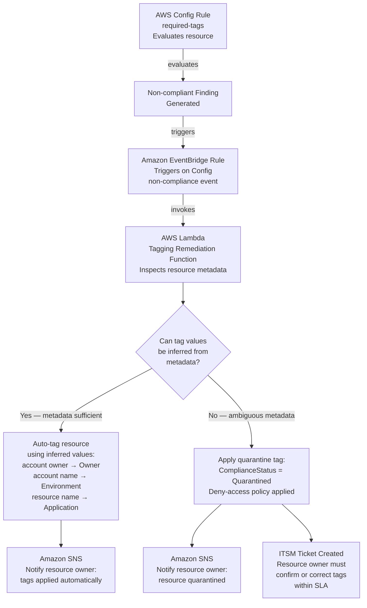

# FinOps Design
## XYZ Corporation — AWS Cloud Transformation

**Document:** 05-finops-design.md  
**Version:** 1.0  
**Status:** Approved for Programme Use  
**WAF Pillars:** Cost Optimisation, Sustainability  
**Requirements Satisfied:** 5.1, 5.2, 5.3, 5.4, 5.5, 5.6, 5.7, 5.8, 5.9, 5.10, 7.1, 7.2, 7.3, 7.4, 7.5

---

## Table of Contents

1. [Purpose](#1-purpose)
2. [FinOps Maturity Journey](#2-finops-maturity-journey)
3. [Cost Visibility Architecture](#3-cost-visibility-architecture)
4. [Cost Anomaly Detection](#4-cost-anomaly-detection)
5. [Tagging Strategy and Enforcement](#5-tagging-strategy-and-enforcement)
6. [Automated Tagging Remediation](#6-automated-tagging-remediation)
7. [Commitment Strategy](#7-commitment-strategy)
8. [Non-Production Environment Scheduling](#8-non-production-environment-scheduling)
9. [AWS Compute Optimizer Integration](#9-aws-compute-optimizer-integration)
10. [FinOps Operating Cadence](#10-finops-operating-cadence)
11. [Sustainability Baseline and Graviton Strategy](#11-sustainability-baseline-and-graviton-strategy)

---

## 1. Purpose

This document defines the cost visibility, anomaly detection, tagging enforcement, commitment strategy, and operational cadence for XYZ Corporation's AWS spending. It provides the architectural design for the FinOps capability that underpins the Cost Optimisation and Sustainability pillars of the AWS Well-Architected Framework.

**Transformation targets for this domain:**

| Metric | Current State | Target State |
|---|---|---|
| Annual AWS cost reduction | Baseline (no optimisation programme) | 25–40% reduction against current annual AWS spend |
| Resource tagging compliance | Ad hoc, unmeasured | ≥95% compliance against mandatory tag schema |
| FinOps maturity (FinOps Foundation model) | 1.0 / 5 | 3.5 / 5 |
| WAF Cost Optimisation pillar score | 1.0 / 5 | 3.5 / 5 |
| WAF Sustainability pillar score | 1.0 / 5 | 2.5 / 5 |

These targets are achieved progressively across Phase 0 through Phase 4 of the transformation programme, as described in the [FinOps Maturity Journey](#2-finops-maturity-journey) section below.

---

## 2. FinOps Maturity Journey

The FinOps capability is introduced and matured in step with the broader transformation phases. Each phase builds on the previous, progressing XYZ Corporation from an unmanaged cost posture to a continuously optimised one.

| Phase | Capability Introduced | Key Deliverable |
|---|---|---|
| **Phase 0 — Foundation** | Enable AWS Cost and Usage Reports (CUR); create dedicated analytics account; deploy CUDOS/CID QuickSight dashboard; establish mandatory tagging schema; baseline current-state spend | CUR pipeline operational; CUDOS dashboard accessible to FinOps team and Engineering leads; tagging schema documented and communicated |
| **Phase 1 — Visibility** | Activate AWS Cost Anomaly Detection monitors (org-level, per-account, service-level); create per-account cost monitors; train account teams on CUDOS dashboards; establish FinOps team and operating cadence | All anomaly monitors active; account owners receiving weekly tagging compliance scorecards; FinOps team cadence launched |
| **Phase 2 — Optimisation** | Commit AWS Savings Plans for stable baseline workloads; enforce tagging via SCPs and AWS Config; deploy AWS Instance Scheduler to Workloads-NonProd OU; begin Compute Optimizer rightsizing recommendations | First Savings Plan commitment in place; SCP tagging enforcement active; non-production scheduling saving compute costs; first rightsizing opportunities identified |
| **Phase 3 — Control** | Activate automated tagging remediation (EventBridge + Lambda); establish quarterly commitment reviews; enforce ScheduleExempt tag governance; track tagging compliance trend toward ≥95% | Automated remediation pipeline operational; quarterly commitment review cycle launched; tagging compliance dashboard showing trend line |
| **Phase 4 — Maturity** | Graviton evaluation completed for top compute workloads; sustainability baseline established via Customer Carbon Footprint Tool; FinOps maturity self-assessment reaches 3.5/5 | Graviton migration tracker populated; carbon footprint baseline documented; FinOps maturity 3.5/5 achieved and evidenced |
| **Ongoing** | Weekly anomaly alert review; monthly CUDOS dashboard review with Engineering leads and Finance; quarterly Savings Plans and Reserved Instances adjustment; continuous Compute Optimizer analysis | Sustained cost reduction against baseline; tagging compliance maintained at ≥95%; commitment coverage adjusted quarterly as workload portfolio evolves |

---

## 3. Cost Visibility Architecture

### 3.1 FinOps Data Flow Diagram

The following diagram shows the end-to-end cost data pipeline, from CUR export through to anomaly alerting and team notification.

```mermaid
flowchart LR
    CUR[AWS Cost and Usage Reports<br/>Parquet · Hourly · Resource IDs]
    S3[Amazon S3<br/>Analytics Account<br/>CUR Bucket]
    GLUE[AWS Glue<br/>Data Catalog<br/>Crawler]
    ATHENA[Amazon Athena<br/>Ad-hoc Queries]
    QS[Amazon QuickSight<br/>CUDOS Dashboard]
    ANOMALY[AWS Cost Anomaly Detection<br/>Monitors + Alerts]
    SNS_FIN[Amazon SNS<br/>Cost Alert Topic]
    TEAMS[Cost Owner<br/>Distribution Lists]

    CUR -->|export| S3
    S3 -->|catalog| GLUE
    GLUE -->|query| ATHENA
    ATHENA -->|visualise| QS
    QS -->|anomaly feed| ANOMALY
    ANOMALY -->|alert| SNS_FIN
    SNS_FIN -->|notify| TEAMS
```

**External dependency:** The analytics account is a dedicated AWS account within the Infrastructure OU, separate from the Log Archive Account. The CUDOS deployment requires Amazon QuickSight Enterprise Edition; XYZ Corporation is responsible for QuickSight licence procurement and user management.

### 3.2 CUR Configuration Details

AWS Cost and Usage Reports are configured with the following parameters to optimise for analytics performance and enable all downstream FinOps use cases:

| Configuration Parameter | Value | Rationale |
|---|---|---|
| Report format | Apache Parquet | Columnar format optimised for Athena queries; significantly reduces query cost and latency compared to CSV |
| Granularity | Hourly | Enables accurate daily cost analysis and fine-resolution anomaly detection; supports per-hour rightsizing analysis |
| Resource IDs | Enabled | Required for per-resource tagging compliance analysis, Compute Optimizer correlation, and rightsizing attribution |
| Report destination | Dedicated analytics account S3 bucket | Separated from Log Archive Account to enforce distinct access controls; FinOps team has read access; security team does not require access |
| Versioning | Overwrite | Latest report version always reflects current billing data; Athena crawler detects partition updates |
| Split cost allocation data | Enabled (where applicable) | Enables container-level (ECS, EKS) cost attribution to individual workloads |

### 3.3 CUDOS Dashboard Views

The CUDOS (Cost and Usage Dashboard Operations Solution) dashboard, maintained by AWS, provides the following views on top of the CUR Athena data source:

| Dashboard View | Audience | Content |
|---|---|---|
| **Executive Summary** | Finance, Programme leadership | Total spend trend; top 5 accounts by spend; Savings Plan coverage rate; month-over-month variance |
| **Account-level** | Account owners, Engineering leads | Per-account daily, weekly, and monthly spend; top services by cost per account; budget vs actuals |
| **Service-level** | FinOps team, Engineering | EC2 spend by instance type; RDS spend breakdown; S3 storage cost by bucket; data transfer costs by account |
| **RI/Savings Plan** | FinOps team, Finance | Commitment coverage %; utilisation %; on-demand exposure; expiring commitments within 90 days |

---

## 4. Cost Anomaly Detection

AWS Cost Anomaly Detection is configured with three monitors providing layered coverage: organisation-wide, per-account, and per-service. All monitors use machine learning to establish baseline spend patterns and alert on statistically significant deviations.

| Monitor Type | Scope | Threshold | Alert Delivery |
|---|---|---|---|
| **Organisation-level** | Total AWS spend across all linked accounts | Absolute: $10,000 above daily baseline; or 20% above trailing 7-day average (whichever triggers first) | Amazon SNS → FinOps team email distribution list |
| **Per-account** | Individual linked account spend | $1,000 above daily baseline per account | Amazon SNS → account owner email + FinOps team |
| **Service-level** | Top 10 services by monthly spend (e.g., EC2, RDS, S3, data transfer) | 30% above trailing 7-day service average | Amazon SNS → FinOps team + relevant service owner |

**Anomaly alert response:** On receipt of an anomaly alert, the FinOps Analyst reviews the CUDOS Account-level and Service-level dashboards within the same business day. If the anomaly is confirmed as unplanned spend, an investigation is raised and the account owner is engaged. The weekly FinOps cadence review includes a standing agenda item for open anomaly alerts (see [Section 10](#10-finops-operating-cadence)).

---

## 5. Tagging Strategy and Enforcement

Consistent resource tagging is the foundation of cost attribution, compliance auditing, and automated remediation. XYZ Corporation mandates four tags on all billable AWS resources.

### 5.1 Mandatory Tag Schema

| Tag Key | Description | Allowed Values | Enforced Via |
|---|---|---|---|
| `Owner` | Team or individual responsible for the resource | Free text (team name or email alias) | SCP (deny creation without tag) + AWS Config rule (ongoing compliance) |
| `CostCentre` | Financial cost centre for billing allocation | Validated cost centre codes (defined by Finance) | SCP + AWS Config rule |
| `Environment` | Deployment environment classification | `prod` / `nonprod` / `sandbox` / `dev` / `staging` | SCP + AWS Config rule |
| `Application` | Name of the business application the resource belongs to | Approved application catalogue values | SCP + AWS Config rule |

All four tags are mandatory. A resource missing any single tag is considered non-compliant and enters the automated remediation pipeline described in [Section 6](#6-automated-tagging-remediation).

### 5.2 Preventive Layer — SCP Enforcement

A Service Control Policy applied to the Workloads-Prod OU and Workloads-NonProd OU denies the following API calls unless all four mandatory tags are present in the request:

- `ec2:RunInstances` (EC2 instance creation)
- `rds:CreateDBInstance` and `rds:CreateDBCluster` (RDS database creation)
- `s3:CreateBucket` (S3 bucket creation)
- `lambda:CreateFunction` (Lambda function creation)
- Additional high-cost resource creation APIs as confirmed during Phase 0 discovery

The SCP operates as a preventive control: it prevents non-compliant resources from being created in the first place. Resources provisioned via AWS Service Catalog products have tags injected automatically by the product template, ensuring compliance at the point of provisioning.

**Dependency:** SCP tag enforcement requires that the provisioning IAM identity (human via IAM Identity Center, or pipeline via OIDC role) passes all four tag key-value pairs in the API request. The Terraform module library includes `tags` as a required variable on all resource modules, enforcing this at the IaC layer before the SCP is reached.

### 5.3 Detective Layer — AWS Config Enforcement

AWS Config is enabled organisation-wide (see Security & Governance Design for configuration details). The following managed Config rules provide continuous, ongoing tagging compliance evaluation:

- **`required-tags`** — evaluates all supported resource types on a continuous basis; generates a non-compliant finding for any resource missing one or more of the four mandatory tags
- **`ec2-instance-no-public-ip` and equivalent service rules** — additional Config rules may be co-deployed as part of the FinOps Config pack

Config findings for non-compliant resources are surfaced in the AWS Config console, in Security Hub (via Config-to-Security Hub integration), and trigger the EventBridge-based remediation pipeline described in [Section 6](#6-automated-tagging-remediation).

---

## 6. Automated Tagging Remediation

When AWS Config detects a non-compliant resource (missing one or more mandatory tags), the following automated remediation pipeline is triggered. The pipeline attempts to infer correct tag values from available resource metadata before escalating to the resource owner.

### 6.1 Remediation Flowchart

**Remediation logic:**

1. **Auto-tag path** — the Lambda function queries resource metadata (account alias, account tags, resource name patterns) to infer tag values. For example: the `Environment` tag is derived from whether the resource resides in the Workloads-Prod OU or Workloads-NonProd OU; the `Owner` tag is derived from the account's owner tag set at account vending time. If all four values can be inferred with sufficient confidence, tags are applied automatically and the resource owner is notified via SNS.

2. **Quarantine path** — if tag values cannot be reliably inferred (e.g., resource name contains no application identifier, or the account has multiple owners), a `ComplianceStatus: Quarantined` tag is applied and an IAM Deny policy is attached to the resource (where the service supports resource-based policies). An SNS notification is sent to the account owner and an ITSM ticket is raised requiring the owner to supply correct tag values within the defined SLA.

**External dependency:** The ITSM ticket creation requires integration with XYZ Corporation's ITSM platform (ServiceNow or equivalent). The integration boundary is an SNS topic subscription invoking an ITSM webhook or Lambda-based connector. XYZ Corporation owns the ITSM integration design.

---

## 7. Commitment Strategy

### 7.1 Savings Plans vs Reserved Instances Comparison

| Feature | AWS Savings Plans | EC2 Reserved Instances |
|---|---|---|
| **Flexibility** | Applies across instance families, sizes, OS, and regions (Compute Savings Plan); or across instance families within a single region (EC2 Instance Savings Plan) | Standard RI: locked to specific instance type, OS, and region. Convertible RI: allows instance family and OS changes within a region |
| **Savings rate** | Up to ~66% vs on-demand (Compute Savings Plan, 3-year no-upfront) | Up to ~72% vs on-demand (Standard RI, 3-year all-upfront) |
| **Service coverage** | EC2, AWS Fargate, AWS Lambda | EC2 only |
| **Commitment term** | 1-year or 3-year | 1-year or 3-year |
| **Payment options** | No upfront, partial upfront, all upfront | No upfront, partial upfront, all upfront |
| **Recommendation for XYZ** | **Primary commitment vehicle** for general compute — maximum flexibility across EC2 family changes, ECS Fargate, and Lambda | Use for specific, well-characterised, long-stable workloads (e.g., dedicated database server instances) where maximum discount justifies reduced flexibility |

### 7.2 XYZ Corporation Commitment Recommendation

- **AWS Compute Savings Plans** are the primary commitment vehicle. The flexibility to cover EC2 (any family, any size, any OS), ECS Fargate, and Lambda with a single plan matches XYZ Corporation's workload portfolio — which includes containerised workloads migrating across instance families as part of rightsizing and Graviton adoption.
- **EC2 Standard Reserved Instances** are used selectively for specific, long-stable database server instances (e.g., dedicated RDS instances with a fixed instance type that has not changed in 12+ months and is not expected to change in the commitment period).
- **Target outcome:** 20–40% savings on committed baseline compute and database workloads.

### 7.3 Commitment Sizing Approach

Commitment sizing follows a conservative methodology to avoid over-commitment on a workload estate that is actively being rightsized and Graviton-migrated:

1. **Trailing 3-month spend analysis** — the FinOps team analyses the trailing 3-month on-demand spend using the CUDOS RI/Savings Plan dashboard to identify stable baseline consumption across EC2, Fargate, and Lambda.
2. **70% baseline commit rule** — only 70% of the trailing 3-month baseline is committed. This conservative threshold leaves 30% headroom to accommodate workload growth, instance family changes during Graviton migration, and active rightsizing that reduces baseline consumption.
3. **Quarterly commitment review** — at each quarterly FinOps cadence meeting, commitment coverage is reviewed against actual consumption. Commitments are adjusted (additional purchases or allowed to expire) as the workload portfolio evolves. See [Section 10](#10-finops-operating-cadence) for the quarterly cadence participants and activities.

---

## 8. Non-Production Environment Scheduling

### 8.1 AWS Instance Scheduler Pattern

AWS Instance Scheduler is deployed to the Workloads-NonProd OU to stop EC2 instances and Amazon RDS clusters outside defined business hours, eliminating compute costs for idle non-production resources. Instance Scheduler is configured centrally and enforced via a Service Control Policy in the Workloads-NonProd OU that denies removal of the scheduler tag.

**Architecture overview:**

- Instance Scheduler is deployed in a central Shared Services or FinOps tooling account
- A DynamoDB table stores schedule configurations per schedule name
- An AWS Lambda function (triggered on a configurable frequency, e.g., every 5 minutes) evaluates each tagged resource against its schedule and starts or stops it accordingly
- EC2 instances and RDS clusters in all Workloads-NonProd OU accounts are tagged with `Schedule: <schedule-name>` to opt into a schedule

### 8.2 Schedule Options

| Schedule Name | Operating Hours | Target Resources | Notes |
|---|---|---|---|
| `office-hours` | Weekdays 07:00–20:00 local time | EC2 instances, RDS clusters (development, test, staging) | Stops overnight and all day Saturday and Sunday; default schedule for most non-production workloads |
| `extended-hours` | Weekdays 06:00–23:00 local time | Resources requiring early-morning or late-evening test windows | Available on request; requires account owner approval |
| `ci-only` | Weekdays 06:00–22:00 local time | CI/CD build environments | Aligned to build pipeline windows |
| Custom | Configurable per application team | Specific workloads with non-standard hours | Requires CCoE approval and documented business justification |

**Target savings:** 30–60% reduction in non-production compute costs, depending on the proportion of workloads on the default `office-hours` schedule.

### 8.3 ScheduleExempt Tag

Resources that must run continuously in non-production environments (e.g., monitoring agents, integration test harnesses that run overnight, shared test infrastructure) are exempt from scheduling by applying the tag `ScheduleExempt: true`. This tag must be requested via the CCoE change process and is not self-service. The SCP in the Workloads-NonProd OU denies removal of Instance Scheduler tags by non-CCoE identities (see Security & Governance Design for SCP details).

---

## 9. AWS Compute Optimizer Integration

### 9.1 Enablement

AWS Compute Optimizer is enabled organisation-wide via delegated administration from the Management Account. Organisation-level enablement ensures that all member accounts automatically contribute utilisation data without requiring per-account activation.

### 9.2 Scope

Compute Optimizer provides machine-learning-based rightsizing recommendations across the following resource types in XYZ Corporation's estate:

| Resource Type | Recommendation Type |
|---|---|
| **EC2 instances** | Right-size to smaller or different instance type; over-provisioned vs under-provisioned flags; Graviton migration eligibility |
| **EC2 Auto Scaling Groups** | Optimal instance type and size for the scaling policy; mixed instance policy recommendations |
| **Amazon RDS instances** | Right-size DB instance class; identify idle or over-provisioned database instances |
| **AWS Lambda functions** | Optimal memory configuration; identify over-provisioned memory allocations |
| **Amazon ECS services on AWS Fargate** | Optimal CPU and memory task size; identify over-provisioned Fargate tasks |

Compute Optimizer requires a minimum of 14 days of utilisation data before generating recommendations. Recommendations improve in accuracy with 30+ days of data.

### 9.3 FinOps Cadence Integration

Compute Optimizer recommendations are reviewed at the monthly FinOps cost review meeting. The FinOps team:

1. Exports the top 10 rightsizing opportunities per account per month from Compute Optimizer
2. Presents recommendations to the relevant Engineering leads at the monthly meeting
3. Tracks accepted recommendations and realised savings in the FinOps tracker
4. Escalates any recommendation above a defined savings threshold (e.g., >$500/month per resource) to the account owner for action within 30 days

Graviton migration eligibility flags from Compute Optimizer are fed into the Graviton migration tracker reviewed at the quarterly cadence (see [Section 11](#11-sustainability-baseline-and-graviton-strategy)).

### 9.4 Expected Rightsizing Savings

Based on industry benchmarks for organically grown AWS estates with no prior rightsizing programme, the expected savings from systematic Compute Optimizer-driven rightsizing are:

- **EC2 and RDS compute:** 15–30% cost reduction on rightsized resources
- **Lambda:** 10–20% cost reduction from memory optimisation
- **Fargate:** 10–25% cost reduction from task size optimisation

These savings are incremental to the commitment strategy savings described in [Section 7](#7-commitment-strategy) and the non-production scheduling savings described in [Section 8](#8-non-production-environment-scheduling).

---

## 10. FinOps Operating Cadence

A structured operating cadence ensures that cost visibility translates into action. The cadence has three frequencies aligned to different decision horizons.

| Cadence | Participants | Activity |
|---|---|---|
| **Weekly** | FinOps Analyst, Account Owners (rotation — each account owner attends once per month) | Anomaly alert review; identification of top-10 cost-increase accounts for the week; tagging compliance scorecard review; active anomaly incidents status update |
| **Monthly** | FinOps team, Engineering leads, Finance | CUDOS dashboard review; executive cost summary preparation; Compute Optimizer top-10 rightsizing opportunities per account; tagging compliance progress trend; Savings Plan and RI commitment coverage report; identification of optimisation actions for the coming month |
| **Quarterly** | FinOps team, CCoE, Finance, Programme leadership | Savings Plans and Reserved Instances review and adjustment (purchase, modify, or allow expiry); FinOps maturity self-assessment against FinOps Foundation model; Graviton migration progress review; sustainability carbon footprint review; budget vs actuals reconciliation; FinOps roadmap update for the next quarter |

**FinOps team composition:** The FinOps team is a function within the CCoE (see Platform & IaC Design for CCoE structure). The FinOps Analyst role is dedicated; Engineering leads and Finance participate in the monthly and quarterly cadences as stakeholders.

---

## 11. Sustainability Baseline and Graviton Strategy

### 11.1 Sustainability Baseline — Customer Carbon Footprint Tool

The AWS Customer Carbon Footprint Tool is the baseline measurement mechanism for XYZ Corporation's sustainability programme. It provides:

- Estimated carbon emissions (metric tonnes CO₂ equivalent) for the organisation's AWS usage, broken down by AWS service and AWS Region
- Month-over-month and year-over-year trend data enabling programme-level sustainability reporting
- A starting point for setting reduction targets aligned to XYZ Corporation's corporate sustainability commitments

The sustainability baseline is established in Phase 4 of the transformation programme. The FinOps team produces a sustainability baseline report using Customer Carbon Footprint Tool data, reviewed at the quarterly FinOps cadence. This baseline informs Graviton migration prioritisation — migrating to Graviton reduces the compute carbon footprint alongside the cost footprint.

**Note:** Customer Carbon Footprint Tool data reflects AWS's methodology for estimating customer emissions based on electricity consumption and renewable energy coverage. XYZ Corporation's sustainability team is responsible for incorporating this data into any external carbon reporting frameworks.

### 11.2 Graviton Evaluation Criteria

AWS Graviton-based instance types (Graviton2, Graviton3, Graviton4 where available) deliver better price-performance than equivalent x86 instance types for compatible workloads. The FinOps team evaluates compute workloads against the following criteria before recommending Graviton migration:

| Criterion | Description |
|---|---|
| **Workload type compatibility** | The workload runs on an ARM64-compatible runtime or container image (Node.js, Python, Java via Corretto, Go, .NET 6+). Compatibility is validated in a test environment before production migration. |
| **Performance parity** | The Graviton instance type delivers equivalent or better performance at lower cost, validated by Compute Optimizer recommendation (Graviton migration eligibility flag) or by direct performance testing in the test environment. |
| **Dependency compatibility** | The workload has no x86-specific compiled dependencies (native libraries, proprietary monitoring agents, or third-party SDKs with no ARM64 build). Dependency audit is a prerequisite for migration. |
| **Cost benefit threshold** | Migration yields a minimum 10% compute cost reduction compared to the equivalent x86 instance type at the same commitment level. Migrations that do not meet this threshold are deferred unless performance requirements justify them independently. |

### 11.3 Graviton Migration Tracker

The Graviton migration tracker is maintained by the FinOps team and reviewed at each quarterly cadence meeting. It records:

| Field | Description |
|---|---|
| Workload / application name | The business application or workload being evaluated |
| Account | AWS account containing the compute resource |
| Current instance type | Existing x86 instance type (e.g., `m5.xlarge`) |
| Recommended Graviton type | Graviton-equivalent instance type (e.g., `m7g.xlarge`) |
| Evaluation status | Not started / In evaluation / Compatible / Incompatible / Migrated |
| Blocker (if applicable) | Specific dependency or compatibility issue preventing migration |
| Estimated monthly saving | Projected cost reduction on migration |
| Realised monthly saving | Actual cost reduction post-migration (tracked for 60 days) |

Migrated workloads are tracked for 60 days post-migration to confirm realised savings match estimates. Incompatible workloads are re-evaluated each quarter as runtime and dependency updates may resolve compatibility blockers over time.

---

*For related design context, see:*
- *[01-target-architecture-overview.md](01-target-architecture-overview.md) — OU hierarchy and account structure*
- *[02-security-governance-design.md](02-security-governance-design.md) — SCP guardrail set including tagging enforcement and NonProd scheduling SCPs*
- *[03-platform-iac-design.md](03-platform-iac-design.md) — Terraform module library tagging standards and CCoE structure*
- *[06-adr-catalog.md](06-adr-catalog.md) — ADR-007: FinOps Tooling and Reporting*
